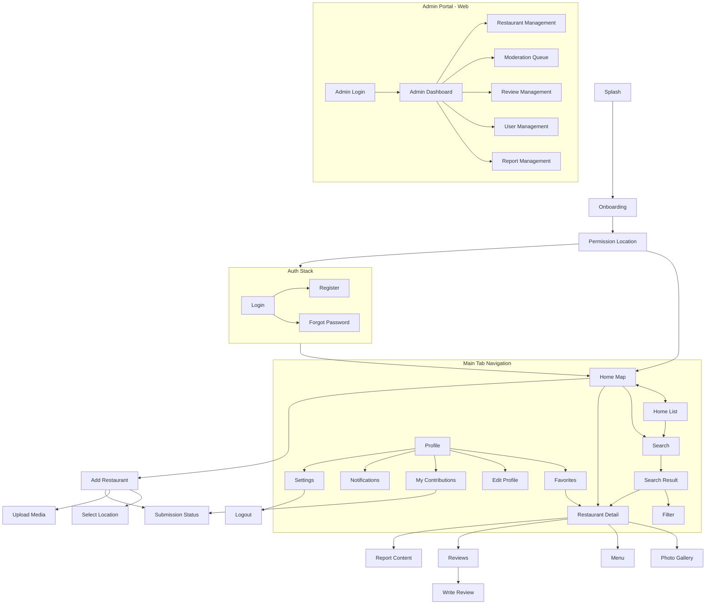
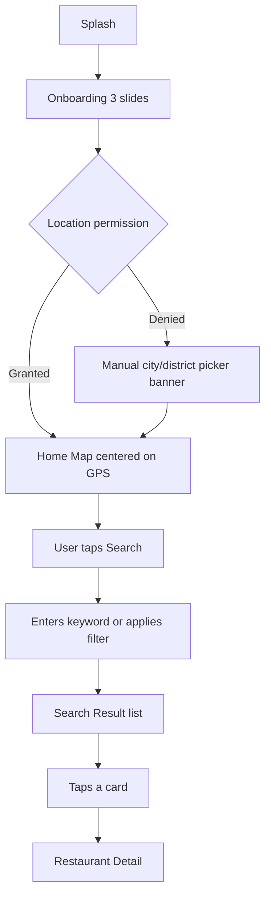
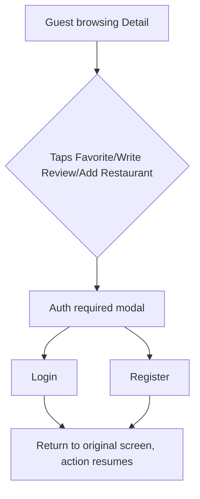
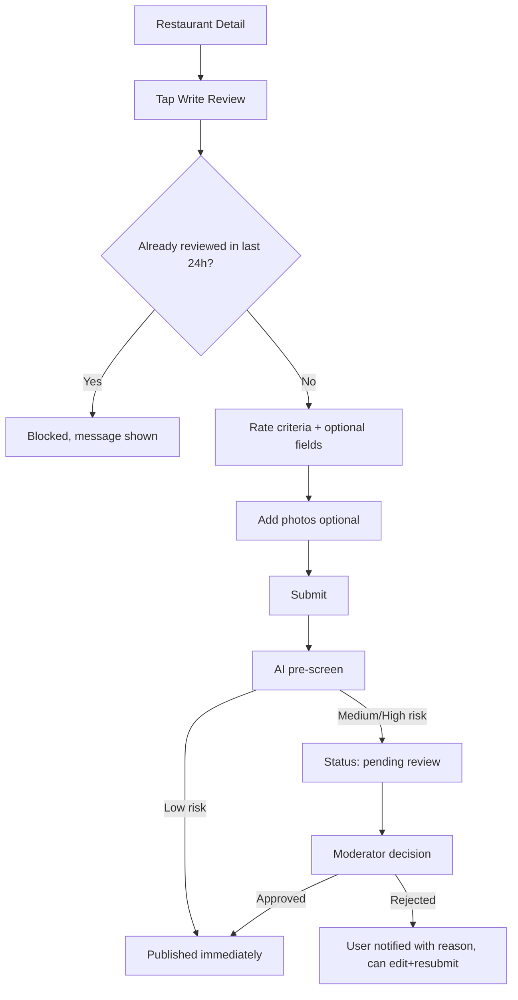
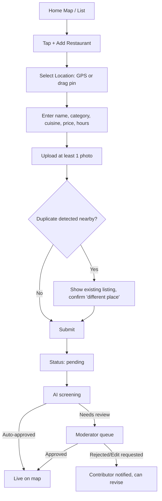
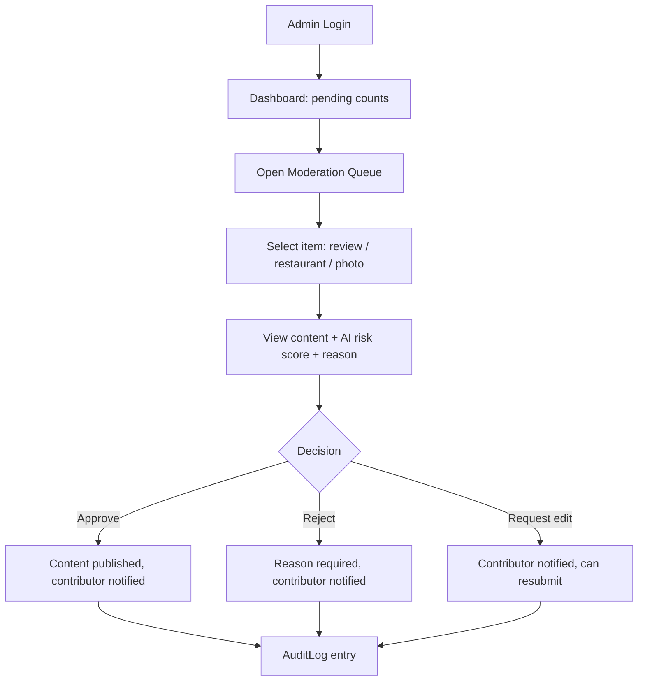
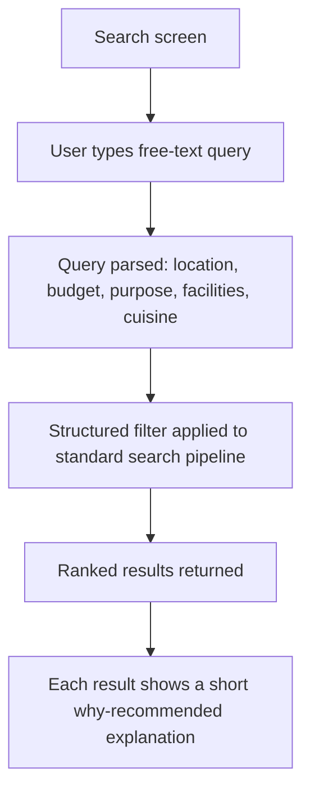

# Sitemap & User Flows — MVP

## 1. Sitemap

Navigation shell: bottom tab bar with 4 tabs — **Bản đồ (Map)**, **Danh sách (List)** *(can be a toggle on the same tab, see Screen List doc)*, **Yêu thích (Favorites)**, **Cá nhân (Profile)** — plus a floating "+" action for Add Restaurant reachable from Map/List.

## 2. Core User Flows

### 2.1 First-time launch → first search

### 2.2 Guest → authenticated action (soft gate)

Business rule: browsing (map, search, detail, reading reviews) never requires login; any write action does. This maximizes discoverability while gating trust-sensitive actions.

### 2.3 Write a review

### 2.4 Add a new restaurant

### 2.5 Moderator workflow (Admin Portal)

### 2.6 AI-assisted natural-language search (baseline, feeds V2 full AI phase but MVP includes a simple version per brief §9)

Note: full conversational AI concierge experience is **V2 (Phase 3 — AI)**; MVP ships only the NL-to-filter parsing layer reusing the existing Search & Filter pipeline, since this is the highest-leverage, lowest-risk slice of the AI vision to demo.

## 3. Screen-to-Screen Navigation Matrix (MVP)

| From | To | Trigger |
|---|---|---|
| Splash | Onboarding / Home Map | First-launch flag check |
| Onboarding | Permission Location | "Bắt đầu" |
| Home Map | Search, Detail, Add Restaurant, Filter | Tap search bar / marker / FAB / filter icon |
| Home List | Detail, Filter | Tap card / filter icon |
| Search | Search Result | Submit query or tap suggestion |
| Search Result | Detail, Filter | Tap card / filter icon |
| Detail | Gallery, Menu, Reviews, Write Review, Report Content, external Maps app | Respective section tap |
| Reviews | Write Review | "Viết đánh giá" |
| Profile | Favorites, Edit Profile, My Contributions, Notifications, Settings | Menu item tap |
| Settings | Login (after logout) | "Đăng xuất" |
| Add Restaurant | Select Location, Upload Media, Submission Status | Step progression |
