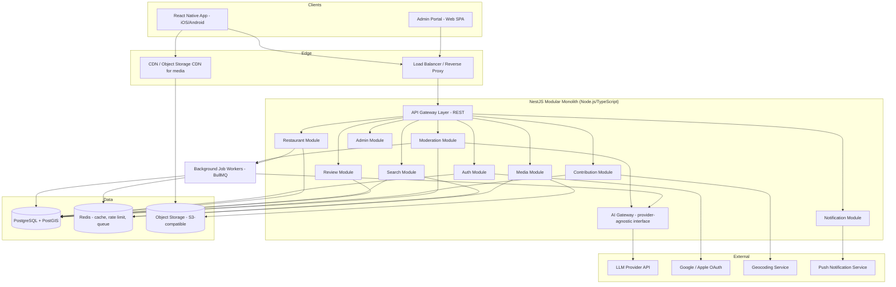
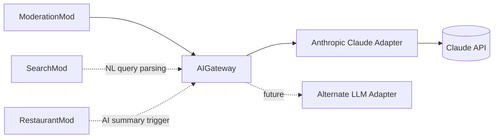
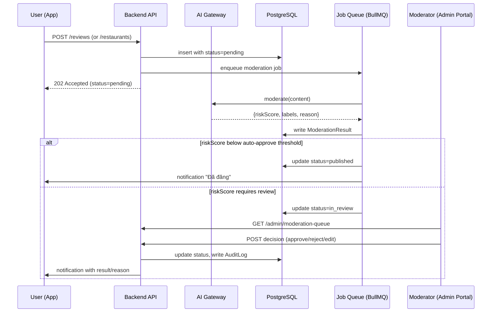
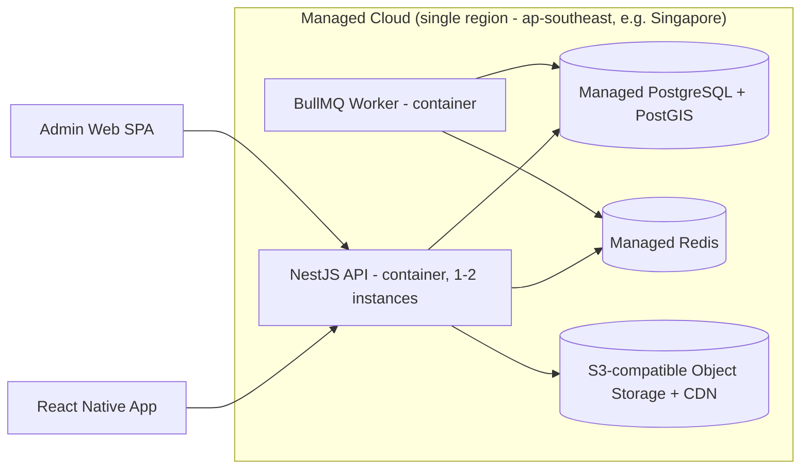

# System Architecture

Full technology rationale lives in [07-tech-stack.md](07-tech-stack.md); this document focuses on structure and data flow.

## 1. Architecture Style: Modular Monolith

**Decision:** one deployable backend service, internally organized into strict domain modules with enforced boundaries (no cross-module direct DB access), not a microservices mesh.

**Why (per project rule "không xây dựng microservices nếu chưa thật sự cần thiết"):**
- Solo/small-team velocity: one codebase, one deploy pipeline, one database to operate.
- Microservices add network latency, distributed transactions, service discovery, and multi-repo ops overhead — none of which this stage needs.
- A modular monolith with clean module boundaries (enforced via NestJS module system + lint rules against cross-module imports) can be split into services later **only where it earns its cost** (e.g., AI/moderation pipeline first, since it's the most independently scalable and swappable piece).

| | Modular Monolith | Microservices |
|---|---|---|
| Dev speed (solo/small team) | High | Low (infra tax) |
| Operational cost | 1 service, 1 DB | N services, N deploys, service mesh |
| Consistency (transactions) | Native DB transactions | Distributed transaction complexity |
| Future extraction | Possible, boundary-dependent | N/A (already split) |
| Portfolio narrative | "I know when *not* to over-engineer" | Often reads as resume-driven design |

## 2. High-Level Diagram

## 3. Module Boundaries (Backend)

| Module | Responsibility | Owns tables (primary) |
|---|---|---|
| `AuthModule` | Registration, login, OAuth, tokens, sessions | `User`, `Role`, `Permission` |
| `UserModule` | Profile, preferences, favorites | `UserProfile`, `Favorite` |
| `RestaurantModule` | Restaurant CRUD, menu, hours, facilities, status | `Restaurant`, `Address`, `Location`, `OpeningHour`, `RestaurantFacility`, `Menu`, `MenuItem`, `Dish`, `Cuisine`, `RestaurantCategory`, `PriceRange`, `RestaurantStatus`, `CrowdedStatus`, `SeatAvailability`, `PowerOutletStatus`, `ParkingInformation` |
| `SearchModule` | Query parsing, filter application, ranking | reads across `Restaurant*` (no ownership), owns `SearchHistory` |
| `ReviewModule` | Review CRUD, criteria ratings, composite scoring | `Review`, `ReviewRating`, `ReviewCriteria` |
| `MediaModule` | Signed upload URLs, image processing pipeline, thumbnails | `Photo`, `Video` |
| `ContributionModule` | Community add/edit submissions, versioning | `Contribution`, `EditSuggestion` |
| `ModerationModule` | AI screening orchestration, moderator decisions, reports | `ModerationResult`, `Report` |
| `NotificationModule` | Transactional notifications | `Notification` |
| `AIModule` (a.k.a. AI Gateway) | Provider-agnostic interface to LLM: moderation scoring, NL query parsing, summary generation | `AIRecommendation`, `AISummary` |
| `AdminModule` | Composition layer over other modules with elevated RBAC + audit | `AuditLog` |

**Rule enforced in code:** a module may only reach another module's tables through that module's exported service — never a raw repository import across module boundaries. This is the seam microservice extraction would later cut along.

## 4. AI Gateway Design (provider-agnostic, per project rule)

- All AI calls go through one internal interface (`AIGateway.moderate()`, `.parseQuery()`, `.summarize()`), each returning a strictly-typed structured result (JSON schema-validated), never raw model text passed on to business logic.
- Provider is swappable behind this interface; MVP ships one adapter (see Tech Stack doc for provider choice and reasoning).
- Every AI call and its structured output is persisted (`ModerationResult`, `AISummary`, `AIRecommendation`) for auditability and to avoid recomputation (caching).

## 5. Data Flow: Contribution → Moderation (reference flow for §06 Moderation Workflow)

## 6. Geospatial Query Path

- `Location` stored as PostGIS `geography(Point, 4326)`.
- Nearby query uses `ST_DWithin` with a GIST index for radius search; viewport query uses `ST_MakeEnvelope` + `&&` bounding-box operator for fast index-assisted pans.
- Redis caches hot viewport tiles (keyed by rounded bounds + filter hash) for a short TTL (e.g., 30–60s) to absorb rapid pan/zoom traffic without hammering Postgres.

## 7. Search Path (MVP — no separate search engine)

- MVP search runs on PostgreSQL directly using `pg_trgm` (fuzzy/typo-tolerant match) + `unaccent` (diacritics-insensitive Vietnamese matching) + a `tsvector` generated column for full-text ranking across name/description/dish names.
- This is intentionally **not** Elasticsearch/OpenSearch at MVP scale (30–50 to low-thousands of rows) — introducing a second search datastore before it's needed would violate the "no over-engineering" rule. Migration path to OpenSearch is documented as a **V2 trigger** in the Tech Stack doc once catalog size / query complexity justifies it.

## 8. Caching Strategy

| Data | Cache | TTL | Invalidation |
|---|---|---|---|
| Viewport marker queries | Redis | 30–60s | Time-based only (cheap to recompute) |
| Restaurant detail (read-heavy) | Redis | 5 min | On any write to that restaurant's core fields |
| Composite score | Stored column (materialized), recomputed on review write | N/A | Recomputed via job on review create/update/delete |
| AI Summary | Stored (`AISummary` table) | Regenerated on a schedule/threshold (e.g., every N new reviews or 7 days) | Not regenerated per request — too costly |
| Auth rate limiting | Redis (sliding window counter) | per-endpoint | N/A |

## 9. Deployment Topology (MVP, cost-optimized — detail in DevOps doc)

## 10. Extension Points (designed now, not built now)

- `Restaurant.ownerId` (nullable FK to `User`) + `Role: owner` reserved for Phase 4 claim/owner-dashboard features — no code path uses it in MVP.
- `PriceRange`/`MenuItem` schema supports a future `Order`/`Booking` entity attaching without migration surgery.
- `AIRecommendation` log table doubles as the training/eval dataset for future personalization (Phase 3), and as the audit trail for "why was this suggested" disputes.
- Notification module is built against an abstract `NotificationChannel` interface so push/email/in-app can be added independently later.
