# Database ERD

Engine: PostgreSQL 15+ with `postgis`, `pg_trgm`, `unaccent`, `uuid-ossp` (or `pgcrypto`) extensions. All primary keys are UUID v4 unless noted. All tables have `createdAt`/`updatedAt` (`timestamptz`, UTC); soft-deletable tables also have `deletedAt` (nullable `timestamptz`).

## 1. Entity Relationship Overview

```mermaid
erDiagram
  USER ||--o| USER_PROFILE : has
  USER }o--|| ROLE : has
  ROLE ||--o{ ROLE_PERMISSION : grants
  PERMISSION ||--o{ ROLE_PERMISSION : granted_via

  RESTAURANT ||--|| ADDRESS : has
  RESTAURANT ||--|| LOCATION : has
  RESTAURANT }o--|| RESTAURANT_CATEGORY : categorized_as
  RESTAURANT ||--o{ RESTAURANT_CUISINE : serves
  CUISINE ||--o{ RESTAURANT_CUISINE : tagged_on
  RESTAURANT ||--|| RESTAURANT_STATUS : has
  RESTAURANT ||--o{ OPENING_HOUR : has
  RESTAURANT ||--o{ RESTAURANT_FACILITY : offers
  RESTAURANT ||--o{ MENU : has
  MENU ||--o{ MENU_ITEM : contains
  MENU_ITEM }o--o| DISH : maps_to
  RESTAURANT }o--o| PRICE_RANGE : bucketed_as
  RESTAURANT ||--o{ PHOTO : has
  RESTAURANT ||--o{ VIDEO : has
  RESTAURANT ||--o{ CROWDED_STATUS : reported
  RESTAURANT ||--o{ SEAT_AVAILABILITY : reported
  RESTAURANT ||--o{ POWER_OUTLET_STATUS : reported
  RESTAURANT ||--o| PARKING_INFORMATION : has

  USER ||--o{ REVIEW : writes
  RESTAURANT ||--o{ REVIEW : receives
  REVIEW ||--o{ REVIEW_RATING : has
  REVIEW_CRITERIA ||--o{ REVIEW_RATING : scored_via
  REVIEW ||--o{ PHOTO : attaches

  USER ||--o{ FAVORITE : saves
  RESTAURANT ||--o{ FAVORITE : saved_by

  USER ||--o{ CONTRIBUTION : submits
  CONTRIBUTION ||--o| EDIT_SUGGESTION : detailed_by
  CONTRIBUTION ||--o| MODERATION_RESULT : screened_by
  REVIEW ||--o| MODERATION_RESULT : screened_by

  USER ||--o{ REPORT : files
  REPORT ||--o| MODERATION_RESULT : escalates_to

  USER ||--o{ NOTIFICATION : receives
  USER ||--o{ SEARCH_HISTORY : performs
  USER ||--o{ AI_RECOMMENDATION : requests
  RESTAURANT ||--o| AI_SUMMARY : summarized_by

  USER ||--o{ AUDIT_LOG : performs_as_actor
```

## 2. Identity & Access

### `User`
| Field | Type | Required | Notes |
|---|---|---|---|
| id | uuid PK | Y | |
| email | varchar(255) | Y | **unique**, lowercase-normalized |
| passwordHash | varchar(255) | N | null if OAuth-only account; bcrypt/argon2, never plaintext |
| oauthProvider | enum(`google`,`apple`,`none`) | Y | default `none` |
| oauthSubjectId | varchar(255) | N | provider's user id; **unique** with `oauthProvider` |
| phone | varchar(15) | N | VN format `+84xxxxxxxxx` |
| roleId | uuid FK → Role | Y | default `user` role on registration |
| status | enum(`active`,`suspended`,`deleted`) | Y | default `active` |
| emailVerifiedAt | timestamptz | N | soft-required, non-blocking in MVP |
| lastLoginAt | timestamptz | N | |
| createdAt/updatedAt | timestamptz | Y | |

**Index:** `email` (unique), `(oauthProvider, oauthSubjectId)` (unique, partial where not null). **Business rule:** one account per email regardless of auth method; `passwordHash` and `oauthProvider != none` are not mutually exclusive (a user may link both later — V1). **Example:** `{email: "lan.tran@gmail.com", oauthProvider: "google", roleId: <user-role-uuid>, status: "active"}`.

### `UserProfile`
| Field | Type | Required | Notes |
|---|---|---|---|
| id | uuid PK | Y | |
| userId | uuid FK → User | Y | **unique** (1:1) |
| displayName | varchar(50) | Y | |
| avatarPhotoId | uuid FK → Photo | N | |
| bio | varchar(280) | N | |
| homeCity | varchar(100) | N | for default map center when no GPS |
| createdAt/updatedAt | timestamptz | Y | |

**Business rule:** created automatically on registration with `displayName` defaulted from email local-part. **Example:** `{displayName: "Lan Trần", homeCity: "TP. Hồ Chí Minh"}`.

### `Role`
| Field | Type | Required | Notes |
|---|---|---|---|
| id | uuid PK | Y | |
| code | enum(`guest`,`user`,`moderator`,`admin`,`owner`) | Y | **unique**; `owner` reserved for Future phase |
| label | varchar(50) | Y | |

### `Permission`
| Field | Type | Required | Notes |
|---|---|---|---|
| id | uuid PK | Y | |
| code | varchar(100) | Y | **unique**, e.g. `restaurant.moderate`, `user.ban` |
| description | varchar(255) | N | |

### `RolePermission` (join table, implementation detail supporting Role/Permission)
| Field | Type | Required | Notes |
|---|---|---|---|
| roleId | uuid FK → Role | Y | composite PK with permissionId |
| permissionId | uuid FK → Permission | Y | |

**Business rule:** MVP hardcodes role→permission mapping in seed data (fine-grained runtime permission editing is **V1**); enforcement happens via a NestJS guard checking `role.permissions` cached in-memory.

## 3. Restaurant Core

### `Restaurant`
| Field | Type | Required | Notes |
|---|---|---|---|
| id | uuid PK | Y | |
| name | varchar(120) | Y | |
| slug | varchar(160) | Y | **unique**, generated from name + short hash |
| description | text | N | |
| categoryId | uuid FK → RestaurantCategory | Y | |
| priceRangeId | uuid FK → PriceRange | N | can be admin-set or computed from menu |
| phone | varchar(15) | N | VN format |
| addressId | uuid FK → Address | Y | 1:1 |
| locationId | uuid FK → Location | Y | 1:1 |
| submittedBy | uuid FK → User | N | null for admin-seeded data |
| ownerId | uuid FK → User | N | **reserved for Future** (claim/owner dashboard), unused in MVP |
| createdAt/updatedAt/deletedAt | timestamptz | Y/Y/N | |

**Index:** `slug` (unique), `categoryId`, `priceRangeId`, GIN trigram index on `name` (via `pg_trgm`) for fuzzy search. **Business rule:** `deletedAt` set = soft-hidden, never returned by public queries; hard-delete only via admin after retention window. **Example:** `{name: "Phở Hòa Pasteur", categoryId: <quán-ăn>, priceRangeId: <50-100k>}`.

### `RestaurantStatus` (1:1 extension — lifecycle & computed fields, kept separate from core facts per normalization)
| Field | Type | Required | Notes |
|---|---|---|---|
| restaurantId | uuid PK/FK → Restaurant | Y | |
| publicationStatus | enum(`pending`,`in_review`,`published`,`rejected`,`hidden`,`removed`) | Y | default `pending` |
| compositeScore | numeric(3,2) | N | 0.00–5.00, Bayesian-damped (see §8 of PRD) |
| reviewCount | int | Y | default 0 |
| lastReviewAt | timestamptz | N | |
| lastComputedAt | timestamptz | N | |

**Business rule:** `compositeScore` recomputed via background job on any `Review` create/update/delete; never computed synchronously in the request path. **Formula (MVP):** `compositeScore = ((v / (v+m)) * R) + ((m / (v+m)) * C)` where `v`=reviewCount, `m`=minimum-votes threshold (5), `R`=raw average rating, `C`=global prior mean across all published restaurants.

### `RestaurantCategory`
| Field | Type | Required | Notes |
|---|---|---|---|
| id | uuid PK | Y | |
| code | varchar(50) | Y | **unique**: `quan_an`, `quan_ca_phe`, `nha_hang`, `xe_day`, `quan_via_he`, `quan_bar` |
| label | varchar(100) | Y | |
| icon | varchar(255) | N | icon asset key |

### `Cuisine`
| Field | Type | Required | Notes |
|---|---|---|---|
| id | uuid PK | Y | |
| code | varchar(50) | Y | **unique**: `mon_viet`, `mon_han`, `mon_nhat`, `mon_chay`, `mon_thai`, `mon_au`... |
| label | varchar(100) | Y | |

### `RestaurantCuisine` (join, N:M)
| restaurantId FK, cuisineId FK | composite PK |

### `Dish`
| Field | Type | Required | Notes |
|---|---|---|---|
| id | uuid PK | Y | |
| name | varchar(100) | Y | canonical dish name, e.g. "Phở bò", "Bún chả" |
| cuisineId | uuid FK → Cuisine | N | |
| aliasKeywords | text[] | N | for search synonym matching, e.g. `{"pho bo","phở"}` |

**Business rule:** curated/admin-managed catalog used for search suggestion and menu canonicalization; not user-creatable in MVP (avoids catalog spam).

### `Menu` / `MenuItem`
| `Menu` field | Type | Required | Notes |
|---|---|---|---|
| id | uuid PK | Y | |
| restaurantId | uuid FK → Restaurant | Y | |
| name | varchar(100) | N | e.g. "Thực đơn chính", "Menu đồ uống" |
| isActive | boolean | Y | default true |

| `MenuItem` field | Type | Required | Notes |
|---|---|---|---|
| id | uuid PK | Y | |
| menuId | uuid FK → Menu | Y | |
| dishId | uuid FK → Dish | N | canonical mapping, optional |
| name | varchar(120) | Y | as written on the actual menu |
| priceVnd | integer | Y | ≥ 0, stored as whole VND |
| photoId | uuid FK → Photo | N | |
| isPopular | boolean | N | admin/algorithm-set flag ("Món được gọi nhiều") |
| category | varchar(50) | N | free-text grouping: "Khai vị", "Món chính"... |

**Validation:** `priceVnd` sanity cap < 10,000,000 (flag outliers to moderation per PRD §7 "giá bất thường"). **Example:** `{name: "Phở tái", priceVnd: 55000, category: "Món chính"}`.

### `PriceRange`
| Field | Type | Required | Notes |
|---|---|---|---|
| id | uuid PK | Y | |
| code | varchar(20) | Y | **unique**: `under_50k`, `50_100k`, `100_200k`, `200_500k`, `above_500k` |
| minVnd / maxVnd | integer / integer(nullable) | Y/N | bucket bounds, per person |

### `Address`
| Field | Type | Required | Notes |
|---|---|---|---|
| id | uuid PK | Y | |
| line | varchar(255) | Y | số nhà, tên đường |
| ward | varchar(100) | N | Phường/Xã |
| district | varchar(100) | Y | Quận/Huyện |
| province | varchar(100) | Y | Tỉnh/Thành phố |
| fullAddressText | varchar(500) | Y | denormalized full string for display/search |

**Business rule:** `province`/`district` validated against a seeded VN administrative-unit reference table (not modeled separately here to avoid over-scoping — a static lookup JSON/table maintained outside core ERD churn).

### `Location`
| Field | Type | Required | Notes |
|---|---|---|---|
| id | uuid PK | Y | |
| geoPoint | `geography(Point,4326)` | Y | PostGIS point (lng, lat) |
| lat / lng | numeric(9,6)/numeric(9,6) | Y | denormalized for easy client consumption |

**Index:** GIST index on `geoPoint` — this is the core enabler of `ST_DWithin`/bounding-box queries. **Business rule:** must resolve within Vietnam's bounding box (lat 8.0–23.4, lng 102.1–109.5) at write time.

### `OpeningHour`
| Field | Type | Required | Notes |
|---|---|---|---|
| id | uuid PK | Y | |
| restaurantId | uuid FK → Restaurant | Y | |
| dayOfWeek | smallint | Y | 0=Sunday..6=Saturday |
| openTime / closeTime | time | Y/Y | `closeTime` may be "less than" `openTime` to represent overnight (e.g., 18:00→02:00) |
| isClosed | boolean | Y | whole-day closed flag (e.g., Monday off) |

**Business rule:** at most one row per `(restaurantId, dayOfWeek)` in MVP (no split shifts yet — split-shift support is **V1**).

### `RestaurantFacility`
| Field | Type | Required | Notes |
|---|---|---|---|
| id | uuid PK | Y | |
| restaurantId | uuid FK → Restaurant | Y | |
| facilityType | enum(`wifi`,`parking_car`,`parking_motorbike`,`air_conditioner`,`outdoor_seating`,`kid_friendly`,`pet_friendly`,`card_payment`,`private_room`) | Y | |
| notes | varchar(255) | N | |

**Index:** `(restaurantId, facilityType)` unique.

## 4. Media

### `Photo`
| Field | Type | Required | Notes |
|---|---|---|---|
| id | uuid PK | Y | |
| ownerType | enum(`restaurant`,`menu_item`,`review`,`user_profile`) | Y | polymorphic attachment |
| ownerId | uuid | Y | |
| storageKey | varchar(500) | Y | object storage key/path |
| thumbnailKey | varchar(500) | N | |
| uploadedBy | uuid FK → User | N | null for admin-seeded |
| width / height | int/int | N | |
| moderationResultId | uuid FK → ModerationResult | N | |
| createdAt/deletedAt | timestamptz | Y/N | |

**Index:** `(ownerType, ownerId)`. **Business rule:** never serve `storageKey` directly with user-controlled content-type — always re-encoded server-side on upload (security, see §Security doc).

### `Video`
Same shape as `Photo` plus `durationSeconds`, `hlsManifestKey` (nullable, for later adaptive streaming). **MVP note:** schema present, upload UI is **V1**.

## 5. Reviews & Ratings

### `ReviewCriteria` (catalog)
| Field | Type | Required | Notes |
|---|---|---|---|
| id | uuid PK | Y | |
| code | varchar(50) | Y | **unique**: `food_quality`,`space`,`price`,`service`,`hygiene`,`wifi`,`parking` (MVP); `menu_accuracy`,`wait_time`,`noise_level`,`work_friendly`,`family_friendly`,`date_friendly`,`group_friendly`,`would_return` (**V1** extension per brief §8) |
| label | varchar(100) | Y | |
| appliesToCategory | uuid FK → RestaurantCategory | N | null = applies to all (e.g., `wifi` mainly relevant to cafés but not restricted) |

### `Review`
| Field | Type | Required | Notes |
|---|---|---|---|
| id | uuid PK | Y | |
| userId | uuid FK → User | Y | |
| restaurantId | uuid FK → Restaurant | Y | |
| overallRating | smallint | Y | 1–5 |
| comment | varchar(2000) | N | |
| dishesOrdered | varchar(100)[] | N | free-text tags |
| billTotalVnd | integer | N | ≥0, <50,000,000 |
| partySize | smallint | N | ≥1 |
| visitedAt | timestamptz | N | |
| waitTimeMinutes | smallint | N | |
| wouldReturn | boolean | N | |
| status | enum(`pending`,`published`,`rejected`,`hidden`) | Y | mirrors moderation pipeline |
| editedAt | timestamptz | N | non-null triggers public "Đã chỉnh sửa" marker |
| createdAt/updatedAt/deletedAt | timestamptz | Y/Y/N | |

**Index:** `(restaurantId, status)`, `(userId, restaurantId)` unique-ish constraint enforced at app layer (one active review per user per restaurant; DB unique index on `(userId, restaurantId) where deletedAt is null`). **Business rule:** re-submitting updates the existing row (versioned via `editedAt`), never creates a duplicate.

### `ReviewRating` (join: Review × ReviewCriteria with a score)
| Field | Type | Required | Notes |
|---|---|---|---|
| id | uuid PK | Y | |
| reviewId | uuid FK → Review | Y | |
| criteriaId | uuid FK → ReviewCriteria | Y | |
| score | smallint | Y | 1–5 |

**Index:** `(reviewId, criteriaId)` unique.

## 6. Community, Favorites & Contribution

### `Favorite`
| Field | Type | Required | Notes |
|---|---|---|---|
| id | uuid PK | Y | |
| userId | uuid FK → User | Y | |
| restaurantId | uuid FK → Restaurant | Y | |
| createdAt | timestamptz | Y | |

**Index:** `(userId, restaurantId)` unique.

### `Contribution` (generic envelope for any user-submitted change)
| Field | Type | Required | Notes |
|---|---|---|---|
| id | uuid PK | Y | |
| userId | uuid FK → User | Y | |
| type | enum(`new_restaurant`,`edit_suggestion`,`status_update`,`closure_report`) | Y | |
| targetRestaurantId | uuid FK → Restaurant | N | null only for brand-new restaurant creation (target created together) |
| payload | jsonb | Y | raw submitted fields, shape depends on `type` |
| status | enum(`pending`,`auto_approved`,`in_review`,`approved`,`rejected`,`edit_requested`) | Y | default `pending` |
| createdAt/updatedAt | timestamptz | Y | |

**Index:** `(userId, status)`, `(targetRestaurantId)`. **Business rule:** this is the single audit trail for "who changed what" independent of whether it was auto- or manually approved.

### `EditSuggestion` (1:1 detail for `Contribution.type = edit_suggestion`)
| Field | Type | Required | Notes |
|---|---|---|---|
| id | uuid PK | Y | |
| contributionId | uuid FK → Contribution | Y | **unique** (1:1) |
| fieldName | varchar(100) | Y | e.g. `openingHour.monday`, `menu.item.price` |
| oldValue | jsonb | N | |
| newValue | jsonb | Y | |

**Business rule:** approving an `EditSuggestion` applies `newValue` to the live entity and snapshots `oldValue` into history for restore (per brief §6 "lịch sử chỉnh sửa và khả năng khôi phục").

## 7. Moderation & Trust

### `ModerationResult`
| Field | Type | Required | Notes |
|---|---|---|---|
| id | uuid PK | Y | |
| targetType | enum(`review`,`contribution`,`photo`,`video`) | Y | polymorphic |
| targetId | uuid | Y | |
| riskScore | numeric(3,2) | Y | 0.00 (safe) – 1.00 (high risk) |
| labels | varchar(50)[] | N | e.g. `{"profanity","spam"}` |
| aiReason | text | Y | human-readable justification from AI |
| recommendedAction | enum(`auto_approve`,`hold_for_review`,`reject`) | Y | |
| decidedBy | uuid FK → User | N | null until a moderator acts (or stays null if auto-approved) |
| decision | enum(`pending`,`approved`,`rejected`,`edit_requested`) | Y | default `pending` |
| decidedAt | timestamptz | N | |
| modelVersion | varchar(50) | Y | for reproducibility/audit |
| createdAt | timestamptz | Y | |

**Index:** `(targetType, targetId)`, `(decision)`. **Business rule (hard constraint):** `recommendedAction = reject` or `riskScore` above the medium threshold can never transition to `decision = approved` without a non-null `decidedBy` (i.e., AI cannot self-approve high-risk content).

### `Report`
| Field | Type | Required | Notes |
|---|---|---|---|
| id | uuid PK | Y | |
| reporterId | uuid FK → User | Y | |
| targetType | enum(`restaurant`,`review`) | Y | |
| targetId | uuid | Y | |
| reason | enum(`spam`,`inappropriate`,`incorrect_info`,`duplicate`,`closed_down`,`other`) | Y | |
| description | varchar(500) | N | |
| status | enum(`open`,`escalated`,`resolved`,`dismissed`) | Y | default `open` |
| resolvedBy | uuid FK → User | N | |
| createdAt/resolvedAt | timestamptz | Y/N | |

**Index:** `(reporterId, targetType, targetId)` unique (prevents duplicate reports). **Business rule:** 3+ independent `closed_down` reports within a rolling 14-day window auto-creates a high-priority `ModerationResult` (does not auto-hide, per PRD §6).

## 8. Notifications & Search Intelligence

### `Notification`
| Field | Type | Required | Notes |
|---|---|---|---|
| id | uuid PK | Y | |
| userId | uuid FK → User | Y | |
| type | enum(`moderation_result`,`report_resolved`,`contribution_status`) | Y | MVP scope; social types reserved **V2** |
| payload | jsonb | Y | includes deep-link target (screen + id) |
| isRead | boolean | Y | default false |
| createdAt | timestamptz | Y | |

### `SearchHistory`
| Field | Type | Required | Notes |
|---|---|---|---|
| id | uuid PK | Y | |
| userId | uuid FK → User | N | nullable for guest (tracked by anonymous `deviceId` instead) |
| deviceId | varchar(100) | N | |
| queryText | varchar(255) | N | |
| appliedFilters | jsonb | N | |
| resultCount | int | N | |
| createdAt | timestamptz | Y | |

**Business rule:** feeds AI personalization in **V2**; MVP only stores it and surfaces "recent searches" client-side.

### `AIRecommendation`
| Field | Type | Required | Notes |
|---|---|---|---|
| id | uuid PK | Y | |
| userId | uuid FK → User | N | nullable for guest |
| rawQuery | text | Y | the natural-language input |
| parsedFilters | jsonb | Y | structured filter object the AI derived |
| returnedRestaurantIds | uuid[] | Y | |
| explanations | jsonb | Y | map of `restaurantId → explanation text` (the "vì sao đề xuất") |
| modelVersion | varchar(50) | Y | |
| createdAt | timestamptz | Y | |

### `AISummary`
| Field | Type | Required | Notes |
|---|---|---|---|
| id | uuid PK | Y | |
| restaurantId | uuid FK → Restaurant | Y | **unique** (latest-only in MVP; historical versions could be kept in **V1**) |
| summaryText | text | Y | |
| pros | varchar(255)[] | N | |
| cons | varchar(255)[] | N | |
| sourceReviewCount | int | Y | reviews considered at generation time |
| modelVersion | varchar(50) | Y | |
| generatedAt | timestamptz | Y | |

**Business rule:** not generated/shown below the minimum review threshold (PRD §10 US-J2); UI must always label this as AI-generated content.

## 9. Situational / Live-ish Status

### `CrowdedStatus`
| Field | Type | Required | Notes |
|---|---|---|---|
| id | uuid PK | Y | |
| restaurantId | uuid FK → Restaurant | Y | |
| level | enum(`empty`,`light`,`moderate`,`crowded`,`full`) | Y | |
| reportedBy | uuid FK → User | Y | |
| reportedAt | timestamptz | Y | |

**Business rule:** displayed value on Detail = most recent report within the last 2 hours, weighted by count if multiple recent reports agree; older reports decay out (not deleted, just excluded from the "current" computation).

### `SeatAvailability`
| Same shape as `CrowdedStatus` | `level` enum(`plenty`,`limited`,`full`) |

### `PowerOutletStatus`
| Same shape | `level` enum(`plenty`,`some`,`none`) — primarily relevant to `quan_ca_phe` category |

### `ParkingInformation`
| Field | Type | Required | Notes |
|---|---|---|---|
| restaurantId | uuid PK/FK → Restaurant | Y | 1:1, more static than the three above |
| hasCarParking / hasMotorbikeParking | boolean/boolean | Y/Y | |
| isFree | boolean | N | |
| notes | varchar(255) | N | |
| lastUpdatedBy | uuid FK → User | N | |
| lastUpdatedAt | timestamptz | N | |

## 10. System

### `AuditLog`
| Field | Type | Required | Notes |
|---|---|---|---|
| id | uuid PK | Y | |
| actorId | uuid FK → User | Y | must be `moderator`/`admin` role at time of action |
| action | varchar(100) | Y | e.g. `restaurant.hide`, `review.reject`, `user.suspend` |
| targetType | varchar(50) | Y | |
| targetId | uuid | Y | |
| beforeState / afterState | jsonb/jsonb | N | |
| createdAt | timestamptz | Y | |

**Index:** `(targetType, targetId)`, `(actorId, createdAt)`. **Business rule:** append-only, no update/delete ever exposed via any API — this is the system's source of truth for "what happened."

## 11. Cross-cutting Constraints Summary

- Every soft-deletable entity (`Restaurant`, `Review`, `Photo`, `Video`) excludes `deletedAt IS NOT NULL` rows from all public read paths via a default query scope.
- Every polymorphic table (`Photo`, `Video`, `ModerationResult`, `Report`) validates `ownerType`/`targetType` against an application-level enum, not a DB-level polymorphic FK (Postgres has no native polymorphic FK — integrity enforced in the service layer + covered by tests).
- All money fields are `integer` VND — never `float`/`decimal` with implied currency ambiguity.
- All enums are implemented as Postgres native `enum` types (not free-text) to get constraint-level validation for a schema this size.
