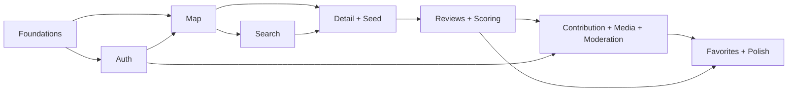

# Product Roadmap & Sprint Plan

Assumption (stated per project rule on unspecified inputs): solo/small-team pace, 2-week sprints, part-time-to-full-time equivalent effort. Adjust sprint count, not scope, if actual velocity differs.

## 1. Phase Roadmap

### Phase 0 — Product Design *(this document set)*
- **Mục tiêu:** Lock vision, personas, MVP boundary, architecture, data model, and roadmap before writing code.
- **Tính năng:** N/A (design artifacts): vision, market/competitive analysis, personas, wireframe direction, design system tokens, ERD, architecture, API contract shape.
- **Phụ thuộc:** None.
- **Rủi ro:** Scope creep before a line of code is written. **Mitigation:** hard MVP boundary in [01-prd-mvp.md](01-prd-mvp.md) §11.
- **Tiêu chí hoàn thành:** All 10 Phase-0 deliverables exist and are internally consistent (this doc set).
- **Chỉ số đo lường:** Design docs reviewed/approved by the one stakeholder (project owner) — binary go/no-go.

### Phase 1 — MVP
- **Mục tiêu:** Ship a usable, demoable, portfolio-credible product: discover, review, contribute, moderate.
- **Tính năng:** Auth, Map, GPS, Search/Filter, Restaurant Detail, Structured Review, Add Restaurant, Upload Media, Favorites, Admin Moderation.
- **Phụ thuộc:** Phase 0 complete; seed dataset ready (see Demo Data Plan, referenced in Portfolio doc).
- **Rủi ro:** Solo-dev burnout from breadth; AI cost creep; map performance at higher marker density. **Mitigation:** sprint-scoped delivery below, caching per architecture doc.
- **Tiêu chí hoàn thành:** All P0 user stories in [02-user-stories.md](02-user-stories.md) pass acceptance criteria; 30–50 seed restaurants live; moderation queue functional end-to-end.
- **Chỉ số đo lường:** Time-to-first-result on map <2s p95; 0 critical security findings open; demo walkthrough completes without a crash.

### Phase 2 — Community
- **Mục tiêu:** Turn passive users into an active contribution loop.
- **Tính năng:** Follow, like, comment, check-in, feed, contributor ranking, badges, Food Passport.
- **Phụ thuộc:** MVP live with real usage data; `Contribution`/`AuditLog` schema already supports attribution (no migration surgery needed).
- **Rủi ro:** Social features without a real user base feel hollow. **Mitigation:** gate Phase 2 kickoff on a minimum real/seed engagement signal, not a calendar date.
- **Tiêu chí hoàn thành:** Feed + follow graph functional; badges awarded automatically from existing `Contribution`/`Review` history.
- **Chỉ số đo lường:** % of MAU who follow ≥1 user; contributor retention (7/30-day).

### Phase 3 — AI
- **Mục tiêu:** Deepen the AI differentiator beyond MVP's basic NL-to-filter parsing.
- **Tính năng:** Full conversational natural-language search, personalized recommendation (using `SearchHistory`/`Favorite`/`AIRecommendation` history), richer AI Food Summary, adaptive AI trust scoring for reviews/contributors, "what should I eat today" meal suggestion.
- **Phụ thuộc:** Sufficient review/search volume for personalization to outperform generic ranking; `AIRecommendation` log accumulated since MVP.
- **Rủi ro:** LLM cost scaling with usage; hallucinated recommendations damaging trust. **Mitigation:** cache aggressively, cap AI-search calls per user/day, always ship the "why" explanation for auditability.
- **Tiêu chí hoàn thành:** AI search handles the 10 example queries from the brief (§9) correctly; AI summary regenerates automatically on a schedule/threshold.
- **Chỉ số đo lường:** AI-search result click-through rate vs. standard filter search; user-reported "helpful" rate on AI summaries.

### Phase 4 — Business
- **Mục tiêu:** Give restaurant owners a reason to actively participate.
- **Tính năng:** Claim restaurant, owner verification, owner dashboard (views/saves/direction-clicks), promotions, review responses, basic analytics.
- **Phụ thuộc:** `Restaurant.ownerId`/`Role.owner` already reserved in schema since MVP (§05 Extension Points) — this phase activates dormant fields, doesn't add new migrations to core tables.
- **Rủi ro:** Verification fraud (fake owner claims). **Mitigation:** manual admin verification step before any owner-write-access is granted.
- **Tiêu chí hoàn thành:** ≥1 real claimed restaurant with an active owner using the dashboard.
- **Chỉ số đo lường:** Claim conversion rate among contacted/eligible restaurants.

### Phase 5 — Monetization
- **Mục tiêu:** Prove revenue-capable architecture without compromising trust in the core discovery product.
- **Tính năng:** Advertising, featured placement, booking, affiliate, vouchers, membership, food ordering, commission.
- **Phụ thuộc:** Meaningful owner adoption from Phase 4; payment/compliance review (out of engineering scope for this document set).
- **Rủi ro:** Monetization pressure eroding review/ranking trust (e.g., pay-to-rank). **Mitigation:** composite score and paid placement must remain visually/architecturally separate — paid placement is a labeled slot, never a silent ranking boost.
- **Tiêu chí hoàn thành:** First paid transaction processed end-to-end in a sandboxed/test environment.
- **Chỉ số đo lường:** Revenue per active restaurant; user trust metric (e.g., "do you trust the ranking?" survey) holds steady pre/post monetization launch.

## 2. Phase 1 (MVP) — Detailed Sprint Plan

8 sprints × 2 weeks ≈ **16 weeks** for a solo builder working consistently; compressible with more hours/week or an extra contributor, expandable if this is a nights-and-weekends pace.

| Sprint | Theme | Scope | Exit criteria |
|---|---|---|---|
| **S1** | Foundations | Repo scaffolding (backend NestJS modular skeleton, RN Expo app skeleton, shared types package); CI skeleton; Postgres+PostGIS+Redis local via Docker Compose; DB migrations for Identity + Restaurant Core tables (§06 ERD §2–3) | `docker compose up` boots API+DB+Redis; empty RN app builds on both platforms; migrations run clean |
| **S2** | Auth + Profile | `AuthModule` (register/login/refresh/logout/forgot-password), Google/Apple OAuth, `UserProfile`; RN screens: Splash, Onboarding, Permission Location, Login, Register, Forgot Password | US-A1–A4 pass acceptance criteria; JWT refresh rotation verified with a test |
| **S3** | Map & Geospatial core | PostGIS nearby/bounds queries, `RestaurantModule` read APIs, RN Home Map with clustering, marker preview, GPS permission fallback | US-B1–B4 pass; viewport pan/zoom refetch debounced and measured <2s p95 on seed data |
| **S4** | Search & Filter | `pg_trgm`/`unaccent`/`tsvector` search, filter query params, RN Search/Search Result/Filter screens, Home List | US-C1–C4 pass; Vietnamese diacritics-insensitive search verified with test cases |
| **S5** | Restaurant Detail + Admin seed tooling | Detail API aggregating menu/hours/facilities/reviews, RN Detail/Gallery/Menu screens; Admin Restaurant Management CRUD (used immediately to seed 30–50 places) | Detail renders full data for a seeded restaurant with all empty-states verified; 30–50 places seeded via Admin |
| **S6** | Reviews + Composite Scoring | `ReviewModule`, `ReviewRating`/`ReviewCriteria`, Bayesian composite score job (BullMQ), RN Reviews/Write Review screens | US-E1–E5 pass; composite score formula unit-tested against known input/output pairs |
| **S7** | Contribution + Media + Moderation (baseline AI) | `ContributionModule`, `MediaModule` (signed upload, compression, magic-byte validation), `ModerationModule` + `AIGateway` first adapter (Claude), Admin Moderation Queue, RN Add Restaurant/Select Location/Upload Media/Submission Status/Report Content | US-F1–F4, US-G1–G2, US-J1 pass; fail-safe verified (AI outage → content held, never auto-published) |
| **S8** | Favorites, Notifications, Polish, Hardening | `Favorite`, `Notification` (transactional only), RN Favorites/Profile/Edit Profile/Notifications/Settings; security pass (rate limiting, input validation, upload hardening — see Security doc); performance pass; bug bash | All P0 stories green end-to-end; security checklist in DevOps/Testing docs signed off; demo script (Portfolio doc) runs without a crash |

**Buffer:** no sprint above reserves slack; if real velocity is lower, absorb by deferring P2-tagged user stories (marked in [02-user-stories.md](02-user-stories.md)) to a Sprint 9, not by cutting P0 scope.

## 3. Dependency Chain (why this sprint order)

Rationale: Auth must exist before anything write-gated (reviews, contribution); Detail needs both Map (location context) and Search (to reach a restaurant) as entry points; Moderation naturally follows Reviews+Contribution since it's the pipeline consuming their output; Favorites/Notifications are low-risk and pushed last so they absorb schedule slippage without blocking anything else.

## 4. Post-MVP Phase Sequencing (indicative, re-scope after real MVP usage data)

| | Phase 2 (Community) | Phase 3 (AI) | Phase 4 (Business) | Phase 5 (Monetization) |
|---|---|---|---|---|
| Est. duration | 6–8 weeks | 6–10 weeks | 6–8 weeks | 8–12 weeks |
| Trigger to start | MVP has real seed engagement | Sufficient review/search volume logged | Phase 2/3 stable, owner interest validated | Owner adoption from Phase 4 proven |
