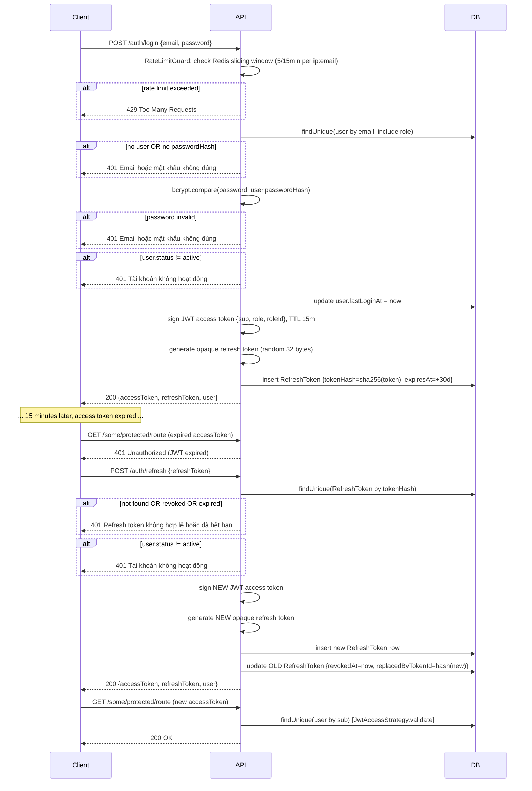
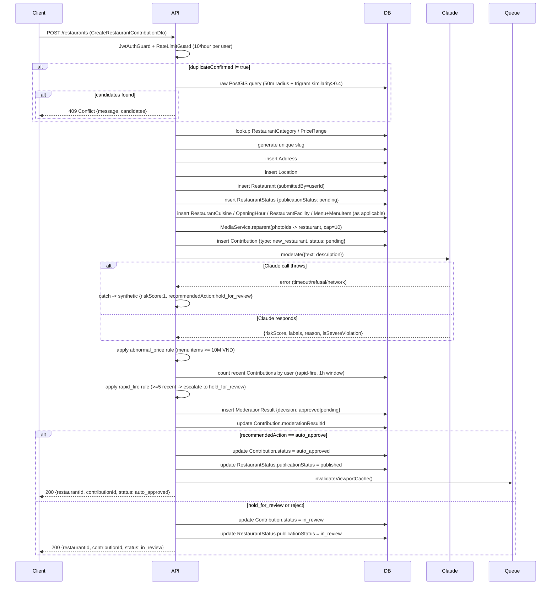
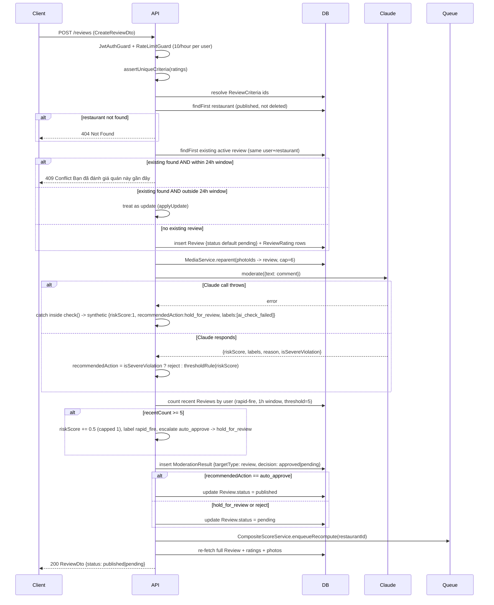
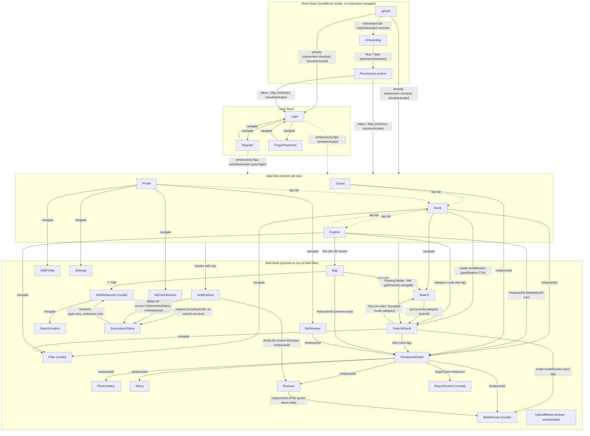

# Full Specification — The Food Map of Vietnam

> **Status**: as-built, current-state documentation. Unlike `01-prd-mvp.md` through `09-testing-plan.md` (the original product/build plan), this document describes the system **as it is actually implemented today**, across backend, admin web, and mobile, down to exact field-level DTO contracts, worked numeric examples for the core algorithms, and full per-screen UX state coverage on mobile. Where the implementation has diverged from or gone beyond the original plan, this doc reflects reality. Last generated: 2026-08-16.

## Table of contents

1. [Product overview](#1-product-overview)
2. [Backend](#2-backend-backend)
   - 2.1 [Global setup](#21-global-setup)
   - 2.2 [Data model — full schema](#22-data-model--full-schema)
   - 2.3 [Core flows (sequence diagrams)](#23-core-flows)
   - 2.4 [Business rules deep dive (worked examples)](#24-business-rules-deep-dive)
   - 2.5 [Modules, endpoints & DTOs](#25-modules-endpoints--dtos)
3. [Admin Web](#3-admin-web-admin-web)
4. [Mobile — "Ngon v3"](#4-mobile-mobile--ngon-v3)
   - 4.1 [Navigation graph](#41-navigation-graph)
   - 4.2 [Screens — exhaustive UX states](#42-screens--exhaustive-ux-states)
   - 4.3 [State management](#43-state-management)
   - 4.4 [API client, push, i18n](#44-api-client-push-i18n)
5. [Known gaps / honest placeholder inventory](#5-known-gaps--honest-placeholder-inventory)
6. [Changelog — fixes made while producing this spec](#6-changelog--fixes-made-while-producing-this-spec)

---

## 1. Product overview

The Food Map of Vietnam is a restaurant discovery and review platform with three client surfaces sharing one backend:

- **Backend** (`backend/`) — NestJS modular monolith, PostgreSQL+PostGIS (Prisma), Redis, S3-compatible storage, Anthropic Claude for moderation/AI summaries, Expo push delivery.
- **Admin Web** (`admin-web/`) — Vite/React internal tool for admins and moderators to manage restaurants, review moderation queue, published reviews, and users.
- **Mobile** (`mobile/`) — Expo/React Native (SDK 57) end-user app, recently reskinned to the "Ngon v3" design language (4-tab + floating "Write" shortcut navigation).
- **Public Web** (`web/`) — Next.js (App Router) SEO-focused end-user site: SSR Home/Search/Restaurant-detail/District pages backed by the live `GET /search`/`GET /restaurants/...` endpoints, `sitemap.ts`/`robots.ts`, `en`/`vi` i18n, plus a deliberately minimal server-side login + favorites layer (`web/src/lib/auth.ts`, `web/src/app/api/favorites/*`) that overrides `docs/build-prompts/09-public-web.md`'s original "no web auth" scope boundary. **Not covered in depth in the rest of this document** (the sections below focus on backend/admin-web/mobile per the original ask) — see §5 for its one known gap.

### Cross-cutting architecture facts

- Single Prisma schema (`backend/prisma/schema.prisma`) is the one source of truth for the data model; both admin-web and mobile talk to the same REST API, no separate GraphQL/BFF layer.
- Auth is uniform across clients: `POST /auth/login` issues a short-lived JWT access token + opaque refresh token pair for anyone, regardless of role. Admin-web additionally rejects (client-side) any role outside `{admin, moderator}` after that same login call — there is no separate admin login endpoint.
- Every piece of user/community-submitted content (reviews, contributions, photos) passes through the same moderation primitives (`ModerationResult`, Claude gateway with a rule-based fallback, a shared risk-score threshold) before going live.
- "Never fabricate fake statistics" is an explicit, repeated design principle in the mobile codebase: static placeholder *goals*/*labels* are used freely where no backend concept exists yet, but no screen invents fake counts, histograms, or activity about real user-generated content — gaps are shown honestly (`"—"`, "chưa có", "coming soon") instead.

---

## 2. Backend (`backend/`)

**Stack**: NestJS (modular monolith) · PostgreSQL + PostGIS via Prisma (raw `$queryRaw` for geo/full-text search) · Redis (cache + rate-limiting + BullMQ queues) · S3-compatible object storage (MinIO locally) · Anthropic Claude (moderation + AI summaries) · Expo push.

### 2.1 Global setup

- Global `ValidationPipe`: `whitelist: true`, `forbidNonWhitelisted: true`, `transform: true` — unknown fields rejected, DTOs auto-transformed.
- Global `AllExceptionsFilter`; `LoggingMiddleware` on all routes.
- CORS via `CORS_ORIGINS` env var (comma-separated origins, `credentials: true`).
- No Swagger/OpenAPI module registered.
- BullMQ (via `REDIS_URL`) runs two in-process worker queues: `composite-score` (recompute job) and `photo-cleanup` (hourly orphan sweep, self-scheduling).
- Modules wired in `AppModule`: Auth, User, Restaurant, Search, Review, Favorite, Media, Contribution, Moderation, Notification, Ai, Admin (+ Prisma/Redis/Health infra modules).

**Key environment variables** (`env.example`): `DATABASE_URL`, `REDIS_URL`, `JWT_ACCESS_SECRET`/`JWT_ACCESS_TTL`/`JWT_REFRESH_TTL`, OAuth provider IDs/secrets (Google/Apple/Facebook), S3 connection settings, `AI_SUMMARY_MIN_REVIEW_COUNT`/`AI_SUMMARY_REFRESH_INTERVAL_DAYS`, `ANTHROPIC_API_KEY` (absent → rule-based text moderation fallback, images always held for review, summaries never generated), `AI_MODERATION_MODEL`/`AI_MODERATION_TIMEOUT_MS`, `AI_SUMMARY_MODEL`.

### 2.2 Data model — full schema

Source: `backend/prisma/schema.prisma` (891 lines), documented field-by-field below — complete enough to redraw the schema from this section alone.

#### Enums (verbatim)

```
enum OAuthProvider { google apple facebook none }
enum UserStatus { active suspended deleted }
enum RoleCode { guest user moderator admin owner }
enum RestaurantPublicationStatus { pending in_review published rejected hidden removed }
enum FacilityType { wifi parking_car parking_motorbike air_conditioner outdoor_seating kid_friendly pet_friendly card_payment private_room }
enum PhotoOwnerType { restaurant menu_item user_profile review contribution }
enum PhotoStatus { pending approved rejected }
enum ReviewStatus { pending published rejected hidden }
enum ModerationTargetType { review contribution photo video restaurant }
enum ModerationRecommendedAction { auto_approve hold_for_review reject }
enum ModerationDecision { pending approved rejected edit_requested }
enum ContributionType { new_restaurant edit_suggestion status_update closure_report }
enum ContributionStatus { pending auto_approved in_review approved rejected edit_requested }
enum ReportTargetType { restaurant review }
enum ReportReason { spam inappropriate incorrect_info duplicate closed_down other }
enum ReportStatus { open escalated resolved dismissed }
enum CrowdedLevel { empty light moderate crowded full }
enum SeatAvailabilityLevel { plenty limited full }
enum PowerOutletLevel { plenty some none }
enum NotificationType { moderation_result report_resolved contribution_status }
enum PushPlatform { ios android }
```

#### Identity & Access

**`Role`** (`roles`) — `id` PK, `code` (unique, `RoleCode`), `label`. Back-relations: `RolePermission[]`, `User[]`.

**`Permission`** (`permissions`) — `id` PK, `code` (unique), `description?`. Back-relation: `RolePermission[]`.

**`RolePermission`** (`role_permissions`) — composite-PK join table (`@@id([roleId, permissionId])`), both FKs `onDelete: Cascade`.

**`User`** (`users`) — `id` PK · `email` (unique) · `passwordHash?` (null for OAuth-only accounts) · `oauthProvider` (default `none`) · `oauthSubjectId?` · `phone?` · `roleId` FK → `Role` · `status` (default `active`) · `emailVerifiedAt?` · `lastLoginAt?` · `createdAt`/`updatedAt`. Table constraint `@@unique([oauthProvider, oauthSubjectId])` (Postgres treats each `(none, NULL)` row as distinct, intentionally). Relations: `profile` (1:1 `UserProfile`), `submittedRestaurants`/`ownedRestaurants` (two separately-named `Restaurant[]` relations), `refreshTokens`, `passwordResetTokens`, `searchHistory`, `uploadedPhotos`, `auditLogs`, `reviews`, `moderationDecisions` (named `ModerationDecidedBy`), `favorites`, `notifications`, `pushTokens`, `contributions`, `reportsFiled`/`reportsResolved` (two named `Report[]` relations), `crowdedStatusReports`, `seatAvailabilityReports`, `powerOutletReports`, `parkingInfoUpdates`.

**`RefreshToken`** (`refresh_tokens`) — `id` PK · `userId` FK (`onDelete: Cascade`) · `tokenHash` (unique, SHA-256 of the raw token) · `expiresAt` · `revokedAt?` · `replacedByTokenId?` · `createdAt`. Index `[userId]`.

**`PasswordResetToken`** (`password_reset_tokens`) — `id` PK · `userId` FK (Cascade) · `tokenHash` (unique) · `expiresAt` (30-min rule) · `usedAt?` (single-use marker) · `createdAt`. Index `[userId]`.

**`UserProfile`** (`user_profiles`) — `id` PK · `userId` (unique FK, 1:1, Cascade) · `displayName` · `avatarPhotoId?` (plain id, no FK — predates the Media module) · `bio?` · `homeCity?` · `createdAt`/`updatedAt`.

#### Restaurant core

**`RestaurantCategory`** (`restaurant_categories`) — `id` PK, `code` (unique), `label`, `icon?`. Relations: `restaurants`, `reviewCriteria`.

**`Cuisine`** (`cuisines`) — `id` PK, `code` (unique), `label`. Relations: `dishes`, `restaurantCuisines`.

**`RestaurantCuisine`** (`restaurant_cuisines`) — composite-PK join (`@@id([restaurantId, cuisineId])`), both FKs Cascade.

**`Dish`** (`dishes`) — `id` PK · `name` (`@@unique`, for find-or-create seeding) · `cuisineId?` FK · `aliasKeywords` (`String[]`, default `[]`). Relation: `menuItems`.

**`PriceRange`** (`price_ranges`) — `id` PK, `code` (unique, e.g. `under_50k`), `minVnd`, `maxVnd?` (null = open-ended top bucket). Relation: `restaurants`.

**`Address`** (`addresses`) — `id` PK, `line`, `ward?`, `district`, `province`, `fullAddressText` (computed join of the parts). Back-ref: `restaurant?` (1:1).

**`Location`** (`locations`) — `id` PK, `lat`/`lng` (`Decimal(9,6)`), `geoPoint` (`Unsupported("geography(Point,4326)")`, DB-trigger-synced from lat/lng, not writable via Prisma Client). Back-ref: `restaurant?` (1:1).

**`Restaurant`** (`restaurants`) — `id` PK · `name` · `slug` (unique) · `description?` · `categoryId` FK · `priceRangeId?` FK · `phone?` · `addressId` (unique FK, 1:1) · `locationId` (unique FK, 1:1) · `submittedBy?` FK → `User` (relation `SubmittedRestaurants`) · `ownerId?` FK → `User` (relation `OwnedRestaurants`) · `createdAt`/`updatedAt`/`deletedAt?` (soft delete) · `searchVector` (`Unsupported("tsvector")`, generated STORED column over name+description, unaccented, GIN-indexed, not writable via Prisma Client). Relations: `status` (1:1 `RestaurantStatus`), `cuisines`, `openingHours`, `facilities`, `menus`, `reviews`, `favorites`, `contributions`, `aiSummary` (1:1), `crowdedStatuses`, `seatAvailabilities`, `powerOutletStatuses`, `parkingInformation` (1:1). Indexes: `[categoryId]`, `[priceRangeId]`.

**`RestaurantStatus`** (`restaurant_status`) — 1:1 detail table, PK = FK (`restaurantId`, Cascade) · `publicationStatus` (default `pending`) · `compositeScore?` (`Decimal(3,2)`) · `reviewCount` (default `0`) · `lastReviewAt?` · `lastComputedAt?` — the denormalized cache every read path relies on.

**`OpeningHour`** (`opening_hours`) — `id` PK, `restaurantId` FK (Cascade), `dayOfWeek` (0=Sun..6=Sat), `openTime?`/`closeTime?` (`@db.Time`), `isClosed` (default `false`). Constraint `@@unique([restaurantId, dayOfWeek])`.

**`RestaurantFacility`** (`restaurant_facilities`) — `id` PK, `restaurantId` FK (Cascade), `facilityType`, `notes?`. Constraint `@@unique([restaurantId, facilityType])`.

**`Menu`** (`menus`) — `id` PK, `restaurantId` FK (Cascade), `name?`, `isActive` (default `true`). Relation: `items`.

**`MenuItem`** (`menu_items`) — `id` PK, `menuId` FK (Cascade), `dishId?` FK, `name`, `priceVnd`, `photoId?` (plain id, no FK yet), `isPopular` (default `false`), `category?`.

#### Search intelligence

**`SearchHistory`** (`search_history`) — write-only in MVP, no read API. `id` PK, `userId?` FK (`onDelete: SetNull`), `deviceId?`, `queryText?`, `appliedFilters?` (Json), `resultCount?`, `createdAt`. Index `[userId]`.

#### Media

**`Photo`** (`photos`) — `id` PK · `ownerType` (polymorphic, app-validated, no real FK) · `ownerId?` (nullable until reparented) · `storageKey` · `thumbnailKey?` · `uploadedBy?` FK (`onDelete: SetNull`) · `width?`/`height?`/`mimeType?`/`fileSizeBytes?` · `status` (default `pending`, gates public visibility) · `moderationResultId?` FK · `createdAt`/`deletedAt?`. Index `[ownerType, ownerId]`.

#### Reviews & ratings

**`ReviewCriteria`** (`review_criteria`) — `id` PK, `code` (unique), `label`, `appliesToCategoryId?` FK. Relation: `ratings`.

**`Review`** (`reviews`) — `id` PK · `userId` FK · `restaurantId` FK · `overallRating` (Int, 1–5) · `comment?` · `dishesOrdered` (`String[]`, default `[]`) · `billTotalVnd?` · `partySize?` · `visitedAt?` · `waitTimeMinutes?` · `wouldReturn?` · `status` (default `pending`) · `editedAt?` (set only if edited >48h after `createdAt`) · `createdAt`/`updatedAt`/`deletedAt?` (soft). Relation: `ratings`. Index `[restaurantId, status]`. **Important**: "one active review per user per restaurant" is enforced by a hand-written **partial unique index** `reviews_user_id_restaurant_id_active_key` on `(user_id, restaurant_id) WHERE deleted_at IS NULL` in raw migration SQL — not expressible in the Prisma DSL, deliberately not a plain `@@unique`.

**`ReviewRating`** (`review_ratings`) — `id` PK, `reviewId` FK (Cascade), `criteriaId` FK, `score` (Int, 1–5). Constraint `@@unique([reviewId, criteriaId])`.

#### Moderation & trust

**`ModerationResult`** (`moderation_results`) — `id` PK · `targetType` (polymorphic) · `targetId` (app-validated) · `riskScore` (`Decimal(3,2)`) · `labels` (`String[]`, default `[]`) · `aiReason` · `recommendedAction` · `decidedBy?` FK (relation `ModerationDecidedBy`) · `decision` (default `pending`) · `decidedAt?` · `modelVersion` · `createdAt`. Relations: `contribution?` (1:1 back-ref), `photos`. Indexes: `[targetType, targetId]`, `[decision]`.

#### Contribution

**`Contribution`** (`contributions`) — `id` PK · `userId` FK · `type` · `targetRestaurantId?` FK (null only for a brand-new restaurant submission) · `payload` (Json, generic envelope) · `status` (default `pending`) · `moderationResultId?` (unique FK) · `createdAt`/`updatedAt`. Indexes: `[userId, status]`, `[targetRestaurantId]`.

**`EditSuggestion`** (`edit_suggestions`) — 1:1 detail row for `type = edit_suggestion`. `id` PK, `contributionId` (unique FK, Cascade), `fieldName` (app-layer allow-listed), `oldValue?` (Json), `newValue` (Json).

**`Report`** (`reports`) — `id` PK · `reporterId` FK (relation `ReportedBy`) · `targetType` · `targetId` · `reason` · `description?` · `status` (default `open`) · `resolvedBy?` FK (relation `ReportResolvedBy`) · `createdAt`/`resolvedAt?`. Constraint `@@unique([reporterId, targetType, targetId])`.

#### AI Summary

**`AISummary`** (`ai_summaries`) — read-side only, 1:1. `id` PK, `restaurantId` (unique FK, Cascade), `summaryText`, `pros`/`cons` (`String[]`, default `[]`), `sourceReviewCount`, `modelVersion`, `generatedAt`.

#### Situational / live-ish status

**`CrowdedStatus`** / **`SeatAvailability`** / **`PowerOutletStatus`** — all insert-only logs with the same shape: `id` PK, `restaurantId` FK (Cascade), `level`, `reportedBy` FK, `reportedAt` (default `now()`). Index `[restaurantId, reportedAt]` on each. "Current" value is derived by the reading service from the most-recent row, never stored as a single mutable field.

**`ParkingInformation`** (`parking_information`) — 1:1, PK = FK (`restaurantId`, Cascade), upserted in place: `hasCarParking`, `hasMotorbikeParking`, `isFree?`, `notes?`, `lastUpdatedBy?` FK, `lastUpdatedAt?`.

#### Favorites & notifications

**`Favorite`** (`favorites`) — `id` PK, `userId` FK (Cascade), `restaurantId` FK (Cascade), `createdAt`. Constraint `@@unique([userId, restaurantId])`.

**`Notification`** (`notifications`) — `id` PK, `userId` FK (Cascade), `type`, `payload` (Json deep-link target, e.g. `{screen, restaurantId}`), `isRead` (default `false`), `createdAt`. Index `[userId, isRead]`.

**`PushToken`** (`push_tokens`) — `id` PK, `userId` FK (Cascade), `token` (unique), `platform`, `createdAt`. Index `[userId]`.

#### System

**`AuditLog`** (`audit_log`) — append-only. `id` PK, `actorId` FK, `action`, `targetType`, `targetId`, `beforeState?`/`afterState?` (Json), `createdAt`. Indexes: `[targetType, targetId]`, `[actorId, createdAt]`.

#### Entity-relationship diagram

```mermaid
erDiagram
    Role ||--o{ User : "roleId"
    Role ||--o{ RolePermission : "roleId"
    Permission ||--o{ RolePermission : "permissionId"
    User ||--o| UserProfile : "userId"
    User ||--o{ RefreshToken : "userId"
    User ||--o{ PasswordResetToken : "userId"
    User ||--o{ Restaurant : "submittedBy"
    User ||--o{ Restaurant : "ownerId"
    User ||--o{ SearchHistory : "userId"
    User ||--o{ Photo : "uploadedBy"
    User ||--o{ AuditLog : "actorId"
    User ||--o{ Review : "userId"
    User ||--o{ ModerationResult : "decidedBy"
    User ||--o{ Favorite : "userId"
    User ||--o{ Notification : "userId"
    User ||--o{ PushToken : "userId"
    User ||--o{ Contribution : "userId"
    User ||--o{ Report : "reporterId"
    User ||--o{ Report : "resolvedBy"
    User ||--o{ CrowdedStatus : "reportedBy"
    User ||--o{ SeatAvailability : "reportedBy"
    User ||--o{ PowerOutletStatus : "reportedBy"
    User ||--o{ ParkingInformation : "lastUpdatedBy"
    RestaurantCategory ||--o{ Restaurant : "categoryId"
    RestaurantCategory ||--o{ ReviewCriteria : "appliesToCategoryId"
    Cuisine ||--o{ Dish : "cuisineId"
    Cuisine ||--o{ RestaurantCuisine : "cuisineId"
    Restaurant ||--o{ RestaurantCuisine : "restaurantId"
    PriceRange ||--o{ Restaurant : "priceRangeId"
    Address ||--|| Restaurant : "addressId"
    Location ||--|| Restaurant : "locationId"
    Restaurant ||--o| RestaurantStatus : "restaurantId"
    Restaurant ||--o{ OpeningHour : "restaurantId"
    Restaurant ||--o{ RestaurantFacility : "restaurantId"
    Restaurant ||--o{ Menu : "restaurantId"
    Menu ||--o{ MenuItem : "menuId"
    Dish ||--o{ MenuItem : "dishId"
    Restaurant ||--o{ Review : "restaurantId"
    Review ||--o{ ReviewRating : "reviewId"
    ReviewCriteria ||--o{ ReviewRating : "criteriaId"
    Restaurant ||--o{ Favorite : "restaurantId"
    Restaurant ||--o{ Contribution : "targetRestaurantId"
    Contribution ||--o| EditSuggestion : "contributionId"
    Contribution ||--o| ModerationResult : "moderationResultId"
    ModerationResult ||--o{ Photo : "moderationResultId"
    Restaurant ||--o| AISummary : "restaurantId"
    Restaurant ||--o{ CrowdedStatus : "restaurantId"
    Restaurant ||--o{ SeatAvailability : "restaurantId"
    Restaurant ||--o{ PowerOutletStatus : "restaurantId"
    Restaurant ||--o| ParkingInformation : "restaurantId"
```



### 2.3 Core flows

#### 2.3a Login + later silent token refresh

**Login, step by step**: `RateLimitGuard` checks a Redis sliding-window sorted set (5 attempts/15min per `ip:email`) → looks up the user by lowercased email (incl. role) → generic `401` if no user or no `passwordHash` (OAuth-only account) — same message either way, no enumeration → `bcrypt.compare` the password, same generic `401` on mismatch → distinct `401 'Tài khoản không hoạt động'` if `status !== 'active'` → writes `lastLoginAt` → issues a session: signs a JWT (`{sub, role, roleId}`, `JWT_ACCESS_SECRET`, TTL from `JWT_ACCESS_TTL` default `15m`) + generates an opaque refresh token (`randomBytes(32).toString('hex')`) + inserts a `RefreshToken` row storing only `sha256(token)` (never the plaintext) with `expiresAt = now + JWT_REFRESH_TTL` (default `30d`).

**Refresh rotation, exact order**: hash the incoming plaintext token → look up the `RefreshToken` row by hash → `401` if not found, revoked, or expired (identical message for all three) → `401 'Tài khoản không hoạt động'` if the owning user isn't active → **issue the brand-new session BEFORE touching the old token** (so a mid-request crash leaves the user with one valid token, never zero) → only then mark the old row `revokedAt = now`, `replacedByTokenId = hash(new token)` for audit/rotation-chain tracing. Reuse of an already-rotated token is rejected outright — no "reuse detection reverses the whole family" logic, just the simple `revokedAt` check.

**JWT verification** (`JwtAccessStrategy`): signature + expiry checked by Passport first → `validate(payload)` does a **live DB lookup** (`user.findUnique({id: payload.sub})`) and throws `401` if the user is gone or `status !== 'active'` — so a suspended/deleted account loses API access immediately, not just at the token's next 15-minute expiry, even though the JWT itself is still cryptographically valid.



#### 2.3b New-restaurant contribution: submit → moderate → finalize

Duplicate-check (unless `duplicateConfirmed: true`) runs a raw PostGIS query — restaurants within 50m AND trigram name-similarity > 0.4 — and aborts with `409 + candidates` before any writes if matches exist. Otherwise: resolve category/price-range → generate a unique slug → insert `Address` → insert `Location` → insert `Restaurant` (`submittedBy: userId`) → insert `RestaurantStatus{publicationStatus: 'pending'}` → optionally bulk-insert cuisines/opening-hours/facilities/menu (menu items best-effort matched against the curated `Dish` catalog, never creating a new `Dish`) → `MediaService.reparent()` attaches the pre-uploaded photos (10-photo cap) → insert `Contribution{type:'new_restaurant', status:'pending'}` → run moderation (Claude text check + abnormal-menu-price rule + rapid-fire rule) → insert `ModerationResult` and link it back to the contribution → **finalize**: `auto_approve` flips `Contribution.status → 'auto_approved'` and `RestaurantStatus.publicationStatus → 'published'` (+ invalidates the viewport cache); anything else sets both to `'in_review'`. The endpoint never synchronously returns `'rejected'` — only a later real moderator decision can do that.

**Closure-report side rule** (same service, different contribution kind): 3+ distinct users' `closure_report` contributions on the same restaurant within a rolling 14-day window escalate the latest report's `ModerationResult` to `riskScore=1.00`/`hold_for_review`/`decision:'pending'` — but never reopens an item a human moderator (`decidedBy` non-null) already decided, and never auto-hides the restaurant.



#### 2.3c Review: submit → moderate → publish/hold

`assertUniqueCriteria` rejects duplicate criteria codes in one submission → resolve criteria ids → verify the target restaurant is published/not-deleted (else `404`) → check for an existing active review by this user (one-active-review-per-user-per-restaurant rule): within 24h of last touch → `409` blocked entirely; outside 24h → treated as an update; none → new `Review` row (`ReviewRating` rows nested) → `MediaService.reparent()` attaches photos (6-photo cap) → **moderation**: Claude text check, with a structural **rapid-fire layer always applied on top** (≥5 reviews by the same user in the last hour pushes `riskScore += 0.5` (capped at 1), adds label `rapid_fire`, and downgrades `auto_approve → hold_for_review` — never de-escalates a Claude `reject`) → any Claude call failure is caught **inside** `check()` itself and converted to a fail-safe synthetic result (`riskScore:1, recommendedAction:'hold_for_review', labels:['ai_check_failed']`) so `check()` itself never throws → write `ModerationResult` (`decision: 'approved'` only if `auto_approve`, never self-approves high risk) → `Review.status` set to `published` or `pending` accordingly → enqueue an async composite-score recompute (BullMQ, decoupled from the response) → return the full `ReviewDto`.

An **edit** re-runs the exact same moderation call against the new comment, so editing can re-flip a published review back to `pending` (or vice versa) based on fresh output; `editedAt` is only bumped if the edit happens >48h after original creation.



**Claude failure handling, summarized**: failure is caught in exactly one place per moderation type (review/contribution/photo), never left to bubble to the controller; the fallback is always `riskScore:1, labels:['ai_check_failed'], recommendedAction:'hold_for_review'` — never `auto_approve`, never `reject` (a failure means "unknown risk," not "safe" or "confirmed violation"). A `ModerationResult` row is still written, so the item stays visible in the Admin Moderation Queue during a Claude outage instead of silently auto-publishing or vanishing. Separately, if `ANTHROPIC_API_KEY` is simply unset (a config state, not a runtime failure), text falls back to a deterministic rule-based heuristic and any accompanying image — unscreenable by that heuristic — is forced to `hold_for_review` with label `image_unscreened_no_api_key`.

### 2.4 Business rules deep dive

#### 2.4a Composite score — Bayesian average, worked examples

Formula (`composite-score.util.ts`):

```
compositeScore = (v / (v + m)) * R + (m / (v + m)) * C
```

- `v` = published, non-deleted review count for the restaurant
- `R` = that restaurant's raw average `overallRating`
- `m` = **`MIN_VOTES_THRESHOLD = 5`** (hard-coded — "minimum votes before a raw average is trusted on its own")
- `C` = the **live** platform-wide average `overallRating` across all published reviews, recomputed on every call — **not** a fixed constant. The one actual hard-coded fallback is `DEFAULT_GLOBAL_PRIOR = 3.5`, used only if literally zero published reviews exist anywhere (true cold start). The worked examples below use `C = 3.5`.
- Returns `null` when `v = 0` — a review-less restaurant never gets a fabricated score. Persisted rounded to 2dp.

**(a) New restaurant, 1 review, 5★** — `v=1, R=5.0, C=3.5, m=5`:
```
1/6 × 5.0 = 0.833333
5/6 × 3.5 = 2.916667
compositeScore = 3.75
```
A single 5★ review is pulled almost all the way down toward the 3.5 prior — at `v=1`, the prior carries 5/6 of the weight.

**(b) 5 reviews averaging 4.2★** — `v=5, R=4.2, C=3.5, m=5`:
```
5/10 × 4.2 = 2.10
5/10 × 3.5 = 1.75
compositeScore = 3.85
```
At `v = m = 5`, the restaurant's own average and the global prior are weighted exactly 50/50.

**(c) 50 reviews averaging 3.8★** — `v=50, R=3.8, C=3.5, m=5`:
```
50/55 × 3.8 = 3.454545
5/55  × 3.5 = 0.318182
compositeScore = 3.77 (rounded)
```
With `v ≫ m`, the score sits very close to the raw average — the prior only nudges it down by 0.03.

**Takeaway**: volume matters more than a single extreme rating. The unit test suite (`composite-score.util.spec.ts`) enforces the general invariant that a 2-review, 5★ restaurant scores strictly lower than a 50-review, 4.6★-average restaurant.

#### 2.4b Search ranking — exact SQL and a worked example

Ranking expression:
```sql
GREATEST(
  ts_rank_cd(r.search_vector, plainto_tsquery('simple', immutable_unaccent($q))),
  similarity(immutable_unaccent(r.name), immutable_unaccent($q))
) AS text_rank
```
(`text_rank = 0` for every row in pure browse mode with no `q`.) `GREATEST` — not `ts_rank_cd` alone — exists so a row that only matches via fuzzy name similarity (not full-text) doesn't tie with unrelated rows at a flat `0`; folding in trigram similarity lets a strong fuzzy match (near-exact name typo) outrank a weak one.

Full `ORDER BY`:
```sql
ORDER BY
  text_rank DESC,
  rs.composite_score DESC NULLS LAST,
  distance_meters ASC NULLS LAST,
  r.created_at DESC
LIMIT 500
```
Tier order: **relevance → quality → proximity → recency**. `NAME_SIMILARITY_THRESHOLD = 0.4` gates whether a fuzzy-name match qualifies as a *candidate* at all (`WHERE` clause) — it does not affect the ranking expression itself.

**Worked example — query "Cơm tấm", 3 candidates:**

| Restaurant | `ts_rank_cd` | `similarity` | `compositeScore` | distance (m) |
|---|---|---|---|---|
| A — "Cơm Tấm Sài Gòn" | 0.12 | 0.55 | 4.10 | 1200 |
| B — "Quán Cơm Tấm Bà Ba" | 0.45 | 0.30 | 3.90 | 500 |
| C — "Cơm Tấm 3 Miền" | 0.45 | 0.20 | 4.50 | 2000 |

1. `text_rank = GREATEST(ts_rank_cd, similarity)`: A → `GREATEST(0.12,0.55)=0.55`; B → `GREATEST(0.45,0.30)=0.45`; C → `GREATEST(0.45,0.20)=0.45`.
2. Sort by `text_rank DESC`: **A leads outright** (0.55). B and C tie at 0.45 and fall through.
3. Tiebreak B vs C by `compositeScore DESC`: `C=4.50 > B=3.90` → **C ranks above B**.

**Final order: A, C, B.** A wins purely on trigram name-strength despite a low `ts_rank_cd`; when B and C tie on text relevance, the better-reviewed C (4.50) beats the closer-but-lower-rated B (3.90, despite being 500m away vs. C's 2000m) — proximity is only consulted after quality, never before it.

#### 2.4c Moderation risk threshold — table and boundary rule

```ts
export const MEDIUM_RISK_THRESHOLD = 0.5;
export function recommendActionForRiskScore(riskScore) {
  return riskScore >= MEDIUM_RISK_THRESHOLD ? 'hold_for_review' : 'auto_approve';
}
```

| `riskScore` | Result |
|---|---|
| 0.1 | `auto_approve` |
| 0.3 | `auto_approve` |
| **0.5** | **`hold_for_review`** |
| 0.7 | `hold_for_review` |
| 0.95 | `hold_for_review` |

**Boundary**: the comparison is `>=`, so **0.5 is inclusive of `hold_for_review`**, not `auto_approve` — only scores strictly below 0.5 auto-approve (a deliberately cautious "round up to caution" boundary). This single constant is the shared source of truth for both `ClaudeGatewayService.moderate()` (which derives `recommendedAction` from this function rather than trusting whatever label Claude itself returns) and `assertDecisionAllowed()` — the app-level twin of the DB CHECK constraint `moderation_results_hard_rule_chk` — which throws before any write attempting to set `decision='approved'` while `recommendedAction==='reject'` or `riskScore>=0.5`, unless a real human `decidedBy` is present.

Two escalation paths sit **on top of** this function and can only escalate, never downgrade: (1) `'reject'` — a third value Claude alone can produce (`isSevereViolation`), never reachable by the rule-based fallback since it can pattern-match but not judge severity; (2) the **rapid-fire override** (+0.5 risk, capped at 1, forces `auto_approve→hold_for_review` at ≥5 submissions/hour by the same user) — a structural signal no single-text scorer can see. A Claude network failure synthesizes `riskScore:1, hold_for_review`; no API key + an image present synthesizes `riskScore:0.5, hold_for_review` (images have no rule-based equivalent, so they're always held).

### 2.5 Modules, endpoints & DTOs

#### `auth` — base `/auth`, `RateLimitGuard` (5/15min on sensitive routes, keyed `ip:email` pre-auth)

| Endpoint | Auth | Purpose |
|---|---|---|
| `POST /auth/register` | public | Create user, issue session |
| `POST /auth/login` | public, 5/15min | Email/password login, generic error message |
| `POST /auth/oauth/{google,apple,facebook}` | public | Verify provider token, link-or-create, issue session |
| `POST /auth/refresh` | public | Rotate refresh token |
| `POST /auth/logout` | public (body-based) | Revoke a given refresh token |
| `POST /auth/forgot-password` | public, 5/15min | Always-identical response; 30-min reset token; **dev-log email stub, no real provider** |
| `POST /auth/reset-password` | public | Consume token, set new password, revoke all refresh tokens |

**DTOs**:

| DTO | Field | Type | Decorators |
|---|---|---|---|
| `LoginDto` | email | string | `@IsEmail()` |
| | password | string | `@IsString()` |
| `RegisterDto` | email | string | `@IsEmail()` |
| | password | string | `@MinLength(8)`, `@Matches(/\d/)` (≥1 digit) |
| | displayName | string? | `@IsOptional()`, `@IsString()`, `@MaxLength(50)` |
| `RefreshDto` | refreshToken | string | `@IsString()` |
| `OAuthLoginDto` | idToken | string | `@IsString()` — Google/Apple JWT ID token, or Facebook access token; same wire field for all three |
| `ForgotPasswordDto` | email | string | `@IsEmail()` |
| `ResetPasswordDto` | token | string | `@IsString()` |
| | newPassword | string | `@MinLength(8)`, `@Matches(/\d/)` |

JWT payload: `{ sub, role, roleId }`, `HS256`, secret `JWT_ACCESS_SECRET`, TTL `JWT_ACCESS_TTL` (default `15m`). Permission checks combine coarse `@Roles`/`RolesGuard` with fine-grained `@RequirePermissions`/`PermissionsGuard` (60s in-memory roleId→permission-code cache).

#### `user` — base `/me`, all `JwtAuthGuard`

`GET /me` (profile + resolved avatar URL) · `PATCH /me/profile` (partial update; `avatarPhotoId` validated as an owned, approved photo) · `DELETE /me` (soft, anonymizing delete — never hard-deletes, preserves review/contribution audit integrity — email rewritten to `deleted-<uuid>@deleted.local`, all refresh tokens revoked).

#### `restaurant` — base `/restaurants`, all public

| Endpoint | Purpose |
|---|---|
| `GET /restaurants/nearby` | PostGIS radius search, clamped 0.1–20km, capped 200 results |
| `GET /restaurants/bounds` | Viewport query, Redis-cached 45s |
| `GET /restaurants/sitemap-index` | All published slugs + updatedAt, for public-web sitemap |
| `GET /restaurants/slug/:slug` | Clean-URL detail lookup |
| `GET /restaurants/:id` | Full detail |
| `GET /restaurants/:id/ai-summary` | Only returns `available:true` if a fresh `AISummary` exists AND review count still meets the minimum |

**DTOs**:

| DTO | Field | Type | Decorators |
|---|---|---|---|
| `BoundsQueryDto` | swLat/swLng/neLat/neLng | number | `@Type(()=>Number)`, `@IsLatitude()`/`@IsLongitude()` |
| `NearbyQueryDto` | lat/lng | number | `@Type(()=>Number)`, `@IsLatitude()`/`@IsLongitude()` |
| | radiusKm | number? | `@IsOptional()`, `@Type(()=>Number)`, `@IsNumber()`, `@Min(0.1)` — deliberately **no** `@Max`; the service silently clamps to a 20km hard cap instead of rejecting out-of-range input |

`isOpenNow` is computed on fixed UTC+7 (no DST), correctly handling overnight hours (close < open) by also checking "yesterday's" row spilling past midnight. Viewport cache is invalidated by a global version counter bumped on every admin restaurant mutation.

<details><summary><code>GET /restaurants/:id</code> response example</summary>

```json
{
  "id": "3b6a5f2e-9d41-4c2a-9a77-1f8c2e0d9a11",
  "name": "Phở Hòa Pasteur",
  "slug": "pho-hoa-pasteur",
  "description": "Quán phở lâu đời tại Quận 3, nổi tiếng với nước dùng đậm đà và thịt bò tươi.",
  "categoryCode": "quan_an",
  "cuisineCodes": ["mon_viet"],
  "phone": "+84283822980",
  "address": {
    "line": "260C Pasteur",
    "ward": "Phường Võ Thị Sáu",
    "district": "",
    "province": "Thành phố Hồ Chí Minh",
    "fullAddressText": "260C Pasteur, Phường Võ Thị Sáu, Thành phố Hồ Chí Minh"
  },
  "location": { "lat": 10.788231, "lng": 106.694124 },
  "priceRange": { "code": "50_100k", "minVnd": 50000, "maxVnd": 100000 },
  "openingHours": [
    { "dayOfWeek": 0, "openTime": "06:00", "closeTime": "22:00", "isClosed": false }
  ],
  "isOpenNow": true,
  "facilities": ["wifi", "air_conditioner", "card_payment"],
  "menus": [{
    "id": "5d4c3b2a-1e0f-4a9b-8c7d-6e5f4a3b2c1d",
    "name": "Thực đơn chính",
    "items": [
      { "id": "1a2b3c4d-5e6f-4a7b-8c9d-0e1f2a3b4c5d", "name": "Phở tái nạm gầu", "priceVnd": 75000, "category": "Phở", "isPopular": true }
    ]
  }],
  "photos": [{ "id": "8c1e2a3b-4d5f-4a6b-9c7d-1e2f3a4b5c6d", "url": "https://cdn.foodmap.vn/photos/8c1e2a3b.jpg", "width": 1600, "height": 1200 }],
  "compositeScore": 4.62,
  "reviewCount": 128,
  "reviews": [{ "id": "f1a2b3c4-d5e6-4f70-8a9b-0c1d2e3f4a5b", "overallRating": 5, "comment": "Rất ngon, sẽ quay lại!", "status": "published" }]
}
```
</details>

<details><summary><code>GET /restaurants/bounds</code> response example (plain array, not paginated)</summary>

```json
[
  {
    "id": "3b6a5f2e-9d41-4c2a-9a77-1f8c2e0d9a11",
    "slug": "pho-hoa-pasteur",
    "name": "Phở Hòa Pasteur",
    "categoryCode": "quan_an",
    "thumbnailUrl": "https://cdn.foodmap.vn/photos/8c1e2a3b-thumb.jpg",
    "compositeScore": 4.62,
    "reviewCount": 128,
    "priceRange": { "code": "50_100k", "minVnd": 50000, "maxVnd": 100000 },
    "lat": 10.788231, "lng": 106.694124,
    "distanceMeters": null,
    "isOpenNow": true
  }
]
```
</details>

#### `search` — `GET /search` (with `q`) and `GET /restaurants` (browse) share one implementation

**`SearchQueryDto`** fields: `q?` (string) · `lat?`/`lng?` (`@IsLatitude()`/`@IsLongitude()`) · `distanceKm?` (`@Min(0.1)`, no max — service clamps to 20km) · `priceMin?`/`priceMax?` (`@Min(0)` each) · `minRating?` (`@Min(1)@Max(5)`) · `openNow?` (boolean, CSV-tolerant transform) · `facilities?`/`cuisine?` (CSV-string→array transform, `@IsIn` each) · `category?` (`@IsIn` 6 codes) · `district?`/`province?`/`ward?` (string) · `page?`/`pageSize?` (`@Min(1)`, pageSize `@Max(50)`).

Facilities filter requires ALL requested facilities present; cuisine filter is ANY-of. `openNow`/`minRating` applied in JS post-hydration (not clean single SQL predicates given overnight-hours logic and honest-null compositeScore). Every call writes a write-only `SearchHistory` row (best-effort JWT decode from the header for attribution only, never enforced).

<details><summary><code>GET /search</code> example</summary>

Request: `GET /search?q=ph%E1%BB%9F&province=Th%C3%A0nh%20ph%E1%BB%91%20H%E1%BB%93%20Ch%C3%AD%20Minh&minRating=4&facilities=wifi,card_payment&page=1&pageSize=20`

```json
{
  "items": [
    {
      "id": "3b6a5f2e-9d41-4c2a-9a77-1f8c2e0d9a11", "slug": "pho-hoa-pasteur", "name": "Phở Hòa Pasteur",
      "categoryCode": "quan_an", "thumbnailUrl": "https://cdn.foodmap.vn/photos/8c1e2a3b-thumb.jpg",
      "compositeScore": 4.62, "reviewCount": 128,
      "priceRange": { "code": "50_100k", "minVnd": 50000, "maxVnd": 100000 },
      "lat": 10.788231, "lng": 106.694124, "distanceMeters": null, "isOpenNow": true
    }
  ],
  "total": 2, "page": 1, "pageSize": 20
}
```
</details>

#### `review` — three controllers: `/reviews`, `/restaurants/:restaurantId/reviews`, `/me/reviews`

| Endpoint | Auth | Purpose |
|---|---|---|
| `POST /reviews` | Jwt + 10/hr | Create-or-update the caller's one active review per restaurant |
| `PATCH /reviews/:id` | Jwt, owner-only | Update; `editedAt` set only >48h post-creation |
| `DELETE /reviews/:id` | Jwt, owner-only | Soft delete, triggers recompute |
| `GET /restaurants/:restaurantId/reviews` | public | Paginated published reviews + per-criteria breakdown |
| `GET /me/reviews` | Jwt | Caller's own history, all statuses |

**DTOs**: `ReviewRatingInputDto` (`criteriaCode` `@IsIn(7 codes)`, `score` `@IsInt @Min(1)@Max(5)`) · `CreateReviewDto` (`restaurantId` `@IsUUID()`; `overallRating` `@IsInt@Min(1)@Max(5)`; `ratings` `@ArrayMinSize(1)` nested; `comment?` `@MaxLength(2000)`; `dishesOrdered?` `@ArrayMaxSize(20)` each `@MaxLength(100)`; `billTotalVnd?` `@Min(0)@Max(49_999_999)`; `partySize?` `@Min(1)`; `visitedAt?` `@IsISO8601()`; `waitTimeMinutes?` `@Min(0)`; `wouldReturn?` boolean; `photoIds?` `@ArrayMaxSize(6)` UUIDs) · `UpdateReviewDto` (same, minus `restaurantId`, all optional — a provided `ratings` is a full replace) · `ReviewListQueryDto` (`sort?` ∈ `newest/most_helpful/has_photos`; `filter?` exact-rating `@Min(1)@Max(5)`; `page?`/`pageSize?`) · `MyReviewListQueryDto` (`page?`/`pageSize?`).

`sort=has_photos` reorders reviews-with-≥1-approved-photo first, computed across the full matching set before pagination (Photo has no real FK back to Review); `most_helpful` degrades silently to newest (no helpfulness-vote model exists).

<details><summary><code>POST /reviews</code> request + response example</summary>

Request:
```json
{
  "restaurantId": "3b6a5f2e-9d41-4c2a-9a77-1f8c2e0d9a11",
  "overallRating": 5,
  "ratings": [
    { "criteriaCode": "food_quality", "score": 5 },
    { "criteriaCode": "service", "score": 4 },
    { "criteriaCode": "hygiene", "score": 5 },
    { "criteriaCode": "price", "score": 4 }
  ],
  "comment": "Phở Hòa Pasteur đúng chuẩn vị Sài Gòn, nước dùng ngọt xương thanh, không bị béo.",
  "dishesOrdered": ["Phở tái nạm gầu", "Phở đặc biệt", "Trà đá"],
  "billTotalVnd": 145000,
  "partySize": 2,
  "visitedAt": "2026-08-10T04:30:00.000Z",
  "waitTimeMinutes": 12,
  "wouldReturn": true,
  "photoIds": ["8c1e2a3b-4d5f-4a6b-9c7d-1e2f3a4b5c6d"]
}
```

Response (`201 Created`):
```json
{
  "id": "f1a2b3c4-d5e6-4f70-8a9b-0c1d2e3f4a5b",
  "restaurantId": "3b6a5f2e-9d41-4c2a-9a77-1f8c2e0d9a11",
  "author": { "id": "9e8d7c6b-5a4f-4b3c-8d2e-1f0a9b8c7d6e", "displayName": "Hoa Nguyễn" },
  "overallRating": 5,
  "ratings": [{ "criteriaCode": "food_quality", "score": 5 }],
  "comment": "Phở Hòa Pasteur đúng chuẩn vị Sài Gòn...",
  "status": "pending",
  "editedAt": null,
  "createdAt": "2026-08-13T08:42:11.000Z",
  "photos": [{ "id": "8c1e2a3b-4d5f-4a6b-9c7d-1e2f3a4b5c6d", "url": "https://cdn.foodmap.vn/photos/8c1e2a3b.jpg", "width": 1600, "height": 1200 }]
}
```
</details>

<details><summary><code>GET /restaurants/:id/reviews</code> response example</summary>

```json
{
  "items": [
    { "id": "f1a2b3c4-...", "overallRating": 5, "comment": "Phở Hòa Pasteur đúng chuẩn vị Sài Gòn.", "status": "published", "createdAt": "2026-08-13T08:42:11.000Z" }
  ],
  "total": 128, "page": 1, "pageSize": 10,
  "ratingBreakdown": [
    { "code": "food_quality", "label": "Chất lượng món ăn", "averageScore": 4.7, "ratingCount": 128 },
    { "code": "wifi", "label": "Wifi", "averageScore": null, "ratingCount": 0 }
  ]
}
```
</details>

#### `favorite` — all `JwtAuthGuard`

`POST`/`DELETE /favorites/:restaurantId` (idempotent) · `GET /me/favorites` (paginated, `FavoriteListQueryDto`: `page?`/`pageSize? @Max(50)`) · `GET /me/favorites/ids` (unpaginated id set, for O(1) client-side "is favorited" checks). No separate create/toggle DTO — the restaurant id comes from the route param.

#### `media` — base `/media`, all `JwtAuthGuard`

`POST /media/upload-url` (`CreateUploadUrlDto`: `contentType` `@IsIn(['image/jpeg','image/png','image/webp'])`, `fileSizeBytes` `@IsInt@Min(1)` — the 8MB cap is enforced in the service, not the DTO — returns a presigned S3 PUT URL, 300s expiry) · `POST /media/confirm` (`ConfirmUploadDto`: `storageKey`, `ownerType` `@IsIn(['restaurant','review','contribution','user_profile'])`, `ownerId?` `@IsUUID()` — validates via HEAD size check + magic-byte sniff, **server-side re-encodes to JPEG** (client content-type never trusted), then **synchronously moderates** before returning) · `DELETE /media/:id` (owner or admin/moderator).

`MediaService.reparent()` atomically re-points unattached photos onto a real owner (caps: review=6, restaurant=10, contribution=10, user_profile=1). `sweepOrphans()` hard-deletes unattached photos >24h old, hourly via BullMQ.

#### `contribution` — all `JwtAuthGuard`, any `user` role

| Endpoint | Extras | Purpose |
|---|---|---|
| `POST /restaurants/duplicate-check` | — | Trigram + 50m-radius duplicate candidates |
| `POST /restaurants` | 10/hr | Submit new restaurant |
| `POST /restaurants/:id/edit-suggestions` | — | Propose a field change (allow-listed fields only) |
| `POST /restaurants/:id/status-reports` | 10/hr | Discriminated-union status report |
| `GET /me/contributions` | — | Caller's history |
| `GET /contributions/:id` | — | Owner-only detail |

**DTOs**: `ContributionAddressDto` (`line`/`ward`/`province` required `@MaxLength`; `district?` legacy, defaults `''`) · `ContributionLocationDto` (`lat`/`lng`) · `ContributionOpeningHourDto` (`dayOfWeek` `0–6`; `openTime?`/`closeTime?` `HH:mm` regex; `isClosed`) · `ContributionMenuItemDto` (`name` `@MaxLength(120)`; `priceVnd` `@Min(0)@Max(50_000_000)`; `category?`; `isPopular?`) · `CreateRestaurantContributionDto` (`name` `@MinLength(2)@MaxLength(120)`; `description?` `@MaxLength(2000)`; `categoryCode` `@IsIn(6 codes)`; `priceRangeCode?` `@IsIn(5 codes)`; `phone?` `@IsPhoneNumber('VN')`; `address`/`location` nested-validated; `cuisineCodes?` `@IsIn(6 codes) each`; `openingHours?` exactly 7 entries (`@ArrayMinSize(7)@ArrayMaxSize(7)`) or omitted entirely; `facilities?` `@IsIn(9 codes) each`; `menuItems?` `@ArrayMaxSize(100)`; `photoIds` **required**, `@ArrayMinSize(1)@ArrayMaxSize(10)`; `duplicateConfirmed?` boolean) · `CreateEditSuggestionDto` (`fieldName` `@IsIn` a fixed 9-value allow-list; `newValue` `@IsDefined()`, no shape validation since it depends on `fieldName`) · `CreateStatusReportDto` (`kind` `@IsIn(8 values)`, plus `@ValidateIf(kind===...)`-conditioned sibling fields per kind) · `DuplicateCheckDto` (`lat`/`lng`/`name`) · `ContributionListQueryDto` (`page?`/`pageSize?`).

<details><summary><code>POST /restaurants</code> (contribution) request + response example</summary>

Request:
```json
{
  "name": "Bún Chả Hương Liên",
  "description": "Quán bún chả nhỏ, bàn ghế nhựa, khách vào ra liên tục vào giờ trưa.",
  "categoryCode": "quan_an",
  "priceRangeCode": "under_50k",
  "phone": "+84987654321",
  "address": { "line": "24 Lê Văn Hưu", "ward": "Phường Ngô Thì Nhậm", "province": "Thành phố Hà Nội" },
  "location": { "lat": 21.020556, "lng": 105.855123 },
  "cuisineCodes": ["mon_viet"],
  "openingHours": [
    { "dayOfWeek": 0, "openTime": "10:00", "closeTime": "20:00", "isClosed": false },
    { "dayOfWeek": 6, "openTime": null, "closeTime": null, "isClosed": true }
  ],
  "facilities": ["card_payment"],
  "menuItems": [{ "name": "Bún chả suất thường", "priceVnd": 45000, "category": "Bún chả", "isPopular": true }],
  "photoIds": ["a1b2c3d4-e5f6-4a7b-8c9d-0e1f2a3b4c5d"],
  "duplicateConfirmed": true
}
```

Response (`201 Created`):
```json
{
  "restaurantId": "d9e8f7a6-b5c4-4d3e-9f2a-1b0c9d8e7f6a",
  "contributionId": "e0f1a2b3-c4d5-4e6f-8a7b-9c0d1e2f3a4b",
  "status": "pending"
}
```
</details>

#### `moderation` — shared primitives + user reports

`POST /reports` (`CreateReportDto`: `targetType` `@IsIn(['restaurant','review'])`; `targetId` `@IsUUID()`; `reason` `@IsIn(6 codes)`; `description?` `@MaxLength(500)` — unique per reporter+target, ensures queue visibility) · `ResolveReportDto` (`status` `@IsIn(['resolved','dismissed'])`, used by the admin endpoint below).

No standalone `ModerationCheckResult` DTO class — it's a plain interface (`{riskScore, labels, aiReason, recommendedAction}`) shared internally between review/contribution/photo moderation services. See §2.4c for the threshold logic itself.

#### `notification` — all `JwtAuthGuard`

`GET /me/notifications` (`NotificationListQueryDto`: `page?`/`pageSize? @Max(50)`) · `PATCH /me/notifications/:id/read` · `POST /me/push-tokens` (`RegisterPushTokenDto`: `token` `@MaxLength(200)`; `platform` `@IsEnum(['ios','android'])` — upserted on the token's own unique constraint) · `DELETE /me/push-tokens/:token`.

Only real producer today: `AdminModerationService.decide()`. `NotificationService.create()` is the single choke-point every notification passes through, always attempting best-effort push delivery afterward (failure logged, never blocks the write). Push delivery (Expo SDK): chunked send via `sendPushNotificationsAsync`; any `DeviceNotRegistered` ticket deletes that stale token.

#### `ai` — no own controller, consumed internally

No class-validator DTOs — these are internal service contracts, not controller bodies. Plain interfaces (`ai-gateway.interface.ts`): `ModerateContentInput{text: string|null, imageUrls?: string[]}` · `StructuredFilter{cuisine?, facilities?, priceMin?, priceMax?, district?, openNow?}` (feeds the currently-uncalled `parseQuery` NL-search method) · `AISummaryResult{summaryText, pros[], cons[]}` · `AIGateway{moderate(), parseQuery(), summarize()}`.

`ClaudeGatewayService.moderate()` — `AI_MODERATION_MODEL` (claude-haiku-4-5), 8s timeout, structured JSON output; images fetched server-side and sent as base64 vision blocks (never a URL source — Claude can't reach internal storage); `recommendedAction` derived from `riskScore` via the shared threshold function (§2.4c), not trusted directly from Claude — only `isSevereViolation` can force `reject`. No API key → text falls back to rule-based heuristic; images have no fallback, always held.

`.summarize()` — `AI_SUMMARY_MODEL` (claude-opus-5), up to 50 most-recent commented published reviews, structured JSON. No fallback by design — on failure the restaurant just stays in its honest "no summary yet" state. `AiSummaryService.regenerateIfNeeded()` (triggered off the review-mutation path via BullMQ) regenerates only on first threshold-crossing and every `AI_SUMMARY_REFRESH_INTERVAL_DAYS` thereafter, and only if ≥1 review has a comment; fully fail-safe.

#### `admin` — five controllers, `JwtAuthGuard` + `RolesGuard`

**Dashboard** (`admin`+`moderator`): `GET /admin/dashboard` — KPIs + 30-day activity series (bucketed in JS) + rating distribution.

**Moderation** (`admin`+`moderator`, no override): `GET /admin/moderation-queue` (`AdminModerationQueryDto`: `targetType?` `@IsIn(5 codes)`; `decision?` `@IsIn(4 codes)`, defaults `pending` in the service; `page?`/`pageSize? @Max(100)`) · `POST /admin/moderation-queue/:id/decision` (`ModerationDecisionDto`: `decision` `@IsIn(['approved','rejected','edit_requested'])`; `reason?` `@MaxLength(500)`, required unless approving — enforced in the service, not `@ValidateIf`, for a clearer error message) · `PATCH /admin/reports/:id/resolve` (`ResolveReportDto`).

**Restaurant** (`admin`+`moderator`; hard delete **admin-only**): full CRUD — `CreateRestaurantDto`/`UpdateRestaurantDto` reuse `AddressInputDto`/`LocationInputDto`; `AdminRestaurantQueryDto` (`status?`, `province?`, `district?`, `ward?`, `search?`, `page?`/`pageSize? @Max(100)`) — plus `ReplaceOpeningHoursDto` (`days`: exactly 7 `OpeningHourEntryDto`, `HH:mm` strings converted to `Date(1970-01-01THH:mm)` server-side), `ReplaceFacilitiesDto` (`facilities`: `@IsIn(9 codes) each`, full-set replace), `CreateMenuItemDto`/`UpdateMenuItemDto` (`priceVnd` capped at `10,000,000` — a tighter sanity cap than the contribution flow's 50M), `AttachPhotoDto` (`url` `@IsUrl({protocols:['https']})`; `width?`/`height?` — admin-supplied URL, bypasses user moderation, `status:approved` immediately).

**Review** (`admin`+`moderator` list; hide/restore/hard-delete **admin-only**): `AdminReviewQueryDto` (`restaurantId?`/`userId?` UUID; `status?`; `minRiskScore?` `@Min(0)@Max(1)` — reviews with no `ModerationResult` yet are excluded when set; `search?`; `page?`/`pageSize? @Max(100)`).

**User** (`admin`+`moderator` list/detail; suspend/reactivate/role-change **admin-only**): `AdminUserQueryDto` (`search?`, `role?` `@IsIn(5 codes)`, `status?` `@IsIn(3 codes)`, `page?`/`pageSize? @Max(100)`) · `UpdateUserRoleDto` (`roleCode` `@IsIn(5 codes)`). Rules: an admin can never suspend/role-change themselves; the last remaining active admin can never be suspended/demoted.

`AuditLogService.record()` is called at every admin mutation site.

---

## 3. Admin Web (`admin-web/`)

**Stack**: Vite + React + TypeScript, React Router, TanStack React Query, hand-rolled inline-SVG charts (no charting library).

### 3.1 Architecture

- **Auth**: no dedicated admin login endpoint — calls the same `POST /auth/login`, then client-side rejects (and discards the token for) any role outside `{admin, moderator}`. Session (`{accessToken, user}`) persisted in `localStorage` (short-lived 15-min tokens, treated as a low-sensitivity internal tool); no refresh-token flow — a 401 just surfaces as an error.
- **Routing**: `/login` public; everything else behind `ProtectedRoute` + `AppLayout` (sidebar/header shell). Routes: `/` (dashboard), `/restaurants`, `/restaurants/new`, `/restaurants/:id`, `/moderation`, `/reviews`, `/users`.
- **API client**: thin `fetch` wrapper, auto-attaches bearer token, parses NestJS's error shape into a typed `ApiError`.
- **Role gating pattern**: sensitive/destructive actions restricted to `admin` are *disabled* (not hidden) for `moderator`, with an explanatory tooltip.
- **List-page convention** (shared across all 4 management pages): debounced search, filter dropdowns resetting to page 1, React Query with `placeholderData: previous`, manual prev/next pagination.

### 3.2 Pages

| Page | Route | Purpose | Key API calls |
|---|---|---|---|
| **AdminLoginPage** | `/login` | Gatekeeper login for admin/moderator only | `POST /auth/login` |
| **AdminDashboardPage** | `/` | KPI cards each deep-linking to a filtered destination page; 7/30-day activity chart; rating-distribution chart | `GET /admin/dashboard` |
| **AdminModerationQueuePage** | `/moderation` | Tabbed by target type, filterable by decision, expandable decision panel (reason required unless approving), inline nested-report resolution | `GET /admin/moderation-queue`, `POST /admin/moderation-queue/:id/decision`, `PATCH /admin/reports/:id/resolve` |
| **AdminRestaurantManagementPage** | `/restaurants` | Search/filter by status/province/ward/legacy district; per-row hide/restore/hard-delete (delete admin-only) | `GET /admin/restaurants`, `POST :id/hide`, `POST :id/restore`, `DELETE :id` |
| **AdminRestaurantEditPage** | `/restaurants/new`, `/restaurants/:id` | Create/edit core fields; 4 independent sub-sections: opening hours (7-row full-replace), facilities (full-set replace), menu (inline CRUD), photos (URL-based, no upload pipeline) | `GET/POST/PATCH/DELETE /admin/restaurants[/:id]`, `PUT :id/opening-hours`, `PUT :id/facilities`, menu-item and photo endpoints |
| **AdminReviewManagementPage** | `/reviews` | Manage already-published reviews; search, status/risk-score filters, deep-link context filter (restaurantId/userId); hide/restore/delete admin-only, delete uses a rare **double confirm** | `GET /admin/reviews`, `PATCH :id/hide`, `PATCH :id/restore`, `DELETE :id` |
| **AdminUserManagementPage** | `/users` | Search/filter by role/status; expandable detail panel (review count, reports-received count); suspend/reactivate/role-change (admin-only, blocked for self) | `GET /admin/users[/:id]`, `PATCH :id/suspend`, `PATCH :id/reactivate`, `PATCH :id/role` |

### 3.3 Notable inconsistency

Restaurant Management restricts only **hard delete** to admin (hide/restore open to moderators), while Review Management restricts **all three** (hide/restore/delete) to admin. This asymmetry exists in both frontend gating and backend `@Roles` overrides — intentional (moderators fully own the pre-publish moderation queue but not post-publish review takedowns), but worth knowing when reasoning about "what can a moderator do."

---

## 4. Mobile (`mobile/`) — "Ngon v3"

**Stack**: Expo/React Native (SDK 57) · React Navigation (native-stack + bottom-tabs, custom floating tab bar) · TanStack React Query · Zustand · i18next · `react-native-maps` + clustering · hand-rolled `fetch` API client with silent-refresh auth.

### 4.1 Navigation graph

```
RootNavigator (conditional-render on authStore.isAuthenticated, no imperative cross-stack nav)
 ├─ Splash / Onboarding / PermissionLocation
 ├─ Auth → Login / Register / ForgotPassword
 └─ Main → MainStack
      ├─ MainTabs (Ngon v3 floating pill bar)
      │    ├─ Home / Explore / Saved / Profile   (4 real tab routes)
      │    └─ "Viết" (Write)                       (5th icon, NOT a route — see below)
      ├─ Search { mode?; category? } · SearchResult { query?; mode?; category? } · Filter (modal)
      ├─ Map (pushed, not a tab)
      ├─ RestaurantDetail / PhotoGallery / Menu / Reviews / WriteReview (modal) { restaurantId }
      ├─ AddRestaurant (modal) / SelectLocation / UploadMedia (unreachable orphan) / SubmissionStatus { contributionId }
      ├─ EditProfile / MyReviews / MyContributions / Notifications / Settings
      └─ ReportContent (modal) { targetType; targetId }
```

**"Viết" (Write) shortcut**: rendered only by `FloatingTabBar` (not in `MainTabParamList`), navigates the parent stack to `SearchResult{mode:'writeReview'}`, reusing the Search flow as a "pick a restaurant, then write a review" entry point — a card tap there routes to `WriteReview` instead of `RestaurantDetail`. `Map` moved off the tab bar into a pushed stack screen (reached via Explore's map teaser).

Full navigation graph (every screen as a node, every `navigation.navigate()` call as an edge — solid edges are explicit calls found by grepping every screen file, dashed edges are implicit transitions driven by conditional-render/state-swap):



A top-level `navigationRef` in `App.tsx` (above `MainStack`) handles push-notification-tap deep links into any `MainStack` screen, sharing the exact same `resolveNotificationTarget` resolver as the in-app `NotificationsScreen` tap handler.

### 4.2 Screens — exhaustive UX states

For every screen: loading / error / empty / success / validation / notable edge cases (all copy referenced by i18n key — the literal Vietnamese/English string lives in the locale files, not reproduced here).

#### Root stack

**SplashScreen** — Loading (only state): centered app title + spinner while `authStore.hydrate()` reads secure storage. No error state possible — hydration is local-only (no network), so an expired token is instead caught lazily by the API client's 401-refresh interceptor on first authenticated request. Unmounts as soon as `RootNavigator` swaps branches (no imperative nav call).

**OnboardingScreen** — 3-slide horizontal carousel (emoji + title/body per slide — "no real illustration assets exist in this MVP"), dot pagination, Skip (top-right) or Next/Start (last slide), both call `setHasOnboarded()` then `onDone()`. Shown once per **device** (AsyncStorage flag), never re-shown after Skip/Start.

**PermissionLocationScreen** — Allow button shows a spinner while `isRequesting`, both buttons disabled during the request. `Location.requestForegroundPermissionsAsync()`'s result (granted or denied) is deliberately ignored — `onDone()` fires in a `finally` block either way, so denial never blocks entry, just reduces later map accuracy. Shown once per **app session** (local `RootNavigator` state, not per device — explicitly not reset on logout, only on a fresh app boot).

#### Auth stack

**LoginScreen** — Loading: submit button label swaps for a spinner. Errors: 401 → generic banner (never distinguishes "no such user" vs "wrong password," per the API contract); non-`ApiError` → network-error banner; social-login failure surfaces through the same banner; no retry button, user just resubmits. Success: email/password + `SocialLoginButtons`, links to Register/ForgotPassword; on success `setSession()` flips `authStore.isAuthenticated`, which is what moves `RootNavigator` into `Main` — no imperative cross-stack nav call. Validation: email regex, password non-empty, submit disabled until both valid.

**RegisterScreen** — Loading: same button-spinner swap. Errors: `ApiError` → server's verbatim message; network → generic banner; inline live password-mismatch check under Confirm Password. Success: displayName (optional)/email/password/confirm/terms-checkbox + social buttons, auto-logs-in on success (same `setSession` pattern). Validation: email regex; password ≥8 chars + ≥1 digit; passwords must match; terms must be checked; submit disabled until all pass.

**ForgotPasswordScreen** — Loading: submit spinner. Errors: server message or generic network fallback, no retry button (user retypes, subject to cooldown). Success: green success banner after submit + "Back to Login" link. Validation: email regex; submit additionally disabled during a 60-second resend cooldown, countdown rendered in the button label, cleaned up via a ref on unmount.

#### Main tabs

**HomeScreen** — Loading: `!locationResolved || (isLoading && no cache)` → 2× skeleton cards in the grid area (search bar/banner/chips render immediately). Errors: full error (no cache) → centered message + Retry; stale-error banner (error + cached data) → inline banner, old data stays visible. Empty: success + 0 items → centered empty title/hint. Success: greeting row (avatar initial, static city label), search bar → `Search`, filter button (active-count badge) → `Filter`, gamification banner (static goal `BADGE_GOAL_REVIEWS=3`, real progress) → `SearchResult{mode:'writeReview'}`, category chips (client toggle, tap again deselects), 2-column grid of `RestaurantGridCard` (inline favorite toggle, tap → `RestaurantDetail`). Edge cases: gamification goal is a static placeholder but its CTA still starts a real write-review flow; grid renders restaurants, not fabricated per-dish cards, since no dish-level review data exists.

**ExploreScreen** — Loading: no explicit skeleton/spinner — the leaderboard `FlatList` simply renders empty until data resolves. Error: no error-UI branch coded for the leaderboard query at all. Empty: no explicit "no leaderboard" state — an empty array just renders nothing below the header. Success: title + Filter pill → `Filter`; 3-way segment control (nearMe/trending/newlyOpened, client state only); map-teaser card → `Map`; 6-tile category grid → `SearchResult{category}`; top-5 `compositeScore` leaderboard → `RestaurantDetail`. Edge cases: "Trending"/"Newly opened" query the identical "browse near me" data — no distinct backend sort exists yet, only the pill's selected state visually differs; category tiles are wired to a real filter even though the source design mockup's own grid was decorative/onClick-less.

**SavedScreen** — Loading: centered large spinner. Error: centered message + Retry. Empty (multiple, mutually exclusive): `tab==='lists'` → static "coming soon" text (feature doesn't exist); wantToTry/visited tab with 0 items → empty text. Success: 3-tab pill row with live count badges (Muốn thử / Đã đi / Danh sách); `RestaurantCard` list with unfavorite (optimistic cache removal) + a per-row visited/want-to-try toggle; tap → `RestaurantDetail`. Edge cases: the want-to-try/visited split is a **local-only** AsyncStorage tag, no backend field; "Danh sách" has zero backend concept; page size capped at 50 (backend's max) — an honest tradeoff given the local-tag split can't paginate cleanly beyond that.

**ProfileScreen** — Loading: header block (avatar/name/email) shows a spinner while `meQuery` loads; rest of the screen renders immediately with `—`/`?` fallbacks. Error: no explicit error UI for the `me` query (unhandled) — stats just show `—` if undefined. Success: avatar/name/email; stats row (Reviews real, Photos/Likes static `—`); badge bar (real count vs static goal `25`); menu → EditProfile/MyReviews/MyContributions/Settings; Logout (spinner while logging out). Edge cases: Photo/Likes are literal `"—"`, never a fabricated number. Logout sequence: best-effort push-token unregister → best-effort refresh-token revoke (both swallow errors) → `clearSession()` always runs in `finally`, so the user is never stuck logged-in on-device even if the network calls fail.

*(FloatingTabBar itself, not a screen: renders Home/Explore/Saved/Profile + the 5th non-route "Viết" icon spliced in at index 2.)*

#### Main stack

**SearchScreen** — No loading/error state at all — purely local, no network call on this screen ("no live autocomplete network call exists in this module"). Success: auto-focused input, Cancel → `goBack()`; length hint shown only while `0 < trimmed length < 2` (300ms debounce purely to avoid flicker, not to drive any network call); empty query shows Recent (AsyncStorage) or, with no history, a hardcoded Popular fallback (`['Cơm tấm','Bún chả','Cà phê','Phở','Bánh mì']`). Submitting records the query and navigates to `SearchResult` forwarding `mode`/`category` from this screen's own route params untouched, so re-submitting mid-flow never drops write-review-pick mode or an active category filter. Validation: `MIN_QUERY_LENGTH=2`.

**SearchResultScreen** — Loading: first page, no cache → 6 skeleton cards. Errors: full error (no cache) → message + Retry; stale-error banner (error + cache) → inline banner, list stays visible; pagination footer spinner, no distinct "load more failed" state. Empty: success + 0 items → empty title/hint + "Open filter" button + a "nearby alternatives" list (`GET /restaurants/nearby`, capped to 5) if available. Success: 4-way header text (pick-for-review / query+category / query-only / category-only / "all results" — see §6 for the fix that added the category-aware variants); "Edit search" → `Search` (forwards mode/category); "Filter" → `Filter`; infinite-scroll list; card tap → `WriteReview` if `mode==='writeReview'`, else `RestaurantDetail`. Edge cases: the header must explicitly name an active category filter when only `category` (no `query`) is present, "or the header reads as if nothing is filtered when it is" — the empty-state nearby-alternatives query only fires when `showEmpty && location !== null`.

**FilterScreen** (modal) — No loading/error (all local state, seeded synchronously from the Zustand store on mount). Success: distance switch+stepper (0.5–20km, 0.5 step, default 3km); price-bucket chips (single-select, tap-active-again deselects); rating chips 1★–5★; Open-now switch; Province/Ward searchable-select (Ward disabled until Province chosen, clearing province clears ward too); facility chips (9, multi-select); cuisine chips (6, multi-select); footer Clear-all (resets store immediately + `goBack()`) / Apply (commits local state + `goBack()`). Validation: distance clamped `[0.5, 20]` in 0.5 steps. Edge cases: local working-state is deliberately seeded FROM the store on open (reopening shows currently-applied filters) and only committed on Apply — neither action is a no-op, both navigate back per spec; presented as a modal stack push rather than a bottom-sheet library, explicitly to avoid a new dependency.

**MapScreen** — Loading: region not yet resolved or fetching with no cache → full-screen spinner + text, no map rendered yet. Errors: full error (no cache) → replaces the whole screen with message + Retry; stale-error banner over the still-visible map; a separate, independent location-unavailable banner (not a network error) with a "choose area manually" link (opens an alert with 3 hardcoded HCMC areas) + dismiss. Empty: 0 raw results OR 0 after client-side quick-filter → different hint text depending on which case it is. Success: clustered map, floating search bar → `Search`, 3 quick-filter chips (Open now/Price/Rating — write directly into the shared filter store, filtering **client-side** since the bounds endpoint has no filter params), recenter FAB (only if location known), "+" Add-Restaurant FAB → `AddRestaurant`, marker tap → preview card (favorite toggle, "view detail" → `RestaurantDetail`). Edge cases: 500ms debounce on region-change ("a pan/zoom gesture can fire this several times in quick succession during momentum scrolling"); this screen independently re-checks permission/location on its own mount rather than reusing `PermissionLocationScreen`'s one-time result.

**RestaurantDetailScreen** — Loading: full-screen spinner. Errors: 404 → not-found copy, **no** retry (not transient); other → error copy + Retry. Sub-empty states within one success render: no photos → placeholder block; `reviewCount===0` → "no rating" text instead of a score, review-preview block skipped entirely ("still honestly 'Chưa có đánh giá' — some restaurants genuinely have none"); no menu items → inline text instead of preview list; AI summary unavailable → inline text ("no fake 'generating...' state — `available:false` is a normal honest response"). Success: photo carousel, name/category/price, rating summary + up to 3 reviews → `Reviews`, address + non-interactive embedded map pin, tappable phone (`tel:` link), opening-hours + open/closed badge, facilities grid, menu preview (3 items) → `Menu`, "see all photos" → `PhotoGallery`, AI summary block (always labeled "AI-generated" when present) with pros/cons, action row (Favorite / Directions / Report → `ReportContent`), "Write review" → `WriteReview`. Edge cases: the favorite toggle is wired unconditionally because this screen is never reached by a guest in the current architecture (MainStack only mounts when authenticated).

**PhotoGalleryScreen** — Loading: centered spinner. Errors: 404 → not-found (no retry); other → generic error + Retry. Empty: 0 photos → icon + text. Success: 3-column grid → full-screen black modal viewer (paged, `initialScrollIndex` set to the tapped photo, close button). Edge cases: renders one flat grid, not tabs by source, because `PhotoDto` has no category/source field to back that ("instead of fabricating tabs the backend can't support").

**MenuScreen** — Loading: spinner. Errors: 404 (no retry) or generic + Retry. Empty: 0 items across all menus. Success: items grouped by category (first-seen order, uncategorized fallback), name + optional Popular badge + formatted VND. Edge cases: flattens every named menu into one grouped list rather than separate tabs — no product requirement yet for that.

**ReviewsScreen** — Loading: inline spinner in the list header. Error: inline error + Retry in the header area. Empty: 0 total → empty text. Success: header (name/category), per-criterion rating bars, sort chips (Newest/Most helpful/Has photos), rating filter chips, paginated list, Prev/Next pager, floating Write-review FAB → `WriteReview` (or `AuthGateModal` for a guest — **dead code in practice**, since a true guest can never reach this screen today). Edge cases: "Most helpful"/"Has photos" sort currently behave identically to "Newest" server-side — offered for forward-compat with the sort contract only.

**WriteReviewScreen** (modal) — Loading: submit label swaps to a spinner. Errors: 409 → duplicate-review alert; 400 → inline text from the server's message (or a generic fallback); other → generic inline error; no retry, re-tap Submit. Auth gate: if `!isAuthenticated`, the whole screen renders only an `AuthGateModal` instead of the form — same dead-code caveat as ReviewsScreen. Success (on submit): an alert whose title/body vary by returned status (published vs. pending), OK → `goBack()`. Validation: overall rating ≥1; ≥1 per-criteria rating; comment ≤2000 chars (live counter); dishes-ordered de-duplicated tag input; bill total digits-only, clamped <50,000,000₫, thousands-formatted; party-size stepper (floor 0); visited-date Today/Yesterday chips or manual `YYYY-MM-DD` text (invalid text resets to null); wait-time digits-only; would-return binary chips (tap-active-again clears to null); photos up to 6; submit disabled unless `overallRating>=1 && ratedCriteriaCount>=1`. Edge cases: no date-picker library exists in the project — deliberately uses quick-pick chips + manual text instead of adding a new native dependency for one optional field.

**AddRestaurantScreen** (modal, 4-step wizard) — Loading: final-step submit label swaps to a spinner. Errors: 409 (duplicate) → replaces step 4's content with a duplicate-candidates review UI ("submit anyway, it's different" re-submits with `duplicateConfirmed:true`, or "back to edit"); other → inline error text. Success: step 0 (Location: map-pick → `SelectLocation`, address line, Province/Ward), step 1 (Info: name/description/category/cuisine/price/phone), step 2 (Photos: up to 10), step 3 (Confirm: summary + Submit, or the duplicate branch). 4-dot stepper header; Back/Continue/Submit nav row (Continue disabled until that step's requirements are met). On success: clears the location-draft store, `navigation.replace('SubmissionStatus', {contributionId})` (replace, not push — can't go "back" into the wizard after submitting). Validation: step 0 needs a picked location + address line + province + ward; step 1 needs name ≥2 chars + category; overall submit gate needs ≥1 photo. Edge cases: deliberate MVP scope-narrowing — opening hours, facilities, and menu items are NOT collected in this flow at all (deferred to post-creation edit suggestions).

**SelectLocationScreen** — No loading/error/network call at all (no geocoding provider configured). Success: fixed center-pin-over-map (drag map, pin stays centered), "use my GPS" button (if location known), bottom sheet with raw lat/lng + Confirm (stores into `useAddRestaurantDraftStore`, not a nav param, then `goBack()`). Edge cases: no reverse-geocoding provider exists, so raw coordinates are shown honestly instead of a fabricated address (a `FUTURE:` comment flags swapping in a real provider, e.g. Goong Maps, later).

**UploadMediaScreen** — Empty: hint text when 0 photos. Success: hint swaps once ≥1 photo added; embeds `PhotoUploadGrid` (max 10). Edge case: **effectively unreachable in normal flows** — confirmed via grep that no screen calls `navigation.navigate('UploadMedia')` anywhere; the real reusable unit (`PhotoUploadGrid`) is embedded inline by AddRestaurant/WriteReview instead. Kept registered as a "standalone fallback."

**SubmissionStatusScreen** — Loading: centered spinner. Error: text-only load-error, no retry. Success: vertical timeline (Submitted → Processing → current status), reason box if rejected/edit-requested with an `aiReason`, "Resubmit" button shown for `edit_requested` — only wired for `new_restaurant` (navigates to `AddRestaurant`); for any other contribution type the button renders but is a no-op on press (a real gap, not a handled message). Polls every 5s while pending/in_review. Edge cases: resubmit always creates a fresh contribution rather than mutating the old one, "matches the backend's own design — a Contribution row is an immutable audit entry."

**EditProfileScreen** — Loading: plain spinner while `meQuery` loads. Errors: load failure → centered text, replaces the form; save failure 400 → phone-specific inline error (server is the source of truth); other `ApiError`/network → top banner. Success: `AvatarPicker`, name/phone/bio/home-city (pre-filled once, gated on `!isDirty` so a background refetch never clobbers in-progress edits), Save (spinner) updates the React Query cache + auth store, then `goBack()`. Validation: display name 2–50 trimmed chars; phone optional, else `/^(\+84|0)\d{9,10}$/`; Save disabled unless both valid. Edge cases: avatar only included in the PATCH payload when a **new, confirmed** photo was picked this session.

**MyReviewsScreen** — Loading: centered large spinner. Error: message + Retry. Empty: empty text. Success: paginated rows (thumbnail, name, stars, status badge for non-published only, 2-line comment preview, relative date) → `RestaurantDetail`; Prev/Next pager.

**MyContributionsScreen** — Loading/Error/Empty: same pattern as MyReviews. Success: paginated rows (type label + target name + date, 3-way status-color badge collapsing `SubmissionStatusScreen`'s full timeline into "where it's at now") → `SubmissionStatus`; Prev/Next pager.

**NotificationsScreen** — Loading/Error/Empty: same pattern. Success: rows (unread dot or spacer, bold title if unread, 3-line body, relative date), tap marks read then resolves `payload.deepLink` (to `Reviews{restaurantId}` or `SubmissionStatus{contributionId}` — unknown shapes navigate nowhere); Prev/Next pager. Edge cases: "no real producer exists yet" beyond review/contribution decisions; `resolveNotificationTarget` is explicitly shared between this screen's tap handler and `App.tsx`'s OS push-tap listener "so both resolve a deep link the exact same way instead of drifting apart."

**SettingsScreen** — Loading: Logout/Delete-account button spinners only (no query on this screen — reads are from context). Error: delete-account failure → alert with server/network message, `deleteArmed` resets to false (must re-arm). Success: 3-way theme selector, 3-way language selector, Logout row, danger-zone card. Edge cases: theme uses an explicit 3-way selector "so 'follow the OS' stays an explicit, revisitable choice"; account deletion requires **two** confirmations (a native alert, then a second on-screen armed button) — "destructive + irreversible." On success, `clearSession()` flips `isAuthenticated`, letting `RootNavigator` fall back to Auth with no imperative nav call.

**ReportContentScreen** (modal) — No loading (no query); submit spinner while pending. Errors: 409 → "already reported" inline text; other → generic inline error; no retry, resubmit by tapping again. Success: 6-reason radio list + optional description (500 char cap, no live counter) + Submit; on success, alert → `goBack()`. Validation: a reason must be selected to enable Submit.

**PlaceholderScreen** (unrouted) — A generic factory (`createPlaceholderScreen(title)`) left over from Module-1 scaffolding, confirmed via grep to be unreferenced by any current navigator wiring — every real route now has a real screen component.

### 4.3 State management

| Store | Holds |
|---|---|
| `useAuthStore` | Derived auth status + cached user DTO (tokens live in `expo-secure-store`, not the store) |
| `useFilterStore` | Shared search/browse filter criteria, persists across Home/Explore/Map/Search/SearchResult/Filter navigation (in-memory only, resets on app restart) |
| `useAddRestaurantDraftStore` | Transient location handoff from `SelectLocationScreen` to `AddRestaurantScreen` |

Plus AsyncStorage-backed local state outside Zustand: theme preference, locale preference, onboarding flag, recent searches, Saved screen's visited tags.

### 4.4 API client, push, i18n

- **API client**: base URL from `app.config.ts`'s `API_BASE_URL`; every request attaches a bearer token from secure storage; exactly one deduped silent `POST /auth/refresh` retry on 401, then falls back to logged-out state (no imperative navigation — `RootNavigator`'s conditional render handles it).
- **Push**: Expo push tokens, registered on login, unregistered on logout, foreground handler shows banner+list. Tap handling deep-links via the top-level `navigationRef`. Real delivery is **unverifiable in this dev environment** (no physical device/APNs credentials configured) — plumbing is complete and correct per Expo's API contract.
- **i18n**: `vi` (default) / `en`, dev-time key-parity guard between the two locale files, `LocaleContext` mirrors `ThemeContext` (system/vi/en, AsyncStorage-persisted, user-overridable in Settings).

---

## 5. Known gaps / honest placeholder inventory

| Area | Gap | Where |
|---|---|---|
| Gamification | No badge/achievement backend; goal numbers are fixed placeholders | Home banner, Profile badge bar |
| Per-dish data | No dish-level rating/like/price aggregation | Home grid (shows restaurants, not dishes) |
| Trending/new sort | No distinct backend sort for "trending" or "newly opened" | ExploreScreen segments |
| Saved custom lists | No schema for user-named restaurant lists | SavedScreen "Danh sách" tab |
| Visited tag | No server-side "visited" flag on Favorite | SavedScreen (local AsyncStorage only) |
| Profile stats | No photo-count/likes-received aggregate endpoints | ProfileScreen stat row |
| Reverse geocoding | No geocoding provider credentialed | Home city label, SelectLocationScreen |
| Search autocomplete | No live-query network call | SearchScreen (local history + hardcoded popular list only) |
| Review helpfulness | No vote model; `sort=most_helpful` still degrades to newest. **`sort=has_photos` is no longer a gap** — it now genuinely reorders server-side (fetches the full matching set, partitions in JS by has-photo status, then paginates) since Photo has no direct FK back to Review | ReviewsScreen, backend `GET /restaurants/:id/reviews` (`review.service.ts`'s `listForRestaurantSortedByPhotos`) |
| Notification producers | Only moderation/contribution-status decisions generate notifications | NotificationsScreen |
| Push delivery verification | No physical device/APNs credentials in this environment | Push notification pipeline |
| Password reset email | Dev-log stub only, no real email provider wired | `POST /auth/forgot-password` |
| Admin photo upload | Admin restaurant photos are pasted URLs, no upload pipeline (distinct from the real user-facing signed-upload flow) | AdminRestaurantEditPage PhotosSection |
| Per-review reporting | `ReportContentScreen` supports reporting a review, but no UI entry point exists yet on any review row (only the restaurant-level Report button, fixed in this pass) | ReviewsScreen / ReviewCard |
| `UploadMediaScreen` | Registered route, but unreachable — nothing navigates here | mobile navigation graph |
| `SubmissionStatusScreen` resubmit | "Resubmit" button is a no-op for any contribution type other than `new_restaurant` | SubmissionStatusScreen |
| `ai.parseQuery()` | Interface method exists, no implementation, no callers anywhere | backend `ai` module |
| ~~Public Web session refresh~~ | **Fixed (2026-08-18)** — was: no silent access-token refresh on the web session, so favorites silently broke after the 15-minute JWT TTL with no re-login prompt. `web/src/lib/auth.ts` now has `backendFetchAuthorized()`, a single-retry refresh-and-retry wrapper (mirrors `mobile/src/api/client.ts`'s pattern) used by both favorites Route Handlers and the SSR favorites page | `web/src/lib/auth.ts`, `web/src/app/api/favorites/*`, `web/src/app/[locale]/favorites/page.tsx` |
| Admin portal session refresh | Same 15-minute access-token expiry with no refresh-token rotation (self-documented `TODO(module-2+)`); a 401 on an already-authenticated request just surfaces as a normal error rather than forcing re-login. **Not fixed in this pass** — user chose to fix the Public Web gap only | `admin-web/src/api/client.ts` |

---

## 6. Changelog — fixes made while producing this spec

Three UI/feature mismatches were found and fixed during the audits behind this specification:

1. **Write-tab context loss**: the floating tab bar's "Viết" shortcut opens `SearchResult{mode:'writeReview'}`, but its "Sửa tìm kiếm" button navigated to a plain `Search` screen that silently dropped `mode` (and `category`) on re-submission — a user editing their query mid-flow would be bounced back to normal browsing (tapping a result opened the restaurant page instead of the write-review form) with no visible error. Fixed by threading `mode`/`category` through `Search` → `SearchResult` (`mobile/src/navigation/types.ts`, `SearchResultScreen.tsx`, `SearchScreen.tsx`).
2. **Dead report button**: `RestaurantDetailScreen`'s Report action opened a "coming soon" alert even though `ReportContentScreen` (with a real `POST /reports` endpoint) was already fully built — just never wired up from here. Fixed to navigate to `ReportContent{targetType:'restaurant', targetId}`; removed the now-unused placeholder copy and `Alert` import.
3. **Misleading search-result header**: arriving at `SearchResultScreen` via an Explore category tile (no text query) showed the header **"Tất cả kết quả"/"All results"** even though results were actively filtered by category — with no other on-screen indicator of that filter, the header actively contradicted what was on screen. Fixed by adding category-aware header variants (`headerForCategory`, `headerForQueryAndCategory`) so the active category is always named when present, whether alone or combined with a text query (`SearchResultScreen.tsx`, both locale files).

### Re-verification pass (2026-08-18)

Every row in §5 was re-checked directly against current source (not assumed from a prior pass). Two corrections came out of it:

- **§5 was stale in one place**: `sort=has_photos` on `GET /restaurants/:id/reviews` was previously listed as degrading to "newest" like `most_helpful` — it doesn't anymore. A real server-side implementation (`listForRestaurantSortedByPhotos`) was added since that row was last written; only `most_helpful` still degrades.
- **§1 and §5 were substantially wrong about Public Web**: it was described as "planned, not started." In fact `web/` is a fully built, functional Next.js app (Home/Search/Restaurant-detail/District pages, SSR against live endpoints, sitemap/robots, i18n) with a real login + favorites layer added on top. This has been corrected throughout; the project memory tracking this phase's timing has also been updated to stop asserting "starts only after mobile MVP." Its one real gap — no silent session refresh on the web, so favorites silently break after the 15-minute access-token TTL — is now tracked as its own §5 row, alongside the same class of gap on the admin portal.

All other 16 rows in §5 were confirmed still accurate as written.

### Fix applied (2026-08-18): Public Web session refresh

Of the two session-refresh gaps found above, the user chose to fix the Public Web one (favorites silently breaking after 15 minutes), leaving the admin-portal one as a documented gap.

- Added `backendFetchAuthorized()` to `web/src/lib/auth.ts`: attaches the current access token, and on a `401` performs exactly one `POST /auth/refresh` + retry (same single-retry contract as `mobile/src/api/client.ts`) before giving up. Returns `null` only when there's truly no session or the refresh token itself is dead — the caller's cue to redirect to `/login`, distinct from a merely-stale access token.
- Both favorites Route Handlers (`web/src/app/api/favorites/ids/route.ts`, `web/src/app/api/favorites/[restaurantId]/route.ts`) and the SSR favorites list page (`web/src/app/[locale]/favorites/page.tsx`) now go through this helper instead of a bare `getAccessToken()` + manual `fetch`. The favorites page previously called `getFavorites()` in `lib/api.ts` (the *unauthenticated* API client, which had one auth-token exception bolted onto it) — that function was removed and the call moved to use `backendFetchAuthorized()` directly, since `api.ts`'s whole reason to exist is server calls with no auth-token handling.
- Verified via `tsc --noEmit` (clean). **Not verified against a live 401**: this environment has no Postgres/Redis running and `backend/.env` is permission-blocked (can't shorten `JWT_ACCESS_TTL` for a fast manual test), so the refresh-and-retry path is confirmed correct by code review and matches the already-proven mobile pattern, but wasn't exercised end-to-end against a real expired token in this pass.
