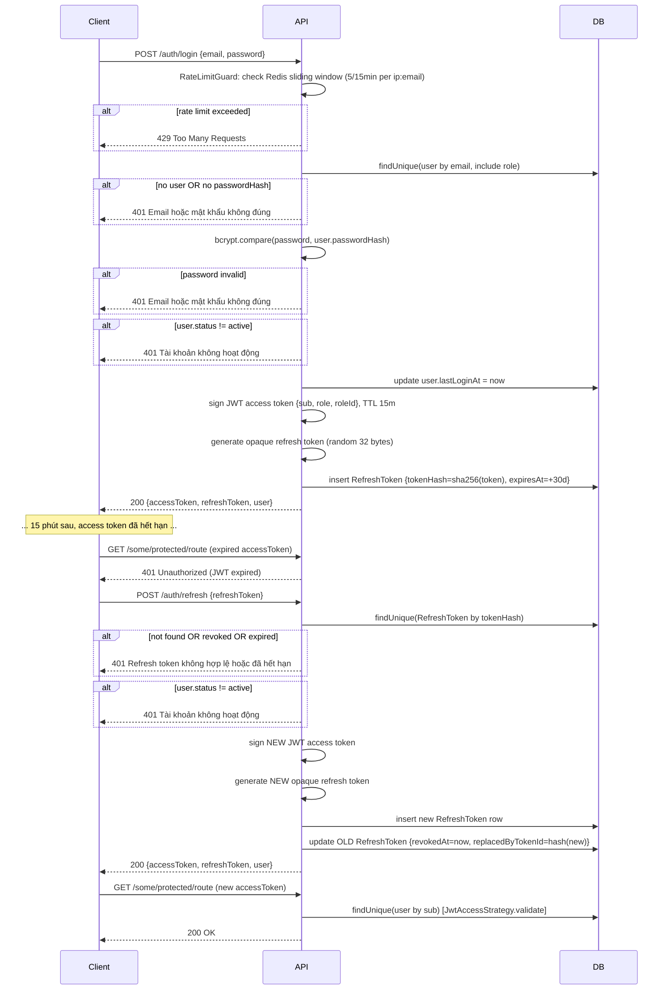
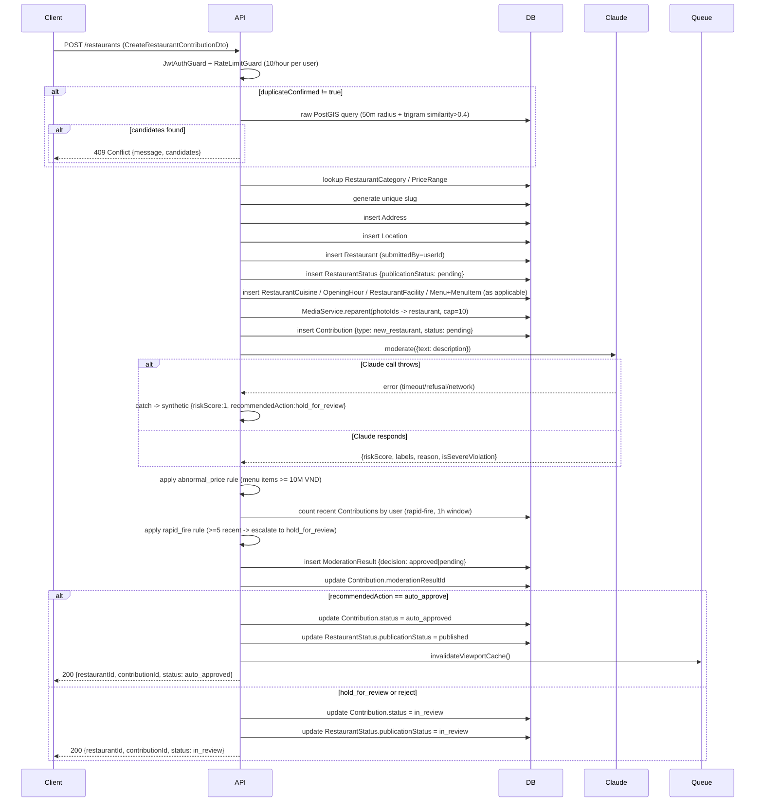
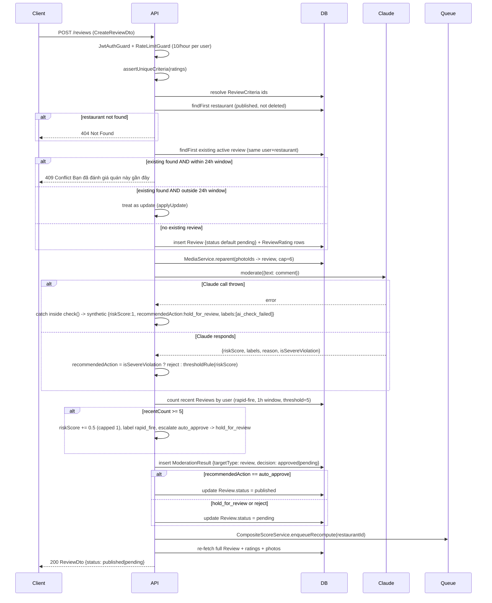
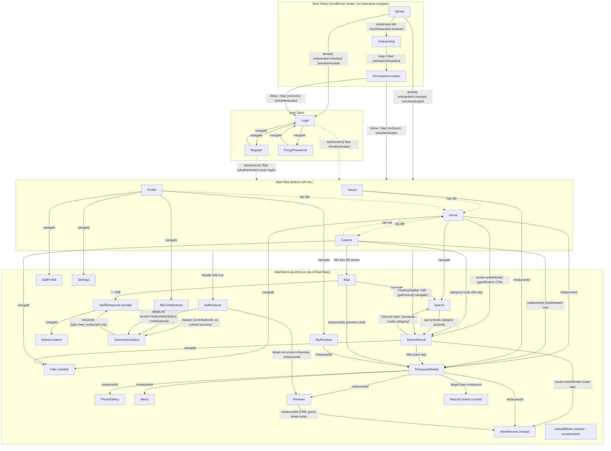

# Bản Đặc Tả Toàn Diện — The Food Map of Vietnam

> **Trạng thái**: tài liệu mô tả hiện trạng thực tế của hệ thống. Khác với `01-prd-mvp.md` đến `09-testing-plan.md` (kế hoạch sản phẩm/xây dựng ban đầu), tài liệu này mô tả hệ thống **đúng như nó đang được triển khai hiện tại**, trên cả backend, admin web và mobile — chi tiết đến từng field trong DTO, có ví dụ số liệu tính tay cho các thuật toán cốt lõi, và mô tả đầy đủ mọi trạng thái giao diện của từng màn hình mobile. Ở những chỗ phần triển khai thực tế đã khác hoặc vượt xa so với kế hoạch ban đầu, tài liệu này phản ánh đúng thực tế. Tạo lần cuối: 2026-08-16.

## Mục lục

1. [Tổng quan sản phẩm](#1-tổng-quan-sản-phẩm)
2. [Backend](#2-backend-backend)
   - 2.1 [Cấu hình toàn cục](#21-cấu-hình-toàn-cục)
   - 2.2 [Mô hình dữ liệu — schema đầy đủ](#22-mô-hình-dữ-liệu--schema-đầy-đủ)
   - 2.3 [Các luồng nghiệp vụ chính (sơ đồ trình tự)](#23-các-luồng-nghiệp-vụ-chính)
   - 2.4 [Đi sâu vào quy tắc nghiệp vụ (ví dụ tính tay)](#24-đi-sâu-vào-quy-tắc-nghiệp-vụ)
   - 2.5 [Module, endpoint & DTO](#25-module-endpoint--dto)
3. [Admin Web](#3-admin-web-admin-web)
4. [Mobile — "Ngon v3"](#4-mobile-mobile--ngon-v3)
   - 4.1 [Sơ đồ điều hướng](#41-sơ-đồ-điều-hướng)
   - 4.2 [Màn hình — đầy đủ các trạng thái giao diện](#42-màn-hình--đầy-đủ-các-trạng-thái-giao-diện)
   - 4.3 [Quản lý state](#43-quản-lý-state)
   - 4.4 [API client, push, i18n](#44-api-client-push-i18n)
5. [Danh sách các khoảng trống / placeholder trung thực](#5-danh-sách-các-khoảng-trống--placeholder-trung-thực)
6. [Nhật ký thay đổi — các lỗi vừa sửa khi soạn bản đặc tả này](#6-nhật-ký-thay-đổi--các-lỗi-vừa-sửa-khi-soạn-bản-đặc-tả-này)

---

## 1. Tổng quan sản phẩm

The Food Map of Vietnam là nền tảng khám phá và đánh giá nhà hàng với ba giao diện người dùng dùng chung một backend:

- **Backend** (`backend/`) — NestJS modular monolith, PostgreSQL+PostGIS (Prisma), Redis, lưu trữ tương thích S3, Anthropic Claude cho kiểm duyệt/tóm tắt AI, gửi push qua Expo.
- **Admin Web** (`admin-web/`) — công cụ nội bộ Vite/React dành cho admin và moderator để quản lý nhà hàng, hàng đợi kiểm duyệt, các đánh giá đã publish, và người dùng.
- **Mobile** (`mobile/`) — ứng dụng Expo/React Native (SDK 57) dành cho người dùng cuối, vừa được lột xác theo ngôn ngữ thiết kế "Ngon v3" (điều hướng 4 tab + phím tắt nổi "Viết").
- **Public Web** (`web/`) — trang Next.js (App Router) tập trung SEO cho người dùng cuối: các trang SSR Home/Search/Chi tiết nhà hàng/Quận, dùng dữ liệu thật từ `GET /search`/`GET /restaurants/...`, có `sitemap.ts`/`robots.ts`, đa ngôn ngữ `en`/`vi`, cùng một lớp đăng nhập + yêu thích tối giản chủ đích (`web/src/lib/auth.ts`, `web/src/app/api/favorites/*`) vượt ra ngoài phạm vi "không có auth cho web" ban đầu trong `docs/build-prompts/09-public-web.md`. **Không được mô tả sâu trong phần còn lại của tài liệu này** (các mục dưới đây tập trung vào backend/admin-web/mobile theo đúng yêu cầu ban đầu) — xem mục 5 về khoảng trống duy nhất của nó.

### Các điểm kiến trúc xuyên suốt

- Một schema Prisma duy nhất (`backend/prisma/schema.prisma`) là nguồn dữ liệu chân lý duy nhất; cả admin-web lẫn mobile đều gọi cùng một REST API, không có lớp GraphQL/BFF riêng.
- Xác thực đồng nhất trên mọi client: `POST /auth/login` cấp một cặp JWT access token (thời hạn ngắn) + refresh token (chuỗi mờ) cho bất kỳ ai, không phân biệt vai trò. Admin-web sau đó tự từ chối (ở phía client) mọi vai trò ngoài `{admin, moderator}` sau đúng lệnh đăng nhập đó — không có endpoint đăng nhập admin riêng.
- Mọi nội dung do người dùng/cộng đồng đóng góp (đánh giá, đóng góp, ảnh) đều đi qua cùng cơ chế kiểm duyệt (`ModerationResult`, Claude gateway kèm cơ chế dự phòng dựa trên luật, một ngưỡng rủi ro dùng chung) trước khi được công khai.
- "Không bao giờ bịa số liệu giả" là nguyên tắc thiết kế được nhắc lại nhiều lần trong code mobile: các *mục tiêu*/*nhãn* tĩnh (placeholder) được dùng thoải mái ở những nơi backend chưa có khái niệm tương ứng, nhưng không màn hình nào bịa ra số đếm, biểu đồ phân bố, hay hoạt động giả về nội dung người dùng thật — các khoảng trống được thể hiện trung thực (`"—"`, "chưa có", "sắp ra mắt") thay vì che giấu.

---

## 2. Backend (`backend/`)

**Công nghệ**: NestJS (modular monolith) · PostgreSQL + PostGIS qua Prisma (dùng `$queryRaw` thô cho tìm kiếm geo/full-text) · Redis (cache + giới hạn tần suất + hàng đợi BullMQ) · lưu trữ đối tượng tương thích S3 (MinIO ở local) · Anthropic Claude (kiểm duyệt + tóm tắt AI) · Expo push.

### 2.1 Cấu hình toàn cục

- `ValidationPipe` toàn cục: `whitelist: true`, `forbidNonWhitelisted: true`, `transform: true` — từ chối field lạ, tự động transform DTO.
- `AllExceptionsFilter` toàn cục; `LoggingMiddleware` áp dụng cho mọi route.
- CORS qua biến môi trường `CORS_ORIGINS` (danh sách origin cách nhau bằng dấu phẩy, `credentials: true`).
- Không có module Swagger/OpenAPI nào được đăng ký.
- BullMQ (qua `REDIS_URL`) chạy 2 worker queue trong cùng tiến trình: `composite-score` (job tính lại điểm tổng hợp) và `photo-cleanup` (dọn ảnh mồ côi mỗi giờ, tự lên lịch).
- Các module được nối trong `AppModule`: Auth, User, Restaurant, Search, Review, Favorite, Media, Contribution, Moderation, Notification, Ai, Admin (+ các module hạ tầng Prisma/Redis/Health).

**Các biến môi trường chính** (`env.example`): `DATABASE_URL`, `REDIS_URL`, `JWT_ACCESS_SECRET`/`JWT_ACCESS_TTL`/`JWT_REFRESH_TTL`, ID/secret của các nhà cung cấp OAuth (Google/Apple/Facebook), thông tin kết nối S3, `AI_SUMMARY_MIN_REVIEW_COUNT`/`AI_SUMMARY_REFRESH_INTERVAL_DAYS`, `ANTHROPIC_API_KEY` (nếu thiếu → kiểm duyệt văn bản chuyển sang dùng luật, ảnh luôn bị giữ lại để duyệt tay, không bao giờ tự sinh tóm tắt), `AI_MODERATION_MODEL`/`AI_MODERATION_TIMEOUT_MS`, `AI_SUMMARY_MODEL`.

### 2.2 Mô hình dữ liệu — schema đầy đủ

Nguồn: `backend/prisma/schema.prisma` (891 dòng), được tài liệu hoá từng field bên dưới — đủ chi tiết để vẽ lại toàn bộ schema chỉ từ mục này.

#### Các enum (giữ nguyên văn)

```
enum OAuthProvider { google apple facebook none }
enum UserStatus { active suspended deleted }
enum RoleCode { guest user moderator admin owner }
enum RestaurantPublicationStatus { pending in_review published rejected hidden removed }
enum FacilityType { wifi parking_car parking_motorbike air_conditioner outdoor_seating kid_friendly pet_friendly card_payment private_room }
enum PhotoOwnerType { restaurant menu_item user_profile review contribution }
enum PhotoStatus { pending approved rejected }
enum ReviewStatus { pending published rejected hidden }
enum ModerationTargetType { review contribution photo video restaurant }
enum ModerationRecommendedAction { auto_approve hold_for_review reject }
enum ModerationDecision { pending approved rejected edit_requested }
enum ContributionType { new_restaurant edit_suggestion status_update closure_report }
enum ContributionStatus { pending auto_approved in_review approved rejected edit_requested }
enum ReportTargetType { restaurant review }
enum ReportReason { spam inappropriate incorrect_info duplicate closed_down other }
enum ReportStatus { open escalated resolved dismissed }
enum CrowdedLevel { empty light moderate crowded full }
enum SeatAvailabilityLevel { plenty limited full }
enum PowerOutletLevel { plenty some none }
enum NotificationType { moderation_result report_resolved contribution_status }
enum PushPlatform { ios android }
```

#### Định danh & phân quyền

**`Role`** (`roles`) — `id` PK, `code` (unique, `RoleCode`), `label`. Quan hệ ngược: `RolePermission[]`, `User[]`.

**`Permission`** (`permissions`) — `id` PK, `code` (unique), `description?`. Quan hệ ngược: `RolePermission[]`.

**`RolePermission`** (`role_permissions`) — bảng join có PK kép (`@@id([roleId, permissionId])`), cả hai FK đều `onDelete: Cascade`.

**`User`** (`users`) — `id` PK · `email` (unique) · `passwordHash?` (null với tài khoản chỉ đăng nhập OAuth) · `oauthProvider` (mặc định `none`) · `oauthSubjectId?` · `phone?` · `roleId` FK → `Role` · `status` (mặc định `active`) · `emailVerifiedAt?` · `lastLoginAt?` · `createdAt`/`updatedAt`. Ràng buộc bảng `@@unique([oauthProvider, oauthSubjectId])` (Postgres xem mỗi dòng `(none, NULL)` là khác nhau, đây là chủ đích). Quan hệ: `profile` (1:1 `UserProfile`), `submittedRestaurants`/`ownedRestaurants` (hai quan hệ `Restaurant[]` đặt tên riêng), `refreshTokens`, `passwordResetTokens`, `searchHistory`, `uploadedPhotos`, `auditLogs`, `reviews`, `moderationDecisions` (tên `ModerationDecidedBy`), `favorites`, `notifications`, `pushTokens`, `contributions`, `reportsFiled`/`reportsResolved` (hai quan hệ `Report[]` đặt tên riêng), `crowdedStatusReports`, `seatAvailabilityReports`, `powerOutletReports`, `parkingInfoUpdates`.

**`RefreshToken`** (`refresh_tokens`) — `id` PK · `userId` FK (Cascade) · `tokenHash` (unique, SHA-256 của token gốc) · `expiresAt` · `revokedAt?` · `replacedByTokenId?` · `createdAt`. Index `[userId]`.

**`PasswordResetToken`** (`password_reset_tokens`) — `id` PK · `userId` FK (Cascade) · `tokenHash` (unique) · `expiresAt` (quy tắc 30 phút) · `usedAt?` (đánh dấu dùng một lần) · `createdAt`. Index `[userId]`.

**`UserProfile`** (`user_profiles`) — `id` PK · `userId` (FK unique, 1:1, Cascade) · `displayName` · `avatarPhotoId?` (id thường, chưa có FK — có từ trước module Media) · `bio?` · `homeCity?` · `createdAt`/`updatedAt`.

#### Lõi nhà hàng

**`RestaurantCategory`** (`restaurant_categories`) — `id` PK, `code` (unique), `label`, `icon?`. Quan hệ: `restaurants`, `reviewCriteria`.

**`Cuisine`** (`cuisines`) — `id` PK, `code` (unique), `label`. Quan hệ: `dishes`, `restaurantCuisines`.

**`RestaurantCuisine`** (`restaurant_cuisines`) — bảng join PK kép (`@@id([restaurantId, cuisineId])`), cả hai FK Cascade.

**`Dish`** (`dishes`) — `id` PK · `name` (`@@unique`, phục vụ find-or-create khi seed) · `cuisineId?` FK · `aliasKeywords` (`String[]`, mặc định `[]`). Quan hệ: `menuItems`.

**`PriceRange`** (`price_ranges`) — `id` PK, `code` (unique, vd `under_50k`), `minVnd`, `maxVnd?` (null = mức cao nhất không giới hạn trên). Quan hệ: `restaurants`.

**`Address`** (`addresses`) — `id` PK, `line`, `ward?`, `district`, `province`, `fullAddressText` (ghép tính sẵn từ các phần). Quan hệ ngược: `restaurant?` (1:1).

**`Location`** (`locations`) — `id` PK, `lat`/`lng` (`Decimal(9,6)`), `geoPoint` (`Unsupported("geography(Point,4326)")`, đồng bộ bằng trigger DB từ lat/lng, không ghi được qua Prisma Client). Quan hệ ngược: `restaurant?` (1:1).

**`Restaurant`** (`restaurants`) — `id` PK · `name` · `slug` (unique) · `description?` · `categoryId` FK · `priceRangeId?` FK · `phone?` · `addressId` (FK unique, 1:1) · `locationId` (FK unique, 1:1) · `submittedBy?` FK → `User` (quan hệ `SubmittedRestaurants`) · `ownerId?` FK → `User` (quan hệ `OwnedRestaurants`) · `createdAt`/`updatedAt`/`deletedAt?` (xoá mềm) · `searchVector` (`Unsupported("tsvector")`, cột STORED tự sinh từ name+description, bỏ dấu, có GIN index, không ghi được qua Prisma Client). Quan hệ: `status` (1:1 `RestaurantStatus`), `cuisines`, `openingHours`, `facilities`, `menus`, `reviews`, `favorites`, `contributions`, `aiSummary` (1:1), `crowdedStatuses`, `seatAvailabilities`, `powerOutletStatuses`, `parkingInformation` (1:1). Index: `[categoryId]`, `[priceRangeId]`.

**`RestaurantStatus`** (`restaurant_status`) — bảng chi tiết 1:1, PK = FK (`restaurantId`, Cascade) · `publicationStatus` (mặc định `pending`) · `compositeScore?` (`Decimal(3,2)`) · `reviewCount` (mặc định `0`) · `lastReviewAt?` · `lastComputedAt?` — cache đã chuẩn hoá mà mọi luồng đọc đều dùng.

**`OpeningHour`** (`opening_hours`) — `id` PK, `restaurantId` FK (Cascade), `dayOfWeek` (0=CN..6=Thứ 7), `openTime?`/`closeTime?` (`@db.Time`), `isClosed` (mặc định `false`). Ràng buộc `@@unique([restaurantId, dayOfWeek])`.

**`RestaurantFacility`** (`restaurant_facilities`) — `id` PK, `restaurantId` FK (Cascade), `facilityType`, `notes?`. Ràng buộc `@@unique([restaurantId, facilityType])`.

**`Menu`** (`menus`) — `id` PK, `restaurantId` FK (Cascade), `name?`, `isActive` (mặc định `true`). Quan hệ: `items`.

**`MenuItem`** (`menu_items`) — `id` PK, `menuId` FK (Cascade), `dishId?` FK, `name`, `priceVnd`, `photoId?` (id thường, chưa có FK), `isPopular` (mặc định `false`), `category?`.

#### Trí tuệ tìm kiếm

**`SearchHistory`** (`search_history`) — chỉ-ghi trong MVP, không có API đọc. `id` PK, `userId?` FK (`onDelete: SetNull`), `deviceId?`, `queryText?`, `appliedFilters?` (Json), `resultCount?`, `createdAt`. Index `[userId]`.

#### Media

**`Photo`** (`photos`) — `id` PK · `ownerType` (đa hình, kiểm tra ở tầng ứng dụng, không có FK thật) · `ownerId?` (có thể null cho tới khi được gán chủ) · `storageKey` · `thumbnailKey?` · `uploadedBy?` FK (`onDelete: SetNull`) · `width?`/`height?`/`mimeType?`/`fileSizeBytes?` · `status` (mặc định `pending`, quyết định việc hiển thị công khai) · `moderationResultId?` FK · `createdAt`/`deletedAt?`. Index `[ownerType, ownerId]`.

#### Đánh giá & xếp hạng

**`ReviewCriteria`** (`review_criteria`) — `id` PK, `code` (unique), `label`, `appliesToCategoryId?` FK. Quan hệ: `ratings`.

**`Review`** (`reviews`) — `id` PK · `userId` FK · `restaurantId` FK · `overallRating` (Int, 1–5) · `comment?` · `dishesOrdered` (`String[]`, mặc định `[]`) · `billTotalVnd?` · `partySize?` · `visitedAt?` · `waitTimeMinutes?` · `wouldReturn?` · `status` (mặc định `pending`) · `editedAt?` (chỉ đặt nếu chỉnh sửa sau >48h kể từ `createdAt`) · `createdAt`/`updatedAt`/`deletedAt?` (xoá mềm). Quan hệ: `ratings`. Index `[restaurantId, status]`. **Quan trọng**: quy tắc "mỗi người dùng chỉ có một đánh giá đang hoạt động cho mỗi nhà hàng" được ép buộc bằng một **partial unique index viết tay** `reviews_user_id_restaurant_id_active_key` trên `(user_id, restaurant_id) WHERE deleted_at IS NULL` trong migration SQL thô — không thể diễn đạt bằng Prisma DSL, và chủ đích không dùng `@@unique` thường.

**`ReviewRating`** (`review_ratings`) — `id` PK, `reviewId` FK (Cascade), `criteriaId` FK, `score` (Int, 1–5). Ràng buộc `@@unique([reviewId, criteriaId])`.

#### Kiểm duyệt & tin cậy

**`ModerationResult`** (`moderation_results`) — `id` PK · `targetType` (đa hình) · `targetId` (kiểm tra ở tầng ứng dụng) · `riskScore` (`Decimal(3,2)`) · `labels` (`String[]`, mặc định `[]`) · `aiReason` · `recommendedAction` · `decidedBy?` FK (quan hệ `ModerationDecidedBy`) · `decision` (mặc định `pending`) · `decidedAt?` · `modelVersion` · `createdAt`. Quan hệ: `contribution?` (quan hệ ngược 1:1), `photos`. Index: `[targetType, targetId]`, `[decision]`.

#### Đóng góp

**`Contribution`** (`contributions`) — `id` PK · `userId` FK · `type` · `targetRestaurantId?` FK (null chỉ khi gửi nhà hàng hoàn toàn mới) · `payload` (Json, khung tổng quát) · `status` (mặc định `pending`) · `moderationResultId?` (FK unique) · `createdAt`/`updatedAt`. Index: `[userId, status]`, `[targetRestaurantId]`.

**`EditSuggestion`** (`edit_suggestions`) — dòng chi tiết 1:1 cho `type = edit_suggestion`. `id` PK, `contributionId` (FK unique, Cascade), `fieldName` (được cho phép theo danh sách ở tầng ứng dụng), `oldValue?` (Json), `newValue` (Json).

**`Report`** (`reports`) — `id` PK · `reporterId` FK (quan hệ `ReportedBy`) · `targetType` · `targetId` · `reason` · `description?` · `status` (mặc định `open`) · `resolvedBy?` FK (quan hệ `ReportResolvedBy`) · `createdAt`/`resolvedAt?`. Ràng buộc `@@unique([reporterId, targetType, targetId])`.

#### Tóm tắt AI

**`AISummary`** (`ai_summaries`) — chỉ dùng để đọc, 1:1. `id` PK, `restaurantId` (FK unique, Cascade), `summaryText`, `pros`/`cons` (`String[]`, mặc định `[]`), `sourceReviewCount`, `modelVersion`, `generatedAt`.

#### Trạng thái tức thời

**`CrowdedStatus`** / **`SeatAvailability`** / **`PowerOutletStatus`** — đều là log chỉ-thêm, cùng cấu trúc: `id` PK, `restaurantId` FK (Cascade), `level`, `reportedBy` FK, `reportedAt` (mặc định `now()`). Index `[restaurantId, reportedAt]` trên mỗi bảng. Giá trị "hiện tại" được service đọc suy ra từ dòng mới nhất, không bao giờ lưu như một field có thể ghi đè.

**`ParkingInformation`** (`parking_information`) — 1:1, PK = FK (`restaurantId`, Cascade), dùng upsert tại chỗ: `hasCarParking`, `hasMotorbikeParking`, `isFree?`, `notes?`, `lastUpdatedBy?` FK, `lastUpdatedAt?`.

#### Yêu thích & thông báo

**`Favorite`** (`favorites`) — `id` PK, `userId` FK (Cascade), `restaurantId` FK (Cascade), `createdAt`. Ràng buộc `@@unique([userId, restaurantId])`.

**`Notification`** (`notifications`) — `id` PK, `userId` FK (Cascade), `type`, `payload` (Json chứa đích deep-link, vd `{screen, restaurantId}`), `isRead` (mặc định `false`), `createdAt`. Index `[userId, isRead]`.

**`PushToken`** (`push_tokens`) — `id` PK, `userId` FK (Cascade), `token` (unique), `platform`, `createdAt`. Index `[userId]`.

#### Hệ thống

**`AuditLog`** (`audit_log`) — chỉ-thêm. `id` PK, `actorId` FK, `action`, `targetType`, `targetId`, `beforeState?`/`afterState?` (Json), `createdAt`. Index: `[targetType, targetId]`, `[actorId, createdAt]`.

#### Sơ đồ quan hệ thực thể (ERD)

```mermaid
erDiagram
    Role ||--o{ User : "roleId"
    Role ||--o{ RolePermission : "roleId"
    Permission ||--o{ RolePermission : "permissionId"
    User ||--o| UserProfile : "userId"
    User ||--o{ RefreshToken : "userId"
    User ||--o{ PasswordResetToken : "userId"
    User ||--o{ Restaurant : "submittedBy"
    User ||--o{ Restaurant : "ownerId"
    User ||--o{ SearchHistory : "userId"
    User ||--o{ Photo : "uploadedBy"
    User ||--o{ AuditLog : "actorId"
    User ||--o{ Review : "userId"
    User ||--o{ ModerationResult : "decidedBy"
    User ||--o{ Favorite : "userId"
    User ||--o{ Notification : "userId"
    User ||--o{ PushToken : "userId"
    User ||--o{ Contribution : "userId"
    User ||--o{ Report : "reporterId"
    User ||--o{ Report : "resolvedBy"
    User ||--o{ CrowdedStatus : "reportedBy"
    User ||--o{ SeatAvailability : "reportedBy"
    User ||--o{ PowerOutletStatus : "reportedBy"
    User ||--o{ ParkingInformation : "lastUpdatedBy"
    RestaurantCategory ||--o{ Restaurant : "categoryId"
    RestaurantCategory ||--o{ ReviewCriteria : "appliesToCategoryId"
    Cuisine ||--o{ Dish : "cuisineId"
    Cuisine ||--o{ RestaurantCuisine : "cuisineId"
    Restaurant ||--o{ RestaurantCuisine : "restaurantId"
    PriceRange ||--o{ Restaurant : "priceRangeId"
    Address ||--|| Restaurant : "addressId"
    Location ||--|| Restaurant : "locationId"
    Restaurant ||--o| RestaurantStatus : "restaurantId"
    Restaurant ||--o{ OpeningHour : "restaurantId"
    Restaurant ||--o{ RestaurantFacility : "restaurantId"
    Restaurant ||--o{ Menu : "restaurantId"
    Menu ||--o{ MenuItem : "menuId"
    Dish ||--o{ MenuItem : "dishId"
    Restaurant ||--o{ Review : "restaurantId"
    Review ||--o{ ReviewRating : "reviewId"
    ReviewCriteria ||--o{ ReviewRating : "criteriaId"
    Restaurant ||--o{ Favorite : "restaurantId"
    Restaurant ||--o{ Contribution : "targetRestaurantId"
    Contribution ||--o| EditSuggestion : "contributionId"
    Contribution ||--o| ModerationResult : "moderationResultId"
    ModerationResult ||--o{ Photo : "moderationResultId"
    Restaurant ||--o| AISummary : "restaurantId"
    Restaurant ||--o{ CrowdedStatus : "restaurantId"
    Restaurant ||--o{ SeatAvailability : "restaurantId"
    Restaurant ||--o{ PowerOutletStatus : "restaurantId"
    Restaurant ||--o| ParkingInformation : "restaurantId"
```



### 2.3 Các luồng nghiệp vụ chính

#### 2.3a Đăng nhập + tự làm mới token về sau

**Đăng nhập, từng bước**: `RateLimitGuard` kiểm tra một sorted-set kiểu sliding-window trên Redis (5 lần/15 phút theo `ip:email`) → tìm user theo email viết thường (kèm role) → trả `401` chung chung nếu không có user hoặc không có `passwordHash` (tài khoản chỉ đăng nhập OAuth) — cùng một thông báo cho cả hai trường hợp, không để lộ thông tin → `bcrypt.compare` mật khẩu, cùng `401` chung nếu sai → `401 'Tài khoản không hoạt động'` riêng biệt nếu `status !== 'active'` → ghi `lastLoginAt` → cấp phiên: ký JWT (`{sub, role, roleId}`, `JWT_ACCESS_SECRET`, thời hạn từ `JWT_ACCESS_TTL` mặc định `15m`) + sinh refresh token dạng chuỗi mờ (`randomBytes(32).toString('hex')`) + thêm một dòng `RefreshToken` chỉ lưu `sha256(token)` (không bao giờ lưu bản gốc) với `expiresAt = now + JWT_REFRESH_TTL` (mặc định `30d`).

**Xoay vòng refresh token, đúng thứ tự**: hash token gốc gửi lên → tìm dòng `RefreshToken` theo hash → `401` nếu không tìm thấy, đã bị thu hồi, hoặc đã hết hạn (cùng một thông báo cho cả ba trường hợp) → `401 'Tài khoản không hoạt động'` nếu user sở hữu không còn active → **cấp phiên mới TRƯỚC KHI đụng vào token cũ** (để nếu tiến trình crash giữa chừng, người dùng vẫn còn một token hợp lệ thay vì không còn cái nào) → chỉ sau đó mới đánh dấu dòng cũ `revokedAt = now`, `replacedByTokenId = hash(token mới)` để phục vụ audit/truy vết chuỗi xoay vòng. Việc dùng lại một token đã bị xoay vòng bị từ chối thẳng — không có cơ chế "phát hiện tái sử dụng thì thu hồi cả chuỗi", chỉ đơn giản kiểm tra `revokedAt`.

**Xác minh JWT** (`JwtAccessStrategy`): Passport kiểm tra chữ ký + hạn dùng trước → `validate(payload)` thực hiện **tra cứu DB trực tiếp** (`user.findUnique({id: payload.sub})`) và ném `401` nếu user không còn tồn tại hoặc `status !== 'active'` — nghĩa là một tài khoản bị khoá/xoá sẽ mất quyền truy cập API ngay lập tức, chứ không phải đợi tới khi token hết hạn sau 15 phút, dù bản thân JWT vẫn còn hợp lệ về mặt mật mã học.



#### 2.3b Đóng góp nhà hàng mới: gửi → kiểm duyệt → xử lý cuối

Kiểm tra trùng lặp (trừ khi `duplicateConfirmed: true`) chạy một truy vấn PostGIS thô — nhà hàng trong bán kính 50m VÀ độ tương đồng tên theo trigram > 0.4 — và dừng lại với `409 + candidates` trước khi ghi bất cứ gì nếu có trùng khớp. Nếu không: resolve category/price-range → sinh slug duy nhất → thêm `Address` → thêm `Location` → thêm `Restaurant` (`submittedBy: userId`) → thêm `RestaurantStatus{publicationStatus: 'pending'}` → tuỳ chọn thêm hàng loạt cuisine/giờ mở cửa/tiện ích/thực đơn (món ăn trong thực đơn được khớp nỗ lực-tốt-nhất với danh mục `Dish` có sẵn, không bao giờ tạo `Dish` mới) → `MediaService.reparent()` gán các ảnh đã upload trước đó (giới hạn 10 ảnh) → thêm `Contribution{type:'new_restaurant', status:'pending'}` → chạy kiểm duyệt (kiểm tra văn bản bằng Claude + luật giá thực đơn bất thường + luật đăng dồn dập) → thêm `ModerationResult` và liên kết ngược lại với contribution → **xử lý cuối**: `auto_approve` chuyển `Contribution.status → 'auto_approved'` và `RestaurantStatus.publicationStatus → 'published'` (+ vô hiệu hoá cache khung nhìn); mọi trường hợp khác đặt cả hai về `'in_review'`. Endpoint này không bao giờ trả về `'rejected'` một cách đồng bộ — chỉ có quyết định thật của moderator về sau mới làm được việc đó.

**Quy tắc phụ về báo cáo đóng cửa** (cùng service, loại contribution khác): nếu có từ 3 người dùng khác nhau trở lên gửi contribution `closure_report` cho cùng một nhà hàng trong vòng 14 ngày, báo cáo mới nhất sẽ đẩy `ModerationResult` lên `riskScore=1.00`/`hold_for_review`/`decision:'pending'` — nhưng không bao giờ mở lại một mục đã được người thật (`decidedBy` khác null) quyết định, và không bao giờ tự động ẩn nhà hàng.



#### 2.3c Đánh giá: gửi → kiểm duyệt → publish/giữ lại

`assertUniqueCriteria` từ chối nếu cùng một mã tiêu chí xuất hiện hai lần trong một lần gửi → resolve id của các tiêu chí → xác minh nhà hàng đích đã publish/chưa xoá (nếu không → `404`) → kiểm tra xem người dùng đã có đánh giá "đang hoạt động" cho nhà hàng này chưa (quy tắc một-đánh-giá-đang-hoạt-động-mỗi-người-mỗi-quán): nếu trong vòng 24h kể từ lần chạm cuối → chặn hẳn với `409`; nếu ngoài 24h → xử lý như một lần cập nhật; nếu chưa có → tạo dòng `Review` mới (kèm các dòng `ReviewRating`) → `MediaService.reparent()` gán ảnh (giới hạn 6 ảnh) → **kiểm duyệt**: kiểm tra văn bản bằng Claude, cộng thêm **lớp cấu trúc "đăng dồn dập" luôn được áp dụng** (≥5 đánh giá bởi cùng một người dùng trong giờ vừa qua sẽ cộng `riskScore += 0.5` (tối đa 1), gắn nhãn `rapid_fire`, và hạ `auto_approve → hold_for_review` — không bao giờ hạ mức quyết định "reject" của Claude) → mọi lỗi gọi Claude đều được bắt **ngay trong** `check()` và chuyển thành kết quả giả lập an toàn (`riskScore:1, recommendedAction:'hold_for_review', labels:['ai_check_failed']`) để `check()` không bao giờ ném lỗi ra ngoài → ghi `ModerationResult` (`decision: 'approved'` chỉ khi `auto_approve`, không bao giờ tự duyệt nội dung rủi ro cao) → đặt `Review.status` thành `published` hoặc `pending` tương ứng → đưa vào hàng đợi tính lại điểm tổng hợp không đồng bộ (BullMQ, tách khỏi luồng phản hồi) → trả về `ReviewDto` đầy đủ.

Một lần **chỉnh sửa** sẽ chạy lại đúng lệnh kiểm duyệt đó với bình luận mới, nên việc sửa có thể lật ngược một đánh giá đã publish về lại `pending` (hoặc ngược lại) tuỳ theo kết quả kiểm duyệt mới; `editedAt` chỉ được cập nhật nếu việc sửa diễn ra sau >48h kể từ khi tạo.



**Tóm tắt cách xử lý khi Claude lỗi**: lỗi được bắt ở đúng một nơi cho mỗi loại kiểm duyệt (đánh giá/đóng góp/ảnh), không bao giờ để lộ ra tới controller; kết quả dự phòng luôn có cùng cấu trúc `riskScore:1, labels:['ai_check_failed'], recommendedAction:'hold_for_review'` — không bao giờ là `auto_approve`, cũng không bao giờ là `reject` (một lần lỗi được xem là "rủi ro chưa xác định", không phải "an toàn" hay "vi phạm đã xác nhận"). Một dòng `ModerationResult` vẫn được ghi, nên mục đó vẫn hiển thị trong Hàng đợi Kiểm duyệt của admin trong lúc Claude gặp sự cố, thay vì tự động publish hoặc biến mất. Riêng biệt, nếu `ANTHROPIC_API_KEY` đơn giản là chưa được cấu hình (một trạng thái cấu hình, không phải lỗi runtime), văn bản sẽ dùng luật xác định thay thế, còn ảnh đi kèm (không thể kiểm tra bằng luật) sẽ bị buộc `hold_for_review` với nhãn `image_unscreened_no_api_key`.

### 2.4 Đi sâu vào quy tắc nghiệp vụ

#### 2.4a Điểm tổng hợp — trung bình kiểu Bayesian, ví dụ tính tay

Công thức (`composite-score.util.ts`):

```
compositeScore = (v / (v + m)) * R + (m / (v + m)) * C
```

- `v` = số đánh giá đã publish, chưa xoá của nhà hàng
- `R` = điểm trung bình thô `overallRating` của nhà hàng đó
- `m` = **`MIN_VOTES_THRESHOLD = 5`** (cố định — "số lượt bình chọn tối thiểu trước khi tin tưởng điểm trung bình thô một mình")
- `C` = **trung bình toàn hệ thống**, tính **trực tiếp mỗi lần gọi** trên toàn bộ `overallRating` của các đánh giá đã publish — **không phải** một hằng số cố định. Hằng số dự phòng cố định duy nhất là `DEFAULT_GLOBAL_PRIOR = 3.5`, chỉ dùng khi thực sự chưa có đánh giá đã publish nào trên toàn hệ thống (cold start thật sự). Các ví dụ tính tay dưới đây dùng `C = 3.5`.
- Trả về `null` khi `v = 0` — một nhà hàng chưa có đánh giá không bao giờ có điểm bịa ra. Giá trị lưu được làm tròn 2 chữ số thập phân.

**(a) Nhà hàng mới, 1 đánh giá, 5 sao** — `v=1, R=5.0, C=3.5, m=5`:
```
1/6 × 5.0 = 0.833333
5/6 × 3.5 = 2.916667
compositeScore = 3.75
```
Một đánh giá 5 sao duy nhất bị kéo gần như hết xuống mức prior 3.5 — tại `v=1`, prior chiếm 5/6 trọng số.

**(b) 5 đánh giá, trung bình 4.2 sao** — `v=5, R=4.2, C=3.5, m=5`:
```
5/10 × 4.2 = 2.10
5/10 × 3.5 = 1.75
compositeScore = 3.85
```
Tại `v = m = 5`, điểm trung bình riêng của nhà hàng và prior toàn hệ thống được cân bằng đúng 50/50.

**(c) 50 đánh giá, trung bình 3.8 sao** — `v=50, R=3.8, C=3.5, m=5`:
```
50/55 × 3.8 = 3.454545
5/55  × 3.5 = 0.318182
compositeScore = 3.77 (làm tròn)
```
Với `v ≫ m`, điểm số sát với trung bình thô — prior chỉ kéo xuống 0.03.

**Bài học rút ra**: số lượng đánh giá quan trọng hơn một đánh giá cực đoan đơn lẻ. Bộ unit test (`composite-score.util.spec.ts`) ép buộc bất biến chung: một nhà hàng có 2 đánh giá 5 sao luôn có điểm thấp hơn hẳn một nhà hàng có 50 đánh giá trung bình 4.6 sao.

#### 2.4b Xếp hạng tìm kiếm — SQL chính xác và ví dụ tính tay

Biểu thức xếp hạng:
```sql
GREATEST(
  ts_rank_cd(r.search_vector, plainto_tsquery('simple', immutable_unaccent($q))),
  similarity(immutable_unaccent(r.name), immutable_unaccent($q))
) AS text_rank
```
(`text_rank = 0` cho mọi dòng ở chế độ duyệt thuần tuý không có `q`.) Dùng `GREATEST` — thay vì chỉ `ts_rank_cd` — để một dòng chỉ khớp qua độ tương đồng tên mờ (không qua full-text) không bị hoà điểm `0` với các dòng hoàn toàn không liên quan; gộp thêm độ tương đồng trigram giúp một khớp mờ mạnh (gõ sai gần đúng tên quán) xếp trên một khớp yếu.

`ORDER BY` đầy đủ:
```sql
ORDER BY
  text_rank DESC,
  rs.composite_score DESC NULLS LAST,
  distance_meters ASC NULLS LAST,
  r.created_at DESC
LIMIT 500
```
Thứ tự tầng: **độ liên quan → chất lượng → khoảng cách → độ mới**. `NAME_SIMILARITY_THRESHOLD = 0.4` chỉ quyết định một khớp tên mờ có đủ điều kiện làm *ứng viên* hay không (ở mệnh đề `WHERE`) — không ảnh hưởng đến biểu thức xếp hạng.

**Ví dụ tính tay — truy vấn "Cơm tấm", 3 ứng viên:**

| Nhà hàng | `ts_rank_cd` | `similarity` | `compositeScore` | khoảng cách (m) |
|---|---|---|---|---|
| A — "Cơm Tấm Sài Gòn" | 0.12 | 0.55 | 4.10 | 1200 |
| B — "Quán Cơm Tấm Bà Ba" | 0.45 | 0.30 | 3.90 | 500 |
| C — "Cơm Tấm 3 Miền" | 0.45 | 0.20 | 4.50 | 2000 |

1. `text_rank = GREATEST(ts_rank_cd, similarity)`: A → `GREATEST(0.12,0.55)=0.55`; B → `GREATEST(0.45,0.30)=0.45`; C → `GREATEST(0.45,0.20)=0.45`.
2. Sắp theo `text_rank DESC`: **A dẫn đầu hẳn** (0.55). B và C hoà ở 0.45, phải xét tiếp.
3. Xét tiếp B và C theo `compositeScore DESC`: `C=4.50 > B=3.90` → **C xếp trên B**.

**Kết quả cuối: A, C, B.** A thắng thuần tuý nhờ độ mạnh của trigram tên dù `ts_rank_cd` thấp; khi B và C hoà điểm về độ liên quan văn bản, quán được đánh giá tốt hơn (C, 4.50) thắng quán gần hơn nhưng điểm thấp hơn (B, 3.90, dù chỉ cách 500m so với 2000m của C) — khoảng cách chỉ được xét sau chất lượng, không bao giờ trước.

#### 2.4c Ngưỡng rủi ro kiểm duyệt — bảng và quy tắc ranh giới

```ts
export const MEDIUM_RISK_THRESHOLD = 0.5;
export function recommendActionForRiskScore(riskScore) {
  return riskScore >= MEDIUM_RISK_THRESHOLD ? 'hold_for_review' : 'auto_approve';
}
```

| `riskScore` | Kết quả |
|---|---|
| 0.1 | `auto_approve` |
| 0.3 | `auto_approve` |
| **0.5** | **`hold_for_review`** |
| 0.7 | `hold_for_review` |
| 0.95 | `hold_for_review` |

**Ranh giới**: phép so sánh là `>=`, nên **0.5 thuộc về `hold_for_review`**, không phải `auto_approve` — chỉ những điểm thấp hơn 0.5 mới được tự duyệt (một ranh giới chủ đích thận trọng kiểu "làm tròn lên phía cẩn trọng"). Hằng số duy nhất này là nguồn chân lý dùng chung cho cả `ClaudeGatewayService.moderate()` (tự tính `recommendedAction` từ hàm này thay vì tin theo nhãn mà Claude trả về) và `assertDecisionAllowed()` — bản song sinh ở tầng ứng dụng của ràng buộc CHECK `moderation_results_hard_rule_chk` trong DB — hàm này ném lỗi trước bất kỳ thao tác ghi nào cố đặt `decision='approved'` trong khi `recommendedAction==='reject'` hoặc `riskScore>=0.5`, trừ khi có một `decidedBy` là người thật.

Có hai đường leo thang nằm **chồng lên trên** hàm này và chỉ có thể leo thang, không bao giờ hạ xuống: (1) `'reject'` — giá trị thứ ba chỉ Claude mới tạo ra được (`isSevereViolation`), cơ chế dựa-trên-luật không bao giờ đạt tới vì nó chỉ khớp mẫu chứ không phán đoán mức độ nghiêm trọng; (2) **cơ chế leo thang đăng dồn dập** (+0.5 rủi ro, tối đa 1, buộc `auto_approve→hold_for_review` khi ≥5 lượt gửi/giờ từ cùng một người dùng) — một tín hiệu cấu trúc mà không bộ chấm điểm văn bản đơn lẻ nào nhìn thấy được. Lỗi mạng khi gọi Claude sẽ tạo ra kết quả giả lập `riskScore:1, hold_for_review`; không có API key mà có ảnh đi kèm sẽ tạo `riskScore:0.5, hold_for_review` (ảnh không có cơ chế dựa-trên-luật tương đương, nên luôn bị giữ lại).

### 2.5 Module, endpoint & DTO

#### `auth` — base `/auth`, `RateLimitGuard` (5 lần/15 phút với các route nhạy cảm, khoá theo `ip:email` trước khi xác thực)

| Endpoint | Xác thực | Mục đích |
|---|---|---|
| `POST /auth/register` | công khai | Tạo user, cấp phiên |
| `POST /auth/login` | công khai, 5/15min | Đăng nhập email/mật khẩu, thông báo lỗi chung chung |
| `POST /auth/oauth/{google,apple,facebook}` | công khai | Xác minh token nhà cung cấp, liên kết hoặc tạo mới, cấp phiên |
| `POST /auth/refresh` | công khai | Xoay vòng refresh token |
| `POST /auth/logout` | công khai (theo body) | Thu hồi refresh token được truyền vào |
| `POST /auth/forgot-password` | công khai, 5/15min | Luôn trả về cùng một phản hồi; token reset hạn 30 phút; **chỉ là log giả lập, chưa nối nhà cung cấp email thật** |
| `POST /auth/reset-password` | công khai | Dùng token, đặt mật khẩu mới, thu hồi toàn bộ refresh token |

**DTO**:

| DTO | Field | Kiểu | Decorator |
|---|---|---|---|
| `LoginDto` | email | string | `@IsEmail()` |
| | password | string | `@IsString()` |
| `RegisterDto` | email | string | `@IsEmail()` |
| | password | string | `@MinLength(8)`, `@Matches(/\d/)` (≥1 chữ số) |
| | displayName | string? | `@IsOptional()`, `@IsString()`, `@MaxLength(50)` |
| `RefreshDto` | refreshToken | string | `@IsString()` |
| `OAuthLoginDto` | idToken | string | `@IsString()` — JWT ID token của Google/Apple, hoặc access token của Facebook; cùng tên field cho cả ba |
| `ForgotPasswordDto` | email | string | `@IsEmail()` |
| `ResetPasswordDto` | token | string | `@IsString()` |
| | newPassword | string | `@MinLength(8)`, `@Matches(/\d/)` |

Payload JWT: `{ sub, role, roleId }`, `HS256`, secret `JWT_ACCESS_SECRET`, thời hạn `JWT_ACCESS_TTL` (mặc định `15m`). Kiểm tra quyền kết hợp `@Roles`/`RolesGuard` (thô) với `@RequirePermissions`/`PermissionsGuard` (chi tiết, cache trong bộ nhớ 60s ánh xạ roleId→mã quyền).

#### `user` — base `/me`, toàn bộ dùng `JwtAuthGuard`

`GET /me` (hồ sơ + URL avatar đã resolve) · `PATCH /me/profile` (cập nhật một phần; `avatarPhotoId` được kiểm tra là ảnh đã duyệt và thuộc sở hữu) · `DELETE /me` (xoá mềm, ẩn danh hoá — không bao giờ xoá cứng, giữ nguyên tính toàn vẹn của lịch sử đánh giá/đóng góp — email được đổi thành `deleted-<uuid>@deleted.local`, mọi refresh token bị thu hồi).

#### `restaurant` — base `/restaurants`, toàn bộ công khai

| Endpoint | Mục đích |
|---|---|
| `GET /restaurants/nearby` | Tìm theo bán kính bằng PostGIS, giới hạn 0.1–20km, tối đa 200 kết quả |
| `GET /restaurants/bounds` | Truy vấn theo khung nhìn, cache Redis 45s |
| `GET /restaurants/sitemap-index` | Toàn bộ slug đã publish + updatedAt, phục vụ sitemap của public-web |
| `GET /restaurants/slug/:slug` | Tra cứu chi tiết theo URL sạch |
| `GET /restaurants/:id` | Chi tiết đầy đủ |
| `GET /restaurants/:id/ai-summary` | Chỉ trả `available:true` nếu có `AISummary` còn mới VÀ số đánh giá vẫn đạt ngưỡng tối thiểu |

**DTO**:

| DTO | Field | Kiểu | Decorator |
|---|---|---|---|
| `BoundsQueryDto` | swLat/swLng/neLat/neLng | number | `@Type(()=>Number)`, `@IsLatitude()`/`@IsLongitude()` |
| `NearbyQueryDto` | lat/lng | number | `@Type(()=>Number)`, `@IsLatitude()`/`@IsLongitude()` |
| | radiusKm | number? | `@IsOptional()`, `@Type(()=>Number)`, `@IsNumber()`, `@Min(0.1)` — chủ đích **không** có `@Max`; service tự âm thầm giới hạn ở mức trần 20km thay vì từ chối |

`isOpenNow` được tính theo giờ VN cố định UTC+7 (không tính DST), xử lý đúng trường hợp giờ mở cửa qua đêm (giờ đóng < giờ mở) bằng cách kiểm tra thêm dòng "hôm qua" tràn qua nửa đêm. Cache khung nhìn bị vô hiệu hoá bằng một bộ đếm phiên bản toàn cục, tăng lên mỗi khi admin sửa nhà hàng.

<details><summary>Ví dụ phản hồi <code>GET /restaurants/:id</code></summary>

```json
{
  "id": "3b6a5f2e-9d41-4c2a-9a77-1f8c2e0d9a11",
  "name": "Phở Hòa Pasteur",
  "slug": "pho-hoa-pasteur",
  "description": "Quán phở lâu đời tại Quận 3, nổi tiếng với nước dùng đậm đà và thịt bò tươi.",
  "categoryCode": "quan_an",
  "cuisineCodes": ["mon_viet"],
  "phone": "+84283822980",
  "address": {
    "line": "260C Pasteur",
    "ward": "Phường Võ Thị Sáu",
    "district": "",
    "province": "Thành phố Hồ Chí Minh",
    "fullAddressText": "260C Pasteur, Phường Võ Thị Sáu, Thành phố Hồ Chí Minh"
  },
  "location": { "lat": 10.788231, "lng": 106.694124 },
  "priceRange": { "code": "50_100k", "minVnd": 50000, "maxVnd": 100000 },
  "openingHours": [
    { "dayOfWeek": 0, "openTime": "06:00", "closeTime": "22:00", "isClosed": false }
  ],
  "isOpenNow": true,
  "facilities": ["wifi", "air_conditioner", "card_payment"],
  "menus": [{
    "id": "5d4c3b2a-1e0f-4a9b-8c7d-6e5f4a3b2c1d",
    "name": "Thực đơn chính",
    "items": [
      { "id": "1a2b3c4d-5e6f-4a7b-8c9d-0e1f2a3b4c5d", "name": "Phở tái nạm gầu", "priceVnd": 75000, "category": "Phở", "isPopular": true }
    ]
  }],
  "photos": [{ "id": "8c1e2a3b-4d5f-4a6b-9c7d-1e2f3a4b5c6d", "url": "https://cdn.foodmap.vn/photos/8c1e2a3b.jpg", "width": 1600, "height": 1200 }],
  "compositeScore": 4.62,
  "reviewCount": 128,
  "reviews": [{ "id": "f1a2b3c4-d5e6-4f70-8a9b-0c1d2e3f4a5b", "overallRating": 5, "comment": "Rất ngon, sẽ quay lại!", "status": "published" }]
}
```
</details>

<details><summary>Ví dụ phản hồi <code>GET /restaurants/bounds</code> (mảng thuần, không phân trang)</summary>

```json
[
  {
    "id": "3b6a5f2e-9d41-4c2a-9a77-1f8c2e0d9a11",
    "slug": "pho-hoa-pasteur",
    "name": "Phở Hòa Pasteur",
    "categoryCode": "quan_an",
    "thumbnailUrl": "https://cdn.foodmap.vn/photos/8c1e2a3b-thumb.jpg",
    "compositeScore": 4.62,
    "reviewCount": 128,
    "priceRange": { "code": "50_100k", "minVnd": 50000, "maxVnd": 100000 },
    "lat": 10.788231, "lng": 106.694124,
    "distanceMeters": null,
    "isOpenNow": true
  }
]
```
</details>

#### `search` — `GET /search` (có `q`) và `GET /restaurants` (duyệt) dùng chung một cài đặt

Các field của **`SearchQueryDto`**: `q?` (string) · `lat?`/`lng?` (`@IsLatitude()`/`@IsLongitude()`) · `distanceKm?` (`@Min(0.1)`, không có max — service tự giới hạn 20km) · `priceMin?`/`priceMax?` (`@Min(0)` mỗi field) · `minRating?` (`@Min(1)@Max(5)`) · `openNow?` (boolean, transform chấp nhận nhiều dạng) · `facilities?`/`cuisine?` (transform chuỗi CSV→mảng, `@IsIn` từng phần tử) · `category?` (`@IsIn` 6 mã) · `district?`/`province?`/`ward?` (string) · `page?`/`pageSize?` (`@Min(1)`, pageSize `@Max(50)`).

Bộ lọc tiện ích yêu cầu có TẤT CẢ tiện ích được yêu cầu; bộ lọc ẩm thực là có MỘT TRONG SỐ. `openNow`/`minRating` được áp dụng ở tầng JS sau khi lấy dữ liệu (không phải một mệnh đề SQL đơn giản do logic giờ qua đêm và điểm tổng hợp có thể null trung thực). Mỗi lần gọi đều ghi một dòng `SearchHistory` chỉ-ghi (giải mã JWT từ header theo kiểu best-effort chỉ để gán tác giả, không bao giờ bắt buộc).

<details><summary>Ví dụ <code>GET /search</code></summary>

Request: `GET /search?q=ph%E1%BB%9F&province=Th%C3%A0nh%20ph%E1%BB%91%20H%E1%BB%93%20Ch%C3%AD%20Minh&minRating=4&facilities=wifi,card_payment&page=1&pageSize=20`

```json
{
  "items": [
    {
      "id": "3b6a5f2e-9d41-4c2a-9a77-1f8c2e0d9a11", "slug": "pho-hoa-pasteur", "name": "Phở Hòa Pasteur",
      "categoryCode": "quan_an", "thumbnailUrl": "https://cdn.foodmap.vn/photos/8c1e2a3b-thumb.jpg",
      "compositeScore": 4.62, "reviewCount": 128,
      "priceRange": { "code": "50_100k", "minVnd": 50000, "maxVnd": 100000 },
      "lat": 10.788231, "lng": 106.694124, "distanceMeters": null, "isOpenNow": true
    }
  ],
  "total": 2, "page": 1, "pageSize": 20
}
```
</details>

#### `review` — ba controller: `/reviews`, `/restaurants/:restaurantId/reviews`, `/me/reviews`

| Endpoint | Xác thực | Mục đích |
|---|---|---|
| `POST /reviews` | Jwt + 10/giờ | Tạo mới hoặc cập nhật đánh giá đang hoạt động duy nhất của người dùng cho một nhà hàng |
| `PATCH /reviews/:id` | Jwt, chỉ chủ sở hữu | Cập nhật; `editedAt` chỉ đặt sau >48h kể từ khi tạo |
| `DELETE /reviews/:id` | Jwt, chỉ chủ sở hữu | Xoá mềm, kích hoạt tính lại điểm |
| `GET /restaurants/:restaurantId/reviews` | công khai | Đánh giá đã publish, phân trang + phân tích theo từng tiêu chí |
| `GET /me/reviews` | Jwt | Lịch sử của người dùng, mọi trạng thái |

**DTO**: `ReviewRatingInputDto` (`criteriaCode` `@IsIn(7 mã)`, `score` `@IsInt @Min(1)@Max(5)`) · `CreateReviewDto` (`restaurantId` `@IsUUID()`; `overallRating` `@IsInt@Min(1)@Max(5)`; `ratings` `@ArrayMinSize(1)` lồng nhau; `comment?` `@MaxLength(2000)`; `dishesOrdered?` `@ArrayMaxSize(20)` mỗi phần tử `@MaxLength(100)`; `billTotalVnd?` `@Min(0)@Max(49_999_999)`; `partySize?` `@Min(1)`; `visitedAt?` `@IsISO8601()`; `waitTimeMinutes?` `@Min(0)`; `wouldReturn?` boolean; `photoIds?` `@ArrayMaxSize(6)` UUID) · `UpdateReviewDto` (giống hệt, trừ `restaurantId`, tất cả optional — `ratings` nếu có sẽ thay thế toàn bộ) · `ReviewListQueryDto` (`sort?` ∈ `newest/most_helpful/has_photos`; `filter?` lọc điểm chính xác `@Min(1)@Max(5)`; `page?`/`pageSize?`) · `MyReviewListQueryDto` (`page?`/`pageSize?`).

`sort=has_photos` sắp xếp lại để các đánh giá có ≥1 ảnh đã duyệt lên đầu, tính trên toàn bộ tập kết quả khớp trước khi phân trang (Photo không có FK thật trỏ về Review); `most_helpful` hiện tự động rơi về sắp xếp theo mới nhất (chưa có mô hình bình chọn hữu ích).

<details><summary>Ví dụ request + response <code>POST /reviews</code></summary>

Request:
```json
{
  "restaurantId": "3b6a5f2e-9d41-4c2a-9a77-1f8c2e0d9a11",
  "overallRating": 5,
  "ratings": [
    { "criteriaCode": "food_quality", "score": 5 },
    { "criteriaCode": "service", "score": 4 },
    { "criteriaCode": "hygiene", "score": 5 },
    { "criteriaCode": "price", "score": 4 }
  ],
  "comment": "Phở Hòa Pasteur đúng chuẩn vị Sài Gòn, nước dùng ngọt xương thanh, không bị béo.",
  "dishesOrdered": ["Phở tái nạm gầu", "Phở đặc biệt", "Trà đá"],
  "billTotalVnd": 145000,
  "partySize": 2,
  "visitedAt": "2026-08-10T04:30:00.000Z",
  "waitTimeMinutes": 12,
  "wouldReturn": true,
  "photoIds": ["8c1e2a3b-4d5f-4a6b-9c7d-1e2f3a4b5c6d"]
}
```

Response (`201 Created`):
```json
{
  "id": "f1a2b3c4-d5e6-4f70-8a9b-0c1d2e3f4a5b",
  "restaurantId": "3b6a5f2e-9d41-4c2a-9a77-1f8c2e0d9a11",
  "author": { "id": "9e8d7c6b-5a4f-4b3c-8d2e-1f0a9b8c7d6e", "displayName": "Hoa Nguyễn" },
  "overallRating": 5,
  "ratings": [{ "criteriaCode": "food_quality", "score": 5 }],
  "comment": "Phở Hòa Pasteur đúng chuẩn vị Sài Gòn...",
  "status": "pending",
  "editedAt": null,
  "createdAt": "2026-08-13T08:42:11.000Z",
  "photos": [{ "id": "8c1e2a3b-4d5f-4a6b-9c7d-1e2f3a4b5c6d", "url": "https://cdn.foodmap.vn/photos/8c1e2a3b.jpg", "width": 1600, "height": 1200 }]
}
```
</details>

<details><summary>Ví dụ response <code>GET /restaurants/:id/reviews</code></summary>

```json
{
  "items": [
    { "id": "f1a2b3c4-...", "overallRating": 5, "comment": "Phở Hòa Pasteur đúng chuẩn vị Sài Gòn.", "status": "published", "createdAt": "2026-08-13T08:42:11.000Z" }
  ],
  "total": 128, "page": 1, "pageSize": 10,
  "ratingBreakdown": [
    { "code": "food_quality", "label": "Chất lượng món ăn", "averageScore": 4.7, "ratingCount": 128 },
    { "code": "wifi", "label": "Wifi", "averageScore": null, "ratingCount": 0 }
  ]
}
```
</details>

#### `favorite` — toàn bộ dùng `JwtAuthGuard`

`POST`/`DELETE /favorites/:restaurantId` (idempotent) · `GET /me/favorites` (phân trang, `FavoriteListQueryDto`: `page?`/`pageSize? @Max(50)`) · `GET /me/favorites/ids` (danh sách id không phân trang, để client kiểm tra "đã yêu thích" tức thời). Không có DTO tạo/bật-tắt riêng — id nhà hàng lấy từ route param.

#### `media` — base `/media`, toàn bộ dùng `JwtAuthGuard`

`POST /media/upload-url` (`CreateUploadUrlDto`: `contentType` `@IsIn(['image/jpeg','image/png','image/webp'])`, `fileSizeBytes` `@IsInt@Min(1)` — giới hạn 8MB được áp dụng ở service, không phải ở DTO — trả về URL S3 PUT có chữ ký trước, hạn 300s) · `POST /media/confirm` (`ConfirmUploadDto`: `storageKey`, `ownerType` `@IsIn(['restaurant','review','contribution','user_profile'])`, `ownerId?` `@IsUUID()` — kiểm tra bằng HEAD size check + dò byte đầu file, **mã hoá lại thành JPEG ở server** (không bao giờ tin content-type client khai báo), sau đó **kiểm duyệt đồng bộ** trước khi trả kết quả) · `DELETE /media/:id` (chủ sở hữu hoặc admin/moderator).

`MediaService.reparent()` gán lại chủ sở hữu cho các ảnh chưa gán một cách nguyên tử (giới hạn: review=6, restaurant=10, contribution=10, user_profile=1). `sweepOrphans()` xoá cứng các ảnh chưa gán chủ quá 24h, chạy mỗi giờ qua BullMQ.

#### `contribution` — toàn bộ dùng `JwtAuthGuard`, mọi vai trò `user`

| Endpoint | Thêm | Mục đích |
|---|---|---|
| `POST /restaurants/duplicate-check` | — | Ứng viên trùng lặp theo trigram + bán kính 50m |
| `POST /restaurants` | 10/giờ | Gửi nhà hàng mới |
| `POST /restaurants/:id/edit-suggestions` | — | Đề xuất thay đổi một field (chỉ các field được cho phép) |
| `POST /restaurants/:id/status-reports` | 10/giờ | Báo cáo trạng thái dạng discriminated union |
| `GET /me/contributions` | — | Lịch sử của người dùng |
| `GET /contributions/:id` | — | Chi tiết, chỉ chủ sở hữu |

**DTO**: `ContributionAddressDto` (`line`/`ward`/`province` bắt buộc `@MaxLength`; `district?` legacy, mặc định `''`) · `ContributionLocationDto` (`lat`/`lng`) · `ContributionOpeningHourDto` (`dayOfWeek` `0–6`; `openTime?`/`closeTime?` regex `HH:mm`; `isClosed`) · `ContributionMenuItemDto` (`name` `@MaxLength(120)`; `priceVnd` `@Min(0)@Max(50_000_000)`; `category?`; `isPopular?`) · `CreateRestaurantContributionDto` (`name` `@MinLength(2)@MaxLength(120)`; `description?` `@MaxLength(2000)`; `categoryCode` `@IsIn(6 mã)`; `priceRangeCode?` `@IsIn(5 mã)`; `phone?` `@IsPhoneNumber('VN')`; `address`/`location` được kiểm tra lồng nhau; `cuisineCodes?` `@IsIn(6 mã) mỗi phần tử`; `openingHours?` đúng 7 mục (`@ArrayMinSize(7)@ArrayMaxSize(7)`) hoặc bỏ hẳn; `facilities?` `@IsIn(9 mã) mỗi phần tử`; `menuItems?` `@ArrayMaxSize(100)`; `photoIds` **bắt buộc**, `@ArrayMinSize(1)@ArrayMaxSize(10)`; `duplicateConfirmed?` boolean) · `CreateEditSuggestionDto` (`fieldName` `@IsIn` danh sách cố định 9 giá trị; `newValue` `@IsDefined()`, không kiểm tra cấu trúc vì phụ thuộc `fieldName`) · `CreateStatusReportDto` (`kind` `@IsIn(8 giá trị)`, cùng các field phụ được điều kiện hoá theo `@ValidateIf` ứng với từng `kind`) · `DuplicateCheckDto` (`lat`/`lng`/`name`) · `ContributionListQueryDto` (`page?`/`pageSize?`).

<details><summary>Ví dụ request + response <code>POST /restaurants</code> (đóng góp)</summary>

Request:
```json
{
  "name": "Bún Chả Hương Liên",
  "description": "Quán bún chả nhỏ, bàn ghế nhựa, khách vào ra liên tục vào giờ trưa.",
  "categoryCode": "quan_an",
  "priceRangeCode": "under_50k",
  "phone": "+84987654321",
  "address": { "line": "24 Lê Văn Hưu", "ward": "Phường Ngô Thì Nhậm", "province": "Thành phố Hà Nội" },
  "location": { "lat": 21.020556, "lng": 105.855123 },
  "cuisineCodes": ["mon_viet"],
  "openingHours": [
    { "dayOfWeek": 0, "openTime": "10:00", "closeTime": "20:00", "isClosed": false },
    { "dayOfWeek": 6, "openTime": null, "closeTime": null, "isClosed": true }
  ],
  "facilities": ["card_payment"],
  "menuItems": [{ "name": "Bún chả suất thường", "priceVnd": 45000, "category": "Bún chả", "isPopular": true }],
  "photoIds": ["a1b2c3d4-e5f6-4a7b-8c9d-0e1f2a3b4c5d"],
  "duplicateConfirmed": true
}
```

Response (`201 Created`):
```json
{
  "restaurantId": "d9e8f7a6-b5c4-4d3e-9f2a-1b0c9d8e7f6a",
  "contributionId": "e0f1a2b3-c4d5-4e6f-8a7b-9c0d1e2f3a4b",
  "status": "pending"
}
```
</details>

#### `moderation` — cơ chế dùng chung + báo cáo từ người dùng

`POST /reports` (`CreateReportDto`: `targetType` `@IsIn(['restaurant','review'])`; `targetId` `@IsUUID()`; `reason` `@IsIn(6 mã)`; `description?` `@MaxLength(500)` — unique theo cặp người báo cáo + đối tượng, đảm bảo xuất hiện trong hàng đợi) · `ResolveReportDto` (`status` `@IsIn(['resolved','dismissed'])`, dùng bởi endpoint admin bên dưới).

Không có class DTO `ModerationCheckResult` riêng — chỉ là một interface thường (`{riskScore, labels, aiReason, recommendedAction}`) dùng chung nội bộ giữa các service kiểm duyệt đánh giá/đóng góp/ảnh. Xem mục 2.4c về logic ngưỡng.

#### `notification` — toàn bộ dùng `JwtAuthGuard`

`GET /me/notifications` (`NotificationListQueryDto`: `page?`/`pageSize? @Max(50)`) · `PATCH /me/notifications/:id/read` · `POST /me/push-tokens` (`RegisterPushTokenDto`: `token` `@MaxLength(200)`; `platform` `@IsEnum(['ios','android'])` — upsert theo ràng buộc unique của chính token) · `DELETE /me/push-tokens/:token`.

Nguồn tạo thông báo thực tế duy nhất hiện nay: `AdminModerationService.decide()`. `NotificationService.create()` là điểm nút duy nhất mọi thông báo đều đi qua, luôn thử gửi push theo kiểu best-effort ngay sau đó (lỗi chỉ ghi log, không bao giờ chặn việc ghi). Gửi push (Expo SDK): gửi theo lô qua `sendPushNotificationsAsync`; mọi ticket báo `DeviceNotRegistered` sẽ xoá token đó.

#### `ai` — không có controller riêng, chỉ dùng nội bộ

Không có DTO class-validator nào — đây là hợp đồng nội bộ giữa các service, không phải body của controller. Các interface thường (`ai-gateway.interface.ts`): `ModerateContentInput{text: string|null, imageUrls?: string[]}` · `StructuredFilter{cuisine?, facilities?, priceMin?, priceMax?, district?, openNow?}` (phục vụ phương thức `parseQuery` tìm kiếm ngôn ngữ tự nhiên hiện chưa có ai gọi) · `AISummaryResult{summaryText, pros[], cons[]}` · `AIGateway{moderate(), parseQuery(), summarize()}`.

`ClaudeGatewayService.moderate()` — `AI_MODERATION_MODEL` (claude-haiku-4-5), timeout 8s, output JSON có cấu trúc; ảnh được server fetch và gửi dạng base64 vision block (không bao giờ dùng URL — Claude không thể truy cập storage nội bộ); `recommendedAction` được tính từ `riskScore` qua hàm ngưỡng dùng chung (mục 2.4c), không tin trực tiếp theo Claude — chỉ `isSevereViolation` mới có thể buộc `reject`. Không có API key → văn bản dùng luật xác định; ảnh không có dự phòng, luôn bị giữ lại.

`.summarize()` — `AI_SUMMARY_MODEL` (claude-opus-5), dùng tối đa 50 đánh giá có bình luận gần nhất đã publish, output JSON có cấu trúc. Không có cơ chế dự phòng theo chủ đích — nếu lỗi, nhà hàng chỉ giữ nguyên trạng thái trung thực "chưa có tóm tắt". `AiSummaryService.regenerateIfNeeded()` (kích hoạt qua BullMQ trên luồng thay đổi đánh giá) chỉ tạo lại khi vừa vượt ngưỡng lần đầu và sau đó cứ mỗi `AI_SUMMARY_REFRESH_INTERVAL_DAYS`, và chỉ khi có ≥1 đánh giá có bình luận; hoàn toàn an toàn khi lỗi.

#### `admin` — năm controller, dùng `JwtAuthGuard` + `RolesGuard`

**Dashboard** (`admin`+`moderator`): `GET /admin/dashboard` — KPI + chuỗi hoạt động 30 ngày (gộp nhóm ở tầng JS) + phân bố điểm đánh giá.

**Moderation** (`admin`+`moderator`, không giới hạn thêm): `GET /admin/moderation-queue` (`AdminModerationQueryDto`: `targetType?` `@IsIn(5 mã)`; `decision?` `@IsIn(4 mã)`, mặc định `pending` ở service; `page?`/`pageSize? @Max(100)`) · `POST /admin/moderation-queue/:id/decision` (`ModerationDecisionDto`: `decision` `@IsIn(['approved','rejected','edit_requested'])`; `reason?` `@MaxLength(500)`, bắt buộc trừ khi duyệt — kiểm tra ở service, không dùng `@ValidateIf`, để thông báo lỗi rõ ràng hơn) · `PATCH /admin/reports/:id/resolve` (`ResolveReportDto`).

**Restaurant** (`admin`+`moderator`; xoá cứng **chỉ admin**): CRUD đầy đủ — `CreateRestaurantDto`/`UpdateRestaurantDto` dùng chung `AddressInputDto`/`LocationInputDto`; `AdminRestaurantQueryDto` (`status?`, `province?`, `district?`, `ward?`, `search?`, `page?`/`pageSize? @Max(100)`) — cùng `ReplaceOpeningHoursDto` (`days`: đúng 7 `OpeningHourEntryDto`, chuỗi `HH:mm` được đổi thành `Date(1970-01-01THH:mm)` ở server), `ReplaceFacilitiesDto` (`facilities`: `@IsIn(9 mã) mỗi phần tử`, thay toàn bộ), `CreateMenuItemDto`/`UpdateMenuItemDto` (`priceVnd` giới hạn `10.000.000` — mức trần chặt hơn so với 50 triệu của luồng đóng góp), `AttachPhotoDto` (`url` `@IsUrl({protocols:['https']})`; `width?`/`height?` — URL do admin cung cấp, bỏ qua kiểm duyệt người dùng, `status:approved` ngay lập tức).

**Review** (`admin`+`moderator` xem danh sách; ẩn/khôi phục/xoá cứng **chỉ admin**): `AdminReviewQueryDto` (`restaurantId?`/`userId?` UUID; `status?`; `minRiskScore?` `@Min(0)@Max(1)` — các đánh giá chưa có `ModerationResult` bị loại khi đặt filter này; `search?`; `page?`/`pageSize? @Max(100)`).

**User** (`admin`+`moderator` xem danh sách/chi tiết; tạm khoá/mở khoá/đổi vai trò **chỉ admin**): `AdminUserQueryDto` (`search?`, `role?` `@IsIn(5 mã)`, `status?` `@IsIn(3 mã)`, `page?`/`pageSize? @Max(100)`) · `UpdateUserRoleDto` (`roleCode` `@IsIn(5 mã)`). Quy tắc: admin không thể tự tạm khoá/đổi vai trò của chính mình; admin cuối cùng còn hoạt động không thể bị tạm khoá/hạ cấp.

`AuditLogService.record()` được gọi tại mọi điểm admin thực hiện thao tác sửa đổi.

---

## 3. Admin Web (`admin-web/`)

**Công nghệ**: Vite + React + TypeScript, React Router, TanStack React Query, biểu đồ SVG tự viết tay (không dùng thư viện biểu đồ).

### 3.1 Kiến trúc

- **Xác thực**: không có endpoint đăng nhập admin riêng — dùng chung `POST /auth/login`, sau đó phía client tự từ chối (và bỏ token) với mọi vai trò ngoài `{admin, moderator}`. Phiên (`{accessToken, user}`) được lưu trong `localStorage` (token thời hạn ngắn 15 phút, được xem là công cụ nội bộ ít nhạy cảm); không có luồng refresh token — 401 chỉ đơn giản hiện ra như một lỗi thông thường.
- **Định tuyến**: `/login` công khai; mọi thứ khác nằm sau `ProtectedRoute` + `AppLayout` (khung sidebar/header). Các route: `/` (dashboard), `/restaurants`, `/restaurants/new`, `/restaurants/:id`, `/moderation`, `/reviews`, `/users`.
- **API client**: wrapper `fetch` mỏng, tự gắn bearer token, parse lỗi theo format của NestJS thành một `ApiError` có kiểu.
- **Kiểu phân quyền UI**: các thao tác nhạy cảm/phá huỷ giới hạn cho `admin` sẽ bị *vô hiệu hoá* (không ẩn đi) đối với `moderator`, kèm tooltip giải thích lý do.
- **Quy ước trang danh sách** (dùng chung cho cả 4 trang quản lý): ô tìm kiếm có debounce, các dropdown lọc reset về trang 1, React Query dùng `placeholderData: previous`, phân trang thủ công kiểu prev/next.

### 3.2 Các trang

| Trang | Route | Mục đích | API chính |
|---|---|---|---|
| **AdminLoginPage** | `/login` | Cổng đăng nhập chỉ dành cho admin/moderator | `POST /auth/login` |
| **AdminDashboardPage** | `/` | Các thẻ KPI, mỗi thẻ liên kết đến trang tương ứng đã lọc sẵn; biểu đồ hoạt động 7/30 ngày; biểu đồ phân bố điểm | `GET /admin/dashboard` |
| **AdminModerationQueuePage** | `/moderation` | Chia tab theo loại đối tượng, lọc theo quyết định, panel xử lý mở rộng (bắt buộc nhập lý do trừ khi duyệt), xử lý báo cáo lồng trực tiếp | `GET /admin/moderation-queue`, `POST /admin/moderation-queue/:id/decision`, `PATCH /admin/reports/:id/resolve` |
| **AdminRestaurantManagementPage** | `/restaurants` | Tìm kiếm/lọc theo trạng thái/tỉnh/phường/quận cũ; ẩn/khôi phục/xoá cứng theo từng dòng (xoá cứng chỉ admin) | `GET /admin/restaurants`, `POST :id/hide`, `POST :id/restore`, `DELETE :id` |
| **AdminRestaurantEditPage** | `/restaurants/new`, `/restaurants/:id` | Tạo/sửa thông tin cốt lõi; 4 phần độc lập: giờ mở cửa (thay toàn bộ 7 dòng), tiện ích (thay toàn bộ), thực đơn (CRUD trực tiếp), ảnh (dựa trên URL, chưa có luồng upload) | `GET/POST/PATCH/DELETE /admin/restaurants[/:id]`, `PUT :id/opening-hours`, `PUT :id/facilities`, các endpoint thực đơn và ảnh |
| **AdminReviewManagementPage** | `/reviews` | Quản lý các đánh giá đã publish; tìm kiếm, lọc theo trạng thái/điểm rủi ro, lọc theo ngữ cảnh sâu (restaurantId/userId); ẩn/khôi phục/xoá chỉ admin, xoá cần **xác nhận hai lần** (hiếm gặp trong app) | `GET /admin/reviews`, `PATCH :id/hide`, `PATCH :id/restore`, `DELETE :id` |
| **AdminUserManagementPage** | `/users` | Tìm kiếm/lọc theo vai trò/trạng thái; panel chi tiết mở rộng (số đánh giá, số lần bị báo cáo); tạm khoá/mở khoá/đổi vai trò (chỉ admin, không áp dụng được cho chính mình) | `GET /admin/users[/:id]`, `PATCH :id/suspend`, `PATCH :id/reactivate`, `PATCH :id/role` |

### 3.3 Điểm chưa nhất quán đáng lưu ý

Trang Quản lý Nhà hàng chỉ giới hạn **xoá cứng** cho admin (ẩn/khôi phục thì moderator vẫn làm được), trong khi trang Quản lý Đánh giá giới hạn **cả ba** (ẩn/khôi phục/xoá) chỉ cho admin. Sự bất đối xứng này tồn tại ở cả phần phân quyền frontend lẫn override `@Roles` ở backend — đây là chủ ý (moderator toàn quyền với hàng đợi kiểm duyệt trước-khi-publish nhưng không có quyền gỡ bài sau-khi-publish), nhưng đáng để biết khi cân nhắc "moderator được làm những gì."

---

## 4. Mobile (`mobile/`) — "Ngon v3"

**Công nghệ**: Expo/React Native (SDK 57) · React Navigation (native-stack + bottom-tabs, thanh tab nổi tự viết) · TanStack React Query · Zustand · i18next · `react-native-maps` + clustering · API client `fetch` tự viết có cơ chế tự làm mới token.

### 4.1 Sơ đồ điều hướng

```
RootNavigator (render có điều kiện theo authStore.isAuthenticated, không điều hướng chủ động xuyên stack)
 ├─ Splash / Onboarding / PermissionLocation
 ├─ Auth → Login / Register / ForgotPassword
 └─ Main → MainStack
      ├─ MainTabs (thanh tab nổi kiểu Ngon v3)
      │    ├─ Home / Explore / Saved / Profile   (4 tab thực sự)
      │    └─ "Viết" (Write)                       (icon thứ 5, KHÔNG phải một route — xem bên dưới)
      ├─ Search { mode?; category? } · SearchResult { query?; mode?; category? } · Filter (modal)
      ├─ Map (được push, không phải tab)
      ├─ RestaurantDetail / PhotoGallery / Menu / Reviews / WriteReview (modal) { restaurantId }
      ├─ AddRestaurant (modal) / SelectLocation / UploadMedia (route mồ côi, không thể tới) / SubmissionStatus { contributionId }
      ├─ EditProfile / MyReviews / MyContributions / Notifications / Settings
      └─ ReportContent (modal) { targetType; targetId }
```

**Phím tắt "Viết" (Write)**: chỉ được `FloatingTabBar` render ra (không nằm trong `MainTabParamList`), điều hướng lên stack cha đến `SearchResult{mode:'writeReview'}`, tận dụng lại luồng tìm kiếm sẵn có làm bước "chọn một nhà hàng rồi đánh giá" — chạm vào một kết quả ở đó sẽ điều hướng đến `WriteReview` thay vì `RestaurantDetail`. `Map` đã được chuyển ra khỏi thanh tab, trở thành một màn hình được push trên stack (mở từ ô teaser bản đồ ở tab Explore).

Sơ đồ điều hướng đầy đủ (mỗi màn hình là một node, mỗi lệnh `navigation.navigate()` là một cạnh — cạnh liền nét là lệnh gọi rõ ràng tìm được bằng cách grep từng file màn hình, cạnh đứt nét là chuyển tiếp ngầm định do render có điều kiện/đổi trạng thái):



Một `navigationRef` cấp cao nhất trong `App.tsx` (nằm trên `MainStack`) xử lý việc deep-link khi người dùng chạm vào thông báo push, đi đến bất kỳ màn hình nào trong `MainStack`, dùng chung đúng bộ resolver `resolveNotificationTarget` với handler chạm-thông-báo trong `NotificationsScreen`.

### 4.2 Màn hình — đầy đủ các trạng thái giao diện

Với mỗi màn hình: loading / lỗi / rỗng / thành công / kiểm tra hợp lệ / các trường hợp biên đáng chú ý (mọi nội dung tham chiếu bằng khoá i18n — chuỗi tiếng Việt/Anh thật nằm trong file locale, không lặp lại ở đây).

#### Root stack

**SplashScreen** — Loading (trạng thái duy nhất): tiêu đề app + spinner giữa màn hình trong lúc `authStore.hydrate()` đọc secure storage. Không thể có trạng thái lỗi — hydrate chỉ đọc local (không gọi mạng), nên token hết hạn sẽ được xử lý sau, bởi interceptor tự làm mới 401 của API client ở lần gọi có xác thực đầu tiên. Unmount ngay khi `RootNavigator` chuyển nhánh (không có lệnh điều hướng chủ động).

**OnboardingScreen** — carousel ngang 3 slide (emoji + tiêu đề/nội dung mỗi slide — "chưa có tài nguyên minh hoạ thật trong MVP này"), chấm phân trang, Bỏ qua (góc trên phải) hoặc Tiếp/Bắt đầu (slide cuối), cả hai đều gọi `setHasOnboarded()` rồi `onDone()`. Chỉ hiện một lần mỗi **thiết bị** (cờ AsyncStorage), không hiện lại sau khi Bỏ qua/Bắt đầu.

**PermissionLocationScreen** — nút Cho phép hiện spinner trong lúc `isRequesting`, cả hai nút bị vô hiệu hoá trong lúc xin quyền. Kết quả của `Location.requestForegroundPermissionsAsync()` (cho phép hoặc từ chối) bị chủ đích bỏ qua — `onDone()` luôn chạy trong khối `finally` dù kết quả thế nào, nên việc từ chối không bao giờ chặn vào app, chỉ làm giảm độ chính xác bản đồ sau này. Chỉ hiện một lần mỗi **phiên app** (state cục bộ ở `RootNavigator`, không phải theo thiết bị — chủ đích không reset khi đăng xuất, chỉ reset khi khởi động app mới).

#### Auth stack

**LoginScreen** — Loading: nhãn nút submit đổi thành spinner. Lỗi: 401 → banner chung chung (không bao giờ phân biệt "không có tài khoản" với "sai mật khẩu", theo đúng hợp đồng API); không phải `ApiError` → banner lỗi mạng; lỗi đăng nhập mạng xã hội hiện qua cùng banner; không có nút thử lại, người dùng tự gửi lại. Thành công: email/mật khẩu + `SocialLoginButtons`, link tới Register/ForgotPassword; khi thành công `setSession()` bật `authStore.isAuthenticated`, chính điều này khiến `RootNavigator` chuyển sang `Main` — không có lệnh điều hướng chủ động xuyên stack. Kiểm tra hợp lệ: regex email, mật khẩu không rỗng, submit vô hiệu hoá cho tới khi cả hai hợp lệ.

**RegisterScreen** — Loading: cùng kiểu đổi nhãn nút thành spinner. Lỗi: `ApiError` → thông báo nguyên văn từ server; mạng → banner chung; kiểm tra trực tiếp mật khẩu không khớp hiện ngay dưới ô Xác nhận mật khẩu. Thành công: tên hiển thị (tuỳ chọn)/email/mật khẩu/xác nhận/checkbox điều khoản + nút mạng xã hội, tự đăng nhập khi thành công (cùng kiểu `setSession`). Kiểm tra hợp lệ: regex email; mật khẩu ≥8 ký tự + ≥1 chữ số; mật khẩu phải khớp; phải tick điều khoản; submit vô hiệu hoá cho tới khi tất cả hợp lệ.

**ForgotPasswordScreen** — Loading: spinner ở nút submit. Lỗi: thông báo từ server hoặc lỗi mạng chung, không có nút thử lại (người dùng gõ lại, tuỳ theo cooldown). Thành công: banner thành công màu xanh sau khi gửi + link "Về trang đăng nhập". Kiểm tra hợp lệ: regex email; submit còn bị vô hiệu hoá thêm trong lúc cooldown gửi lại 60 giây, đếm ngược hiển thị ngay trong nhãn nút, được dọn dẹp qua ref khi unmount.

#### Main tabs

**HomeScreen** — Loading: `!locationResolved || (isLoading && chưa có cache)` → 2 thẻ skeleton trong khu vực lưới (thanh tìm kiếm/banner/chip vẫn hiện ngay). Lỗi: lỗi toàn màn (không cache) → thông báo giữa màn hình + Thử lại; banner lỗi khi có cache → banner nhỏ, dữ liệu cũ vẫn hiển thị. Rỗng: thành công + 0 mục → tiêu đề/gợi ý rỗng giữa màn hình. Thành công: hàng chào (avatar chữ cái đầu, nhãn thành phố tĩnh), thanh tìm kiếm → `Search`, nút lọc (huy hiệu số bộ lọc đang bật) → `Filter`, banner gamification (mục tiêu tĩnh `BADGE_GOAL_REVIEWS=3`, tiến độ thật) → `SearchResult{mode:'writeReview'}`, chip danh mục (bật/tắt cục bộ, chạm lại để bỏ chọn), lưới 2 cột `RestaurantGridCard` (nút yêu thích inline, chạm → `RestaurantDetail`). Trường hợp biên: mục tiêu gamification là placeholder tĩnh nhưng nút CTA của nó vẫn khởi động một luồng viết-đánh-giá thật; lưới hiển thị nhà hàng, không phải các thẻ theo món bịa ra, vì chưa có dữ liệu đánh giá theo món.

**ExploreScreen** — Loading: không có skeleton/spinner rõ ràng — `FlatList` của bảng xếp hạng đơn giản render rỗng cho tới khi có dữ liệu. Lỗi: không có nhánh giao diện lỗi nào cho truy vấn bảng xếp hạng. Rỗng: không có trạng thái "chưa có bảng xếp hạng" rõ ràng — mảng rỗng chỉ đơn giản không hiện gì dưới phần đầu. Thành công: tiêu đề + pill Bộ lọc → `Filter`; 3 tab (gần tôi/xu hướng/mới mở, chỉ state cục bộ); thẻ teaser bản đồ → `Map`; lưới 6 ô danh mục → `SearchResult{category}`; bảng xếp hạng top-5 theo `compositeScore` → `RestaurantDetail`. Trường hợp biên: "Xu hướng"/"Mới mở" lấy đúng cùng dữ liệu "gần tôi" — chưa có cách sắp xếp riêng ở backend, chỉ trạng thái được chọn của pill là khác; các ô danh mục được nối với bộ lọc thật dù chính lưới trong file thiết kế gốc là trang trí/không có onClick.

**SavedScreen** — Loading: spinner lớn giữa màn hình. Lỗi: thông báo + Thử lại. Rỗng (nhiều trạng thái, loại trừ lẫn nhau): `tab==='lists'` → chữ tĩnh "sắp ra mắt" (tính năng chưa tồn tại); tab muốn-thử/đã-đi có 0 mục → chữ rỗng. Thành công: hàng 3 tab pill có huy hiệu số đếm thật (Muốn thử / Đã đi / Danh sách); danh sách `RestaurantCard` với bỏ yêu thích (xoá lạc quan khỏi cache) + nút bật/tắt đã-đi/muốn-thử theo từng dòng; chạm → `RestaurantDetail`. Trường hợp biên: phân chia muốn-thử/đã-đi chỉ là một thẻ **lưu cục bộ** trên AsyncStorage, không có field ở backend; "Danh sách" chưa có khái niệm backend nào; giới hạn trang ở mức 50 (mức tối đa của backend) — một đánh đổi trung thực vì phần chia theo thẻ cục bộ không thể phân trang sạch hơn mức đó.

**ProfileScreen** — Loading: phần đầu (avatar/tên/email) hiện spinner trong lúc `meQuery` tải; phần còn lại hiện ngay với `—`/`?` mặc định. Lỗi: không có giao diện lỗi rõ ràng cho truy vấn `me` — số liệu chỉ hiện `—` nếu chưa xác định. Thành công: avatar/tên/email; hàng thống kê (Đánh giá thật, Ảnh/Lượt thích tĩnh `—`); thanh huy hiệu (số thật so với mục tiêu tĩnh `25`); menu → EditProfile/MyReviews/MyContributions/Settings; Đăng xuất (spinner khi đang xử lý). Trường hợp biên: Ảnh/Lượt thích là dấu `"—"` nguyên văn, không bao giờ là số bịa. Trình tự đăng xuất: huỷ đăng ký push best-effort → thu hồi refresh token best-effort (cả hai đều nuốt lỗi) → `clearSession()` luôn chạy trong `finally`, để người dùng không bao giờ bị kẹt ở trạng thái đăng nhập trên máy dù các lệnh gọi mạng thất bại.

*(Bản thân FloatingTabBar, không phải một màn hình: render Home/Explore/Saved/Profile + icon "Viết" thứ 5 không phải route, chèn ở vị trí index 2.)*

#### Main stack

**SearchScreen** — Không có trạng thái loading/lỗi nào — hoàn toàn cục bộ, không gọi mạng trên màn hình này ("chưa có gọi mạng để gợi ý tự động thật sự trong module này"). Thành công: input tự focus, Huỷ → `goBack()`; gợi ý độ dài chỉ hiện khi `0 < độ dài đã trim < 2` (debounce 300ms chỉ để tránh nhấp nháy, không phải để gọi mạng); khi query rỗng hiện Gần đây (AsyncStorage) hoặc, nếu chưa có lịch sử, danh sách Phổ biến cố định (`['Cơm tấm','Bún chả','Cà phê','Phở','Bánh mì']`). Gửi sẽ ghi lại truy vấn và điều hướng tới `SearchResult`, chuyển tiếp nguyên vẹn `mode`/`category` từ chính route params của màn hình này, để việc gửi lại giữa chừng không bao giờ làm mất chế độ chọn-quán-để-đánh-giá hay bộ lọc danh mục đang bật. Kiểm tra hợp lệ: `MIN_QUERY_LENGTH=2`.

**SearchResultScreen** — Loading: trang đầu, chưa có cache → 6 thẻ skeleton. Lỗi: lỗi toàn màn (không cache) → thông báo + Thử lại; banner lỗi khi có cache → banner nhỏ, danh sách vẫn hiển thị; spinner ở footer khi phân trang, không có trạng thái riêng cho "tải thêm thất bại". Rỗng: thành công + 0 mục → tiêu đề/gợi ý rỗng + nút "Mở bộ lọc" + danh sách "gợi ý gần đó" (`GET /restaurants/nearby`, tối đa 5) nếu có. Thành công: tiêu đề động 4 kiểu (chọn-để-đánh-giá / từ khoá+danh mục / chỉ từ khoá / chỉ danh mục / "tất cả kết quả" — xem mục 6 về lỗi đã sửa liên quan tới các biến thể theo danh mục); "Sửa tìm kiếm" → `Search` (chuyển tiếp mode/category); "Bộ lọc" → `Filter`; danh sách cuộn vô hạn; chạm thẻ → `WriteReview` nếu `mode==='writeReview'`, ngược lại → `RestaurantDetail`. Trường hợp biên: tiêu đề phải nêu rõ bộ lọc danh mục đang bật khi chỉ có `category` (không có `query`), "nếu không tiêu đề sẽ đọc như thể không có gì đang được lọc trong khi thực ra có"; truy vấn gợi ý gần đó ở trạng thái rỗng chỉ chạy khi `showEmpty && location !== null`.

**FilterScreen** (modal) — Không có loading/lỗi (toàn bộ state cục bộ, được khởi tạo đồng bộ từ store Zustand khi mount). Thành công: switch + stepper khoảng cách (0.5–20km, bước 0.5, mặc định 3km); chip khoảng giá (chọn một, chạm lại vào chip đang chọn để bỏ chọn); chip đánh giá 1★–5★; switch Đang mở cửa; chọn Tỉnh/Phường dạng tìm kiếm (Phường bị vô hiệu hoá cho tới khi chọn Tỉnh, xoá tỉnh cũng xoá luôn phường); chip tiện ích (9, chọn nhiều); chip ẩm thực (6, chọn nhiều); footer Xoá tất cả (reset store ngay + `goBack()`) / Áp dụng (ghi state cục bộ vào store + `goBack()`). Kiểm tra hợp lệ: khoảng cách giới hạn `[0.5, 20]` theo bước 0.5. Trường hợp biên: state làm việc cục bộ chủ đích được khởi tạo TỪ store khi mở (mở lại sẽ thấy đúng bộ lọc đang áp dụng) và chỉ được ghi vào store khi Áp dụng — cả hai nút đều không phải no-op, đều điều hướng lùi lại theo đúng đặc tả; hiển thị dạng modal push trên stack thay vì thư viện bottom-sheet, chủ đích để tránh thêm dependency mới.

**MapScreen** — Loading: vùng nhìn chưa resolve hoặc đang tải mà chưa có cache → spinner + chữ toàn màn hình, chưa vẽ bản đồ. Lỗi: lỗi toàn màn (không cache) → thay toàn bộ màn hình bằng thông báo + Thử lại; banner lỗi nhỏ đè lên bản đồ vẫn hiển thị; một banner độc lập báo vị trí-không-khả-dụng (không phải lỗi mạng) kèm link "chọn khu vực thủ công" (mở alert với 3 khu vực HCMC cố định) + nút đóng. Rỗng: 0 kết quả thô HOẶC 0 sau khi lọc nhanh cục bộ → gợi ý khác nhau tuỳ trường hợp nào. Thành công: bản đồ có cụm, thanh tìm kiếm nổi → `Search`, 3 chip lọc nhanh (Đang mở/Giá/Đánh giá — ghi thẳng vào filter store dùng chung, lọc **ở phía client** vì endpoint bounds không có tham số lọc), nút định vị lại (chỉ hiện nếu biết vị trí), FAB "+" Thêm-nhà-hàng → `AddRestaurant`, chạm marker → thẻ xem trước (bật/tắt yêu thích, "xem chi tiết" → `RestaurantDetail`). Trường hợp biên: debounce 500ms khi vùng nhìn thay đổi ("một cử chỉ pan/zoom có thể kích hoạt việc này nhiều lần liên tiếp trong lúc cuộn theo quán tính"); màn hình này tự kiểm tra lại quyền/vị trí độc lập mỗi lần mount thay vì dùng lại kết quả một-lần của `PermissionLocationScreen`.

**RestaurantDetailScreen** — Loading: spinner toàn màn. Lỗi: 404 → chữ không-tìm-thấy, **không** có nút thử lại (không phải lỗi tạm thời); lỗi khác → chữ lỗi + Thử lại. Các trạng thái rỗng-con trong cùng một lần render thành công: không có ảnh → khối placeholder; `reviewCount===0` → chữ "chưa có đánh giá" thay vì điểm số, phần xem-trước-đánh-giá bị bỏ hẳn ("vẫn trung thực 'Chưa có đánh giá' — một số quán thực sự chưa có"); không có món nào trong thực đơn → chữ inline thay cho danh sách xem trước; tóm tắt AI không khả dụng → chữ inline ("không có trạng thái 'đang tạo...' giả — `available:false` là một phản hồi bình thường, trung thực"). Thành công: carousel ảnh, tên/danh mục/giá, tóm tắt đánh giá + tối đa 3 đánh giá → `Reviews`, địa chỉ + pin bản đồ nhúng không tương tác, hàng số điện thoại chạm được (link `tel:`), danh sách giờ mở cửa + huy hiệu Đang mở/Đóng cửa, lưới tiện ích, xem trước thực đơn (3 món) → `Menu`, "xem tất cả ảnh" → `PhotoGallery`, khối tóm tắt AI (luôn gắn nhãn "do AI tạo" khi hiển thị) kèm ưu/nhược điểm, hàng hành động (Yêu thích / Chỉ đường / Báo cáo → `ReportContent`), "Viết đánh giá" → `WriteReview`. Trường hợp biên: nút yêu thích được nối không điều kiện vì màn hình này không bao giờ được một khách chưa đăng nhập chạm tới trong kiến trúc hiện tại (MainStack chỉ mount khi đã xác thực).

**PhotoGalleryScreen** — Loading: spinner giữa màn hình. Lỗi: 404 → không-tìm-thấy (không thử lại); lỗi khác → lỗi chung + Thử lại. Rỗng: 0 ảnh → icon + chữ. Thành công: lưới 3 cột → mở modal xem toàn màn đen (cuộn ngang theo trang, `initialScrollIndex` đặt tới ảnh vừa chạm, nút đóng). Trường hợp biên: hiển thị một lưới phẳng duy nhất, không chia tab theo nguồn, vì `PhotoDto` không có field category/nguồn để hỗ trợ điều đó ("thay vì bịa ra các tab mà backend không hỗ trợ").

**MenuScreen** — Loading: spinner. Lỗi: 404 (không thử lại) hoặc lỗi chung + Thử lại. Rỗng: 0 món trong mọi thực đơn. Thành công: các món nhóm theo category (thứ tự xuất hiện đầu tiên, fallback "chưa phân loại"), tên + huy hiệu Phổ biến tuỳ chọn + giá VND đã định dạng. Trường hợp biên: gộp mọi thực đơn có tên thành một danh sách nhóm duy nhất thay vì tách tab riêng — chưa có yêu cầu sản phẩm nào cho việc đó.

**ReviewsScreen** — Loading: spinner inline trong phần đầu danh sách. Lỗi: lỗi inline + Thử lại trong khu vực đầu. Rỗng: tổng = 0 → chữ rỗng. Thành công: phần đầu (tên/danh mục), thanh điểm theo từng tiêu chí, chip sắp xếp (Mới nhất/Hữu ích nhất/Có ảnh), chip lọc theo sao, danh sách phân trang, pager Trước/Sau, FAB Viết-đánh-giá nổi → `WriteReview` (hoặc `AuthGateModal` cho khách — **dead code trên thực tế**, vì một khách thật sự không bao giờ tới được màn hình này hiện nay). Trường hợp biên: sắp xếp "Hữu ích nhất"/"Có ảnh" hiện hành xử giống hệt "Mới nhất" ở server — chỉ để tương thích ngược với hợp đồng sắp xếp.

**WriteReviewScreen** (modal) — Loading: nhãn submit đổi thành spinner. Lỗi: 409 → alert đánh-giá-trùng; 400 → chữ inline từ thông báo của server (hoặc fallback chung); khác → lỗi inline chung; không thử lại, chạm Gửi lại. Chặn khách: nếu `!isAuthenticated`, toàn bộ màn hình chỉ render `AuthGateModal` thay vì form — cùng lưu ý dead-code như ReviewsScreen. Thành công (khi gửi): alert có tiêu đề/nội dung khác nhau tuỳ trạng thái trả về (đã publish hay đang chờ), OK → `goBack()`. Kiểm tra hợp lệ: điểm tổng thể ≥1; ≥1 tiêu chí được chấm; bình luận ≤2000 ký tự (bộ đếm trực tiếp); tag món đã gọi không trùng lặp; tổng hoá đơn chỉ số, giới hạn <50.000.000₫, định dạng phân cách nghìn; số người đi kiểu stepper (sàn 0); ngày ghé thăm chip Hôm nay/Hôm qua hoặc chữ thủ công `YYYY-MM-DD` (chữ sai sẽ reset về null); thời gian chờ chỉ số; có quay lại hay không dạng chip nhị phân (chạm lại vào chip đang chọn để xoá về null); ảnh tối đa 6; submit vô hiệu hoá trừ khi `overallRating>=1 && ratedCriteriaCount>=1`. Trường hợp biên: dự án chưa có thư viện chọn ngày — chủ đích dùng chip chọn nhanh + chữ thủ công thay vì thêm dependency native mới cho một field tuỳ chọn.

**AddRestaurantScreen** (modal, wizard 4 bước) — Loading: nhãn submit ở bước cuối đổi thành spinner. Lỗi: 409 (trùng lặp) → thay nội dung bước 4 bằng giao diện xem-xét-ứng-viên-trùng ("vẫn gửi, nó khác" gửi lại với `duplicateConfirmed:true`, hoặc "quay lại sửa"); khác → chữ lỗi inline. Thành công: bước 0 (Vị trí: chọn trên bản đồ → `SelectLocation`, địa chỉ, Tỉnh/Phường), bước 1 (Thông tin: tên/mô tả/danh mục/ẩm thực/giá/số điện thoại), bước 2 (Ảnh: tối đa 10), bước 3 (Xác nhận: tóm tắt + Gửi, hoặc nhánh trùng lặp). Phần đầu 4 chấm; hàng điều hướng Quay lại/Tiếp tục/Gửi (Tiếp tục vô hiệu hoá cho tới khi đủ điều kiện bước đó). Khi thành công: xoá store nháp vị trí, `navigation.replace('SubmissionStatus', {contributionId})` (replace, không push — không thể "quay lại" vào wizard sau khi gửi). Kiểm tra hợp lệ: bước 0 cần vị trí đã chọn + địa chỉ + tỉnh + phường; bước 1 cần tên ≥2 ký tự + danh mục; điều kiện gửi tổng thể cần ≥1 ảnh. Trường hợp biên: chủ đích thu hẹp phạm vi MVP — giờ mở cửa, tiện ích, thực đơn KHÔNG được thu thập trong luồng này (để dành cho đề xuất chỉnh sửa sau khi tạo).

**SelectLocationScreen** — Không có loading/lỗi/gọi mạng nào (chưa cấu hình nhà cung cấp geocoding). Thành công: kiểu pin-cố-định-giữa-bản-đồ (kéo bản đồ, pin giữ nguyên ở giữa), nút "dùng GPS của tôi" (nếu biết vị trí), bottom sheet hiện toạ độ thô + Xác nhận (lưu vào `useAddRestaurantDraftStore`, không phải nav param, rồi `goBack()`). Trường hợp biên: chưa có nhà cung cấp reverse-geocoding nào, nên toạ độ thô được hiển thị trung thực thay vì một địa chỉ bịa ra (một chú thích `FUTURE:` đánh dấu việc thay bằng provider thật, vd Goong Maps, sau này).

**UploadMediaScreen** — Rỗng: chữ gợi ý khi 0 ảnh. Thành công: chữ gợi ý đổi khi có ≥1 ảnh; nhúng `PhotoUploadGrid` (tối đa 10). Trường hợp biên: **hiện không thể tới được trong các luồng bình thường** — xác nhận bằng grep rằng không có màn hình nào gọi `navigation.navigate('UploadMedia')`; thành phần dùng lại thật sự (`PhotoUploadGrid`) được nhúng trực tiếp bởi AddRestaurant/WriteReview thay vào đó. Vẫn được giữ đăng ký như một "phương án dự phòng độc lập".

**SubmissionStatusScreen** — Loading: spinner giữa màn hình. Lỗi: chỉ chữ lỗi tải, không có thử lại. Thành công: dòng thời gian dọc (Đã gửi → Đang xử lý → trạng thái hiện tại), khối lý do nếu bị từ chối/yêu cầu-chỉnh-sửa kèm `aiReason`, nút "Gửi lại" hiện khi `edit_requested` — chỉ hoạt động thật với `new_restaurant` (điều hướng tới `AddRestaurant`); với các loại đóng góp khác, nút vẫn hiện nhưng không làm gì khi chạm (một khoảng trống thật, không phải một thông báo được xử lý). Polling mỗi 5 giây trong lúc pending/in_review. Trường hợp biên: gửi lại luôn tạo một contribution hoàn toàn mới thay vì sửa cái cũ, "khớp với chính thiết kế của backend — một dòng Contribution là một bản ghi audit bất biến."

**EditProfileScreen** — Loading: spinner thường trong lúc `meQuery` tải. Lỗi: tải lỗi → chữ giữa màn hình, thay thế toàn bộ form; lưu lỗi 400 → lỗi inline riêng cho số điện thoại (server là nguồn chân lý); `ApiError`/mạng khác → banner ở đầu. Thành công: `AvatarPicker`, tên/số điện thoại/tiểu sử/thành phố (điền sẵn một lần, chỉ khi chưa `isDirty` để một lần refetch nền không bao giờ ghi đè chỉnh sửa đang dở), Lưu (spinner) cập nhật cache React Query + auth store, rồi `goBack()`. Kiểm tra hợp lệ: tên hiển thị 2–50 ký tự đã trim; số điện thoại tuỳ chọn, nếu có phải khớp `/^(\+84|0)\d{9,10}$/`; Lưu vô hiệu hoá trừ khi cả hai hợp lệ. Trường hợp biên: avatar chỉ được đưa vào payload PATCH khi có một ảnh **mới, đã xác nhận** được chọn trong phiên này.

**MyReviewsScreen** — Loading: spinner lớn giữa màn hình. Lỗi: thông báo + Thử lại. Rỗng: chữ rỗng. Thành công: các dòng phân trang (thumbnail, tên, sao, huy hiệu trạng thái chỉ cho trạng thái khác published, xem trước bình luận 2 dòng, ngày tương đối) → `RestaurantDetail`; pager Trước/Sau.

**MyContributionsScreen** — Loading/Lỗi/Rỗng: cùng kiểu MyReviews. Thành công: các dòng phân trang (nhãn loại + tên đích + ngày, huy hiệu 3 màu gộp toàn bộ dòng thời gian của `SubmissionStatusScreen` thành "đang ở đâu bây giờ") → `SubmissionStatus`; pager Trước/Sau.

**NotificationsScreen** — Loading/Lỗi/Rỗng: cùng kiểu. Thành công: các dòng (chấm chưa đọc hoặc khoảng trắng, tiêu đề đậm nếu chưa đọc, nội dung 3 dòng, ngày tương đối), chạm sẽ đánh dấu đã đọc rồi resolve `payload.deepLink` (tới `Reviews{restaurantId}` hoặc `SubmissionStatus{contributionId}` — hình dạng không xác định thì không điều hướng đi đâu); pager Trước/Sau. Trường hợp biên: "chưa có nguồn tạo thông báo thực tế nào" ngoài quyết định đánh giá/đóng góp; `resolveNotificationTarget` chủ đích dùng chung giữa handler chạm của màn hình này và listener chạm-push của `App.tsx` "để cả hai resolve deep link theo đúng cùng một cách thay vì lệch nhau."

**SettingsScreen** — Loading: chỉ spinner ở nút Đăng xuất/Xoá tài khoản (không có query trên màn hình này — các phần đọc đều từ context). Lỗi: xoá tài khoản thất bại → alert với thông báo từ server/mạng, `deleteArmed` reset về false (phải bấm lại để "vũ trang"). Thành công: bộ chọn theme 3 chế độ, bộ chọn ngôn ngữ 3 chế độ, hàng Đăng xuất, thẻ vùng nguy hiểm. Trường hợp biên: theme dùng bộ chọn 3 chế độ rõ ràng "để 'theo hệ điều hành' luôn là một lựa chọn tường minh, có thể xem lại"; xoá tài khoản cần **hai** bước xác nhận (một alert gốc, rồi một nút thứ hai trên màn hình chỉ hiện khi đã "vũ trang") — "phá huỷ + không thể hoàn tác." Khi thành công, `clearSession()` bật `isAuthenticated` về false, để `RootNavigator` tự quay về Auth mà không cần lệnh điều hướng chủ động.

**ReportContentScreen** (modal) — Không có loading (không có query); spinner submit khi đang gửi. Lỗi: 409 → chữ inline "đã báo cáo rồi"; khác → lỗi inline chung; không thử lại, gửi lại bằng cách chạm lại nút. Thành công: danh sách radio 6 lý do + mô tả tuỳ chọn (giới hạn 500 ký tự, không có bộ đếm trực tiếp) + Gửi; khi thành công, alert → `goBack()`. Kiểm tra hợp lệ: phải chọn một lý do để bật nút Gửi.

**PlaceholderScreen** (không có route) — một factory thường (`createPlaceholderScreen(title)`) còn sót lại từ giai đoạn dựng khung Module 1, xác nhận bằng grep là không được bất kỳ navigator hiện tại nào tham chiếu — mọi route thật đều đã có component thật.

### 4.3 Quản lý state

| Store | Lưu trữ gì |
|---|---|
| `useAuthStore` | Trạng thái đăng nhập suy ra + DTO người dùng đã cache (token nằm ở `expo-secure-store`, không nằm trong store) |
| `useFilterStore` | Tiêu chí lọc tìm kiếm/duyệt dùng chung, giữ nguyên xuyên suốt Home/Explore/Map/Search/SearchResult/Filter (chỉ ở bộ nhớ, mất khi khởi động lại app) |
| `useAddRestaurantDraftStore` | Truyền tạm vị trí từ `SelectLocationScreen` sang `AddRestaurantScreen` |

Ngoài ra còn có state cục bộ lưu ở AsyncStorage nằm ngoài Zustand: preference theme, preference ngôn ngữ, cờ đã xem onboarding, lịch sử tìm kiếm gần đây, thẻ "đã đi" ở màn Saved.

### 4.4 API client, push, i18n

- **API client**: base URL lấy từ `API_BASE_URL` trong `app.config.ts`; mọi request đều gắn bearer token từ secure storage; khi gặp 401 sẽ tự động thử refresh (`POST /auth/refresh`) đúng một lần, gộp các lượt gọi đồng thời lại với nhau, rồi thử lại request gốc; nếu vẫn thất bại thì chuyển về trạng thái đăng xuất (không gọi điều hướng chủ động — `RootNavigator` tự xử lý qua render có điều kiện).
- **Push**: token push của Expo, đăng ký khi đăng nhập, huỷ đăng ký khi đăng xuất, có handler hiển thị banner+danh sách khi app đang mở. Khi chạm vào thông báo sẽ deep-link qua `navigationRef` cấp cao nhất. Việc gửi push thực tế **chưa thể kiểm chứng trong môi trường phát triển này** (không có thiết bị thật/thông tin xác thực APNs) — phần hạ tầng đã hoàn chỉnh và đúng theo hợp đồng API của Expo.
- **i18n**: `vi` (mặc định) / `en`, có cơ chế kiểm tra (chỉ ở chế độ dev) đảm bảo hai file ngôn ngữ có cùng bộ khoá, `LocaleContext` có cấu trúc tương tự `ThemeContext` (system/vi/en, lưu ở AsyncStorage, người dùng có thể đổi trong Cài đặt).

---

## 5. Danh sách các khoảng trống / placeholder trung thực

| Khu vực | Khoảng trống | Ở đâu |
|---|---|---|
| Gamification | Chưa có backend cho huy hiệu/thành tích; số mục tiêu là cố định | Banner ở Home, thanh huy hiệu ở Profile |
| Dữ liệu theo món | Chưa có tổng hợp điểm/lượt thích/giá theo từng món ăn | Lưới ở Home (hiện hiển thị nhà hàng thay vì món ăn) |
| Sắp xếp xu hướng/mới | Chưa có cách sắp xếp riêng ở backend cho "xu hướng" hay "mới mở" | Các tab ở ExploreScreen |
| Danh sách tuỳ chỉnh | Chưa có schema cho danh sách nhà hàng do người dùng đặt tên | Tab "Danh sách" ở SavedScreen |
| Thẻ đã đi | Chưa có cờ "đã đi" ở phía server trên Favorite | SavedScreen (chỉ lưu cục bộ ở AsyncStorage) |
| Thống kê Profile | Chưa có endpoint tổng hợp số ảnh/lượt thích | Hàng thống kê ở ProfileScreen |
| Reverse geocoding | Chưa có provider geocoding nào được cấu hình | Nhãn thành phố ở Home, SelectLocationScreen |
| Gợi ý tìm kiếm | Chưa có gọi mạng để gợi ý theo thời gian thực | SearchScreen (chỉ có lịch sử cục bộ + danh sách phổ biến cố định) |
| Đánh giá hữu ích | Chưa có mô hình bình chọn; `sort=most_helpful` vẫn rơi về mới nhất. **`sort=has_photos` không còn là khoảng trống nữa** — hiện đã thực sự sắp xếp lại ở phía server (lấy toàn bộ tập khớp, chia nhóm ở JS theo có-ảnh-hay-không, rồi mới phân trang) vì Photo không có FK trực tiếp trỏ về Review | ReviewsScreen, backend `GET /restaurants/:id/reviews` (hàm `listForRestaurantSortedByPhotos` trong `review.service.ts`) |
| Nguồn tạo thông báo | Chỉ quyết định kiểm duyệt/trạng thái đóng góp mới sinh thông báo | NotificationsScreen |
| Kiểm chứng gửi push | Chưa có thiết bị thật/thông tin xác thực APNs trong môi trường này | Luồng gửi push |
| Email đặt lại mật khẩu | Chỉ là log giả lập, chưa nối nhà cung cấp email thật | `POST /auth/forgot-password` |
| Upload ảnh ở admin | Ảnh nhà hàng trong admin dùng URL dán tay, chưa có luồng upload (khác với luồng upload có chữ ký thật dành cho người dùng) | Phần Ảnh ở AdminRestaurantEditPage |
| Báo cáo từng đánh giá | `ReportContentScreen` hỗ trợ báo cáo một đánh giá, nhưng chưa có điểm vào giao diện nào ở từng dòng đánh giá (mới chỉ có nút Báo cáo ở cấp nhà hàng, đã được nối lại trong đợt sửa lần này) | ReviewsScreen / ReviewCard |
| `UploadMediaScreen` | Route đã đăng ký nhưng không thể tới — không có nơi nào điều hướng tới đây | Sơ đồ điều hướng mobile |
| Gửi lại ở `SubmissionStatusScreen` | Nút "Gửi lại" không làm gì với mọi loại đóng góp khác `new_restaurant` | SubmissionStatusScreen |
| `ai.parseQuery()` | Phương thức interface tồn tại, chưa có triển khai, chưa có ai gọi | backend module `ai` |
| ~~Làm mới phiên trên Public Web~~ | **Đã sửa (2026-08-18)** — trước đây: chưa có cơ chế tự làm mới access token trên web, nên tính năng yêu thích âm thầm hỏng sau khi JWT hết hạn 15 phút, không có lời nhắc đăng nhập lại. `web/src/lib/auth.ts` nay có `backendFetchAuthorized()`, một wrapper tự làm mới + gọi lại đúng một lần (theo đúng mẫu của `mobile/src/api/client.ts`), dùng chung bởi cả hai Route Handler yêu thích lẫn trang danh sách yêu thích SSR | `web/src/lib/auth.ts`, `web/src/app/api/favorites/*`, `web/src/app/[locale]/favorites/page.tsx` |
| Làm mới phiên ở Admin Portal | Cùng vấn đề hết hạn access token sau 15 phút, chưa có cơ chế xoay vòng refresh token (đã tự ghi chú `TODO(module-2+)`); một lỗi 401 trên request đã xác thực chỉ hiện ra như lỗi thông thường thay vì buộc đăng nhập lại. **Chưa sửa trong đợt này** — người dùng chọn chỉ sửa khoảng trống ở Public Web | `admin-web/src/api/client.ts` |

---

## 6. Nhật ký thay đổi — các lỗi vừa sửa khi soạn bản đặc tả này

Ba lỗi lệch pha giữa giao diện và tính năng đã được phát hiện và sửa trong các đợt rà soát phía sau bản đặc tả này:

1. **Mất ngữ cảnh ở tab Viết**: phím tắt "Viết" trên thanh tab nổi mở `SearchResult{mode:'writeReview'}`, nhưng nút "Sửa tìm kiếm" ở đó lại điều hướng sang một màn hình `Search` bình thường và âm thầm làm mất `mode` (và `category`) khi gửi lại tìm kiếm — người dùng chỉnh lại từ khoá giữa chừng sẽ bị đưa về chế độ duyệt thông thường (chạm vào một kết quả sẽ mở trang nhà hàng thay vì form viết đánh giá) mà không có bất kỳ cảnh báo nào. Đã sửa bằng cách truyền `mode`/`category` xuyên suốt `Search` → `SearchResult` (`mobile/src/navigation/types.ts`, `SearchResultScreen.tsx`, `SearchScreen.tsx`).
2. **Nút báo cáo "chết"**: nút Báo cáo ở `RestaurantDetailScreen` chỉ hiện một thông báo "sắp ra mắt", dù `ReportContentScreen` (cùng endpoint thật `POST /reports`) đã được xây dựng đầy đủ từ trước — chỉ là chưa được nối vào đây. Đã sửa để điều hướng đến `ReportContent{targetType:'restaurant', targetId}`; đồng thời xoá phần chữ placeholder không còn dùng đến và import `Alert` không cần thiết.
3. **Tiêu đề kết quả tìm kiếm gây hiểu lầm**: khi vào `SearchResultScreen` từ một ô danh mục ở Explore (không có từ khoá), tiêu đề hiện **"Tất cả kết quả"** dù kết quả thực ra đang bị lọc theo danh mục — không có gì khác trên màn hình cho biết bộ lọc đó đang bật, khiến tiêu đề mâu thuẫn trực tiếp với những gì đang hiển thị. Đã sửa bằng cách thêm các biến thể tiêu đề nhận biết danh mục (`headerForCategory`, `headerForQueryAndCategory`), để danh mục đang bật luôn được nêu tên khi có, dù đứng một mình hay kết hợp với từ khoá tìm kiếm (`SearchResultScreen.tsx`, cả hai file locale).

### Đợt rà soát lại (2026-08-18)

Từng dòng trong mục 5 đã được kiểm tra lại trực tiếp với source hiện tại (không giả định theo lần rà soát trước). Có hai điểm cần sửa:

- **Mục 5 đã lỗi thời ở một chỗ**: `sort=has_photos` trên `GET /restaurants/:id/reviews` trước đây bị liệt kê là rơi về "mới nhất" giống `most_helpful` — nay không còn đúng nữa. Một triển khai thật ở server (`listForRestaurantSortedByPhotos`) đã được thêm vào sau khi dòng đó được viết; chỉ còn `most_helpful` là vẫn rơi về mới nhất.
- **Mục 1 và mục 5 đã sai đáng kể về Public Web**: trước đây mô tả là "kế hoạch, chưa bắt đầu". Thực tế `web/` là một ứng dụng Next.js đã hoàn chỉnh và hoạt động thật (các trang Home/Search/Chi tiết nhà hàng/Quận, SSR dựa trên endpoint thật, sitemap/robots, đa ngôn ngữ) cùng một lớp đăng nhập + yêu thích thật được thêm vào sau đó. Đã sửa lại xuyên suốt tài liệu; bộ nhớ dự án theo dõi tiến độ phase này cũng đã được cập nhật để không còn khẳng định "chỉ bắt đầu sau khi mobile MVP xong" nữa. Khoảng trống thật sự duy nhất của nó — chưa có cơ chế làm mới phiên trên web, nên tính năng yêu thích âm thầm hỏng sau khi access token hết hạn 15 phút — nay đã có dòng riêng ở mục 5, cùng với khoảng trống tương tự ở admin portal.

16 dòng còn lại trong mục 5 đều được xác nhận vẫn chính xác như đã viết.

### Đã sửa (2026-08-18): làm mới phiên trên Public Web

Trong hai khoảng trống về làm mới phiên vừa tìm thấy ở trên, người dùng chọn sửa khoảng trống ở Public Web (tính năng yêu thích âm thầm hỏng sau 15 phút), giữ nguyên khoảng trống ở admin portal như một mục đã ghi nhận.

- Thêm `backendFetchAuthorized()` vào `web/src/lib/auth.ts`: gắn access token hiện tại, và khi gặp `401` sẽ thực hiện đúng một lần `POST /auth/refresh` + gọi lại (cùng hợp đồng thử-lại-một-lần với `mobile/src/api/client.ts`) trước khi bỏ cuộc. Chỉ trả về `null` khi thực sự không có phiên nào hoặc refresh token cũng đã chết — đây là tín hiệu để chuyển hướng về `/login`, khác với trường hợp chỉ đơn thuần access token đã cũ.
- Cả hai Route Handler yêu thích (`web/src/app/api/favorites/ids/route.ts`, `web/src/app/api/favorites/[restaurantId]/route.ts`) lẫn trang danh sách yêu thích SSR (`web/src/app/[locale]/favorites/page.tsx`) nay đều đi qua helper này thay vì gọi `getAccessToken()` trần rồi tự `fetch`. Trang yêu thích trước đây gọi `getFavorites()` trong `lib/api.ts` (client API *không xác thực*, vốn có một ngoại lệ nhận token gắn thêm vào) — hàm đó đã bị xoá, chỗ gọi được chuyển sang dùng `backendFetchAuthorized()` trực tiếp, vì lý do tồn tại của `api.ts` chính là các lệnh gọi server không cần xử lý token xác thực.
- Đã kiểm tra bằng `tsc --noEmit` (sạch). **Chưa kiểm tra với một token 401 thật**: môi trường này không có Postgres/Redis đang chạy và `backend/.env` bị chặn quyền chỉnh sửa (không thể rút ngắn `JWT_ACCESS_TTL` để test nhanh), nên đường làm mới + gọi lại được xác nhận đúng qua đọc lại code và khớp với đúng mẫu đã được chứng minh trên mobile, nhưng chưa được chạy thử đầu-cuối với một token hết hạn thật trong đợt này.
